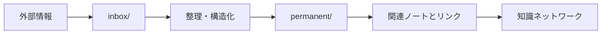

# CLAUDE.md

This file provides guidance to Claude Code (claude.ai/code) when working with code in this repository.

## リポジトリ概要

このリポジトリはObsidianベースのZettelkasten（ツェッテルカステン）ナレッジ管理システムです。個人の学習・思考を記録し、アイデア間の有機的なつながりを形成することを目的としています。

### Zettelkastenの4原則

1. **単一性（Atomicity）**: 1 zettel には 1 つの明確なアイデアだけを書く
2. **自律性（Autonomy）**: そのノート単体を読んでも意味が通るように書く
3. **リンク（Connectivity）**: 関連する zettel に必ずリンクを張る
4. **ID 付与（Identity）**: すべての zettel に一意な ID を付ける

## ディレクトリ構造

```
zettelkasten/
├── inbox/          # 未整理の情報（記事クリップ、メモ等）
├── permanent/      # 永続的なZettelノート（主要な知識ベース）
├── literature/     # 文献ノート（書籍・論文・記事などの読書ノート）
├── structure/      # トピック別の目次ノートやマップノート
├── templates/      # ノート作成用テンプレート
├── archive/        # アーカイブ
└── attachments/    # 添付ファイル
```

## ファイル命名規則

### permanent/ ディレクトリ

- **フォーマット**: `YYYYMMDDHHMMSS-descriptive-title.md`
- **例**: `20251214235033-claude-md-strategic-design-principles.md`
- **重要事項**:
  - タイムスタンプ（`YYYYMMDDHHMM`部分）は一意なIDとして機能
  - タイトル部分は英数字 + ハイフン中心（日本語も可だが長すぎないこと）
  - 新規作成時は`date`コマンドで現在時刻を取得してファイル名に反映

### テンプレート構造

すべてのpermanentノートは `templates/general.md` の構造に従う必要があります：

```yaml
---
id: YYYY-MM-DD-HHmmss
title: ノートのタイトル
created: YYYY-MM-DD HH:mm:ss
updated: YYYY-MM-DD HH:mm:ss
tags:
  - zettel
source:
  type: none | book | article | web | talk | memo
  ref: "ソースのURL等"
---

## 要約（Summary）
[2-3行の簡潔なまとめ]

## 本文（Body）
### 背景・問題意識
### アイデア・主張
### 内容を視覚化するMermaid図
### 具体例・ケース
### 反論・限界・条件

## 関連ノート（Links）
[5個程度の関連ノートへのリンク]

## To-Do / 次に考えること
```

## Zettelkasten運用原則

### 1つのアイデア = 1つのノート

- 各ノートは単一の概念・アイデアに焦点を当てる
- 複数の概念は別々のノートに分割し、相互リンクで結ぶ
- これにより再利用性と発見可能性が向上する

### アトミック性の維持

- ノートは独立して理解可能でなければならない
- 過度な前提知識を要求しない
- 必要なコンテキストは「背景・問題意識」セクションに記載

### リンク駆動の知識ネットワーク

- 関連ノートには必ず双方向リンクを作成
- リンク時には関係性を明示する（類似/対比/前提/応用等）
- 孤立したノートは避ける

## 新規ノート作成時のガイドライン

### 禁止事項

- **Never** テンプレートなしで新規ノートを作成しない
- **Never** 複数の独立した概念を1つのノートに混在させない
- **Never** front matterを省略しない
- **Never** 原文のコピー＆ペーストで済ませない（自分の言葉で書く）

### 推奨事項

- **Always** `templates/general.md` をベースに作成
- **Always** Mermaid図でアイデアを視覚化する
  - 適切な図のタイプを使用（フローチャート、シーケンス、クラス等）
  - 重要なコンポーネントをハイライト
  - 日本語ラベルは`"`で囲む
- **Always** 5個程度の関連ノートへリンクを作成
  - `find permanent -name '*.md' -print0 | xargs -0 grep -i title`で既存ノートを把握
  - 関連ノートのファイルを参照し、適切にリンク
- **Always** ソース情報（`source.type`, `source.ref`）を記録
- **Always** タグは既存タグを優先（新規タグの爆発を防ぐ）
  - タグは英語の小文字のみで構成された一語

## ワークフロー

### 情報の流れ



1. **収集フェーズ**: 外部情報をinbox/に保存
2. **処理フェーズ**: inbox/の情報を読み、自分の言葉で permanent/ にZettelノートを作成
3. **統合フェーズ**: 既存ノートとのリンクを確立し、知識ネットワークを拡張

### Web記事からZettel作成の詳細ワークフロー

ユーザーから「この記事からzettelを作って」と依頼された場合：

#### 1. 記事理解フェーズ

- 主張の中心（メインテーマ）、重要な議論、主要な概念を特定
- 長期的な再利用に向かない細部（古いニュース、単発の事例）と長く使えるアイデアを切り分ける
- **シグナル抽出**: 逸話や事例と、再利用可能な概念・主張・モデル・パターンを区別

#### 2. Zettel候補の設計

- 以下を含む候補リストを作成：
  - 仮タイトル（「この記事のまとめ」ではなく、アイデアを直接表現）
  - 1文の説明（何のノートか）
  - ノート種別：`concept` / `argument` / `method` / `example` / `critique` 等
- **概念分解**: 1つの候補が複数の大きなアイデアを抱え込まないように注意

#### 3. ノート間の関係設計（各zettelごと）

- どのノートがどれにリンクすべきかを決める：
  - 前提となる概念
  - 支援する議論や証拠
  - 関連するフレームワーク
  - 代替案や反対意見
- **コンテキスト保持**: 将来の自分が元記事に戻らなくてもよいように必要最小限の文脈を残す

#### 4. Zettel執筆（各候補ごと）

1. タイムスタンプベースの一意なIDを生成
2. `templates/general.md` の構造を厳密に維持
3. **自分の言葉で説明**（元記事をなぞらない）
4. 「未来の自分が記事を忘れていてもわかるか？」を基準に書く
5. front matterの全フィールドに適切な値を設定
6. Mermaid図を必ず含める
7. 他ノートへのリンク作成：
   - `find permanent -name '*.md' -print0 | xargs -0 grep -i title`を実行
   - 関連しそうなzettelの対象ファイルを参照
   - 5個程度のリンクを追加

#### 5. レビューと最適化

各ノートが以下を満たしているか確認：

- [ ] 主アイデアが1つに絞られているか
- [ ] 記事に戻らなくても理解できるか
- [ ] 少なくとも1つは他ノートや概念にリンクしているか
- [ ] 似た内容が複数ノートにダブっていないか

### 既存ノート編集時

1. `updated` フィールドを現在時刻に更新
2. front matterやセクション構造を破壊しない
3. リンクの整合性を維持
4. タグ追加時は既存タグを優先

## Git管理ポリシー

**Git管理対象**：

- `permanent/`（永続的な知識ベース）
- `templates/`
- `literature/`, `archive/`, `attachments/`

## 日本語使用について

- このリポジトリは**日本語**がプライマリ言語
- ノートの本文、タイトルは日本語で記述
- タグは英語の小文字のみ（例: `ai`, `zettelkasten`, `development-methods`）
- Claude Codeとのやり取りも日本語で行う

## ノート種別（zettel-creator.agent.mdより）

Zettelノートは以下の種別に分類される：

- **永続ノート（Permanent Notes）**: 自分の言葉で書かれた、再利用可能な洞察中心のノート
- **文献ノート（Literature Notes）**: 元記事・書籍が何を言っているかを整理記録（引用と簡潔なコメント）
- **概念ノート（Concept）**: ある概念・理論・フレームワークの説明
- **主張ノート（Argument）**: 特定の主張とその根拠
- **方法論ノート（Method）**: 手法・プロセス・パターンの記述
- **事例ノート（Example）**: 具体例・ケーススタディ
- **批評ノート（Critique）**: 既存アイデアへの批判・反論・限界

## 良いタイトルの例

- ❌ 悪い例: 「この記事のまとめ」「OpenTelemetryについて」
- ✅ 良い例: 「ローカルファーストなソフトウェアが信頼性を高める理由」「Delta-to-Cumulative Processorの設計上の課題」

タイトルはアイデアを直接表現する短く明快なものにする。