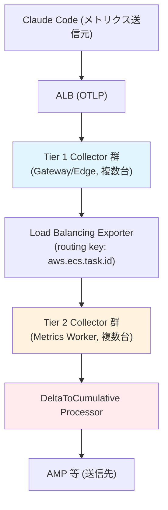

## 要約（Summary）

- OpenTelemetryのDeltaToCumulative Processorはstatefulで、同じtimeseriesを同じCollectorにルーティングする必要がある。
- SPOFを避けるため、Tier 1 (Gateway) と Tier 2 (Worker) の2段構成を推奨。
- Load Balancing Exporterでroutingを行い、stateful処理をTier 2に限定。

## 本文（Body）

### 背景・問題意識

DeltaToCumulative Processorは各timeseriesの累積stateを保持するため、ALBのラウンドロビンでは同じtimeseriesが異なるCollectorに分散され、cumulative値が壊れる。SPOFを避けつつstatefulさを扱う設計が必要。

### アイデア・主張

Tier 1 Collector群でLoad Balancing Exporterを使い、routing key（例: aws.ecs.task.id）で同じtimeseriesを同じTier 2 Collectorにルーティング。Tier 2でDeltaToCumulativeを実行。両Tierを複数台で冗長化し、SPOFを回避。

### Routing Keyの詳細

Routing keyは、Load Balancing Exporterがテレメトリデータを複数のバックエンドCollectorに分散する際に使用する識別子である。

- **用途**: 同じrouting keyを持つデータ（例: 同じトレースIDのスパン、または同じメトリクスストリーム）を常に同じバックエンドインスタンスにルーティングする。これにより、一貫性のあるハッシュリングに基づいて決定論的な分散を実現。
- **なぜ必要か**: DeltaToCumulative Processorのようなstateful処理では、各timeseriesの累積stateを1つのインスタンスで維持する必要があるため、同じデータが同じCollectorに届くようにする。
- **例**: `aws.ecs.task.id`のような属性をrouting keyに使用することで、ECSタスクごとにデータをグループ化し、stateful処理の整合性を保つ。これにより、ALBのランダム分散を上書きし、statefulさとスケーラビリティを両立させる。

### 内容を視覚化するMermaid図

### 具体例・ケース

- Claude Code → ALB → Tier 1 Collector (ECS複数台) → Load Balancing Exporter → Tier 2 Collector (ECS複数台) → DeltaToCumulative → AMP。
- 代替: Sidecar Collectorで各クライアント近くに配置、またはdelta対応バックエンドに変更。

### 反論・限界・条件

- State喪失リスク: Collector再起動や台数変更でseriesがリセットされるが、統計上許容。
- 構成の複雑さ: 2段構成が必要。
- 適用条件: AWS ECS/ALB環境前提。

## 関連ノート（Links）

- [[202511291430-delta-to-cumulative-processor|OpenTelemetry DeltaToCumulative Processorの概要]] DeltaToCumulative Processorの概要
- [[202511291440-load-balancing-exporter|OpenTelemetry Collector Load Balancing Exporterの概要]] Load Balancing Exporterの概要
- [[20251129172155-temporality-conversion-challenges|Temporality変換の課題と方法]] 変換の課題

## To-Do / 次に考えること

- [ ] AWS ECSでの2段Collector構成を実装
- [ ] routing keyの選択とテスト
- [ ] state喪失時の影響評価