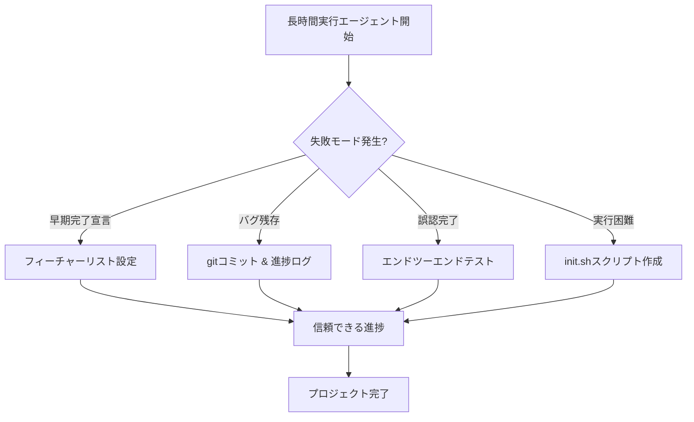

## 要約（Summary）

- 長時間実行AIエージェントの主な失敗モードは、プロジェクトの早期完了宣言、バグ残存、フィーチャーの誤認完了、アプリ実行方法の把握困難。
- これに対する対策として、フィーチャーリストの設定、進捗ログとgit履歴の確認、自己検証、初期スクリプト作成を適用。
- これらの対策により、エージェントの長期タスク実行信頼性が向上し、ソフトウェア開発のような複雑プロジェクトが可能になる。

## 本文（Body）

ここに **1つのアイデアだけ** を、自分の言葉で書く。

長時間実行AIエージェントの失敗モードとその対策を体系的に理解することで、AIの自律性を高め、人間との協働を効率化できる。

### 背景・問題意識

AIエージェントは短時間タスクでは有効だが、長時間実行ではコンテキストウィンドウの制限によりセッション間で状態が失われ、一貫した進捗が難しくなる。これにより、エージェントが人間のソフトウェアエンジニアのように振る舞えず、プロジェクト全体の失敗を招く。なぜこの問題が発生するのか？ エージェントが一度に全てを解決しようとするか、進捗を誤認する傾向があるため。

### アイデア・主張

長時間実行エージェントの失敗を防ぐには、4つの主要失敗モードに対して構造化された解決策を適用する。これにより、エージェントが段階的に信頼できる進捗を実現できる。

- **早期完了宣言**: エージェントが一部の機能実装で全体完了と判断。対策: フィーチャーリストを設定し、完了基準を明確化。
- **バグ残存**: セッション終了時にコードが不安定。対策: gitコミットと進捗ログで状態を記録し、次のセッションでテスト。
- **フィーチャー誤認完了**: テストなしで完了マーク。対策: エンドツーエンドテストを実施し、自己検証。
- **実行方法把握困難**: 各セッションでアプリ起動方法を再学習。対策: init.shスクリプトを作成。

これらの対策は、Anthropicの実験で効果が確認された。

### 内容を視覚化するMermaid図

### 具体例・ケース

Webアプリクローン作成プロジェクトで、エージェントがチャット機能を部分実装しただけで「完了」と宣言し、次のセッションでバグだらけのコードを引き継ぐケース。これを防ぐため、フィーチャーリストに200項目を定義し、各セッションで1つずつテスト済みで完了マーク。

### 反論・限界・条件

これらの対策は完全ではなく、ブラウザ自動化の限界（例: モーダル検知不可）で一部バグを見逃す可能性。適用には初期設定の労力が必要で、単純タスクでは過剰。エージェントのプロンプト設計スキルが前提。

## 関連ノート（Links）

- [[20251129165837-long-running-agent-context-window-problem|長時間実行AIエージェントのコンテキストウィンドウ問題]] 根本的なコンテキスト問題
- [[20251129165838-initializer-agent-environment-setup|Initializer agentによる環境初期化]] 初期環境設定の詳細
- [[20251129165839-coding-agent-incremental-progress|Coding agentによるインクリメンタル進捗]] インクリメンタル進捗の方法
- [[20251129165840-feature-list-task-management|フィーチャーリストによるタスク管理]] フィーチャーリストの役割
- [[20251129165841-ai-agent-end-to-end-testing|AIエージェントにおけるエンドツーエンドテスト]] テストの重要性
- [[20251129160321-ai-delegation-failure-patterns|AI丸投げの失敗パターン]] AI委譲の失敗パターンとの比較

## To-Do / 次に考えること

- [ ] 自分のAIプロジェクトで失敗モードを観察し、対策を適用
- [ ] ブラウザ自動化ツールの限界を調査
- [ ] マルチエージェントアーキテクチャでの対策を検討
- [ ] 数週間後にこのノートの有効性を再評価