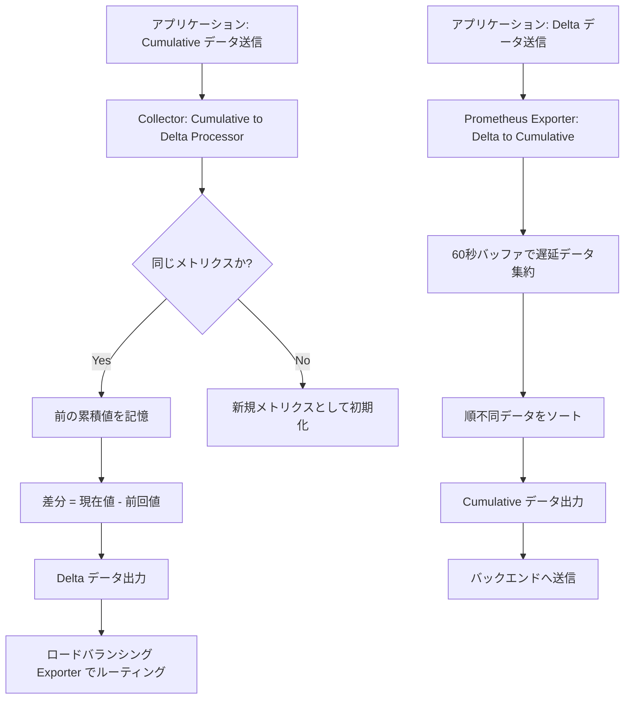

## 要約（Summary）

- OpenTelemetry Collectorを使用することで、アプリケーションで設定したtemporalityをバックエンド向けに変換可能だが、スケーリングが大きな課題となる。
- CumulativeからDeltaへの変換は専用プロセッサで実現可能だが、メトリクスを同じCollectorにルーティングする必要があり、ロードバランシングが必要。
- DeltaからCumulativeへの変換は現在プロセッサとして利用できず、エクスポーターで一部対応可能だが、out-of-orderデータやデータ損失の問題が深刻。

## 本文（Body）

### 背景・問題意識

バックエンドが異なるtemporalityを要求する場合、アプリケーションの再設定や再起動を避けるため、Collectorでの変換が有効。しかし、変換プロセスは単なるデータ変換を超え、エンドツーエンドの信頼性、スケーラビリティ、データ完全性を考慮する必要がある。特に、分散環境でのメトリクスルーティングが複雑になる。

### アイデア・主張

- **Cumulative to Delta変換**: CollectorのCumulative to Deltaプロセッサを使用。以前の値を記憶して差分を計算するが、同じメトリクスが常に同じCollectorインスタンスに到達する必要がある。これを解決するため、ロードバランシングエクスポーター（metrics対応が最近追加）を使用し、クラスタをスケール可能にする。
- **Delta to Cumulative変換**: 現在、Collectorに専用プロセッサがない。Prometheusエクスポーターなどの一部エクスポーターで変換機能が実装されているが、ヘルパーとして汎用化の提案がある。変換にはout-of-order問題を扱うため、60秒の遅延バッファを導入し、遅延データを集約する。
- **根本的な課題**: Delta temporalityは全データポイントを必要とするため、Collectorダウン時のデータ損失が避けられない。Cumulativeは解像度低下に留まるが、変換の複雑さが増す。

### 内容を視覚化するMermaid図

### 具体例・ケース

- サーバーレス環境（AWS Lambda）でDeltaを使用し、Prometheusバックエンドへ送信する場合: DeltaをCumulativeに変換。60秒遅延で大部分のデータをカバーするが、60秒を超える遅延データは失われる。
- Kubernetes環境でのCumulative to Delta: サイドカーコンテナやnode-localサービスで同じCollectorにルーティング。ロードバランシングエクスポーターでクラスタスケール。
- 複数バックエンドへの送信: アプリケーションでCumulativeを設定し、一部バックエンド向けにCollectorでDeltaに変換。

### 反論・限界・条件

- **out-of-order問題**: Deltaデータが順不同で到着すると、過去のCumulative値を上書きできない。TSDB（例: Prometheus）で高コストになるため、60秒バッファを使用するが、60秒を超える遅延は対応不可。
- **データ損失リスク**: Delta変換ではCollectorダウンでデータが失われ、Cumulative変換では全Deltaポイントが必要。Deltaの欠点が変換で増幅される。
- **スケーリング限界**: 変換には状態管理が必要で、クラスタリングが難しい。ロードバランシングで改善されるが、完全ではない。
- **適用条件**: 変換はバックエンド変更時の回避策として有用だが、理想はバックエンドに合わせた直接設定。変換はパフォーマンスオーバーヘッドを伴う。

## 関連ノート（Links）

- [[20251129172154-backend-temporality-choice|バックエンドによるTemporality選択基準]] バックエンドによる選択基準
- [[20251129172156-time-series-aggregation-differences]] 集約の違い
- [[20251129172158-temporality-final-recommendation|Temporalityの最終推奨]] 最終推奨
- [[202511291430-delta-to-cumulative-processor|OpenTelemetry DeltaToCumulative Processorの概要]] DeltaToCumulative Processorの概要
- [[202511291440-load-balancing-exporter|OpenTelemetry Collector Load Balancing Exporterの概要]] スケーリングのためのload balancing

## To-Do / 次に考えること

- [ ] CollectorのCumulative to Deltaプロセッサとロードバランシングエクスポーターの設定方法を調査
- [ ] PrometheusエクスポーターのDelta to Cumulative変換機能をテスト
- [ ] 自環境での変換パイプラインのスケーラビリティ評価