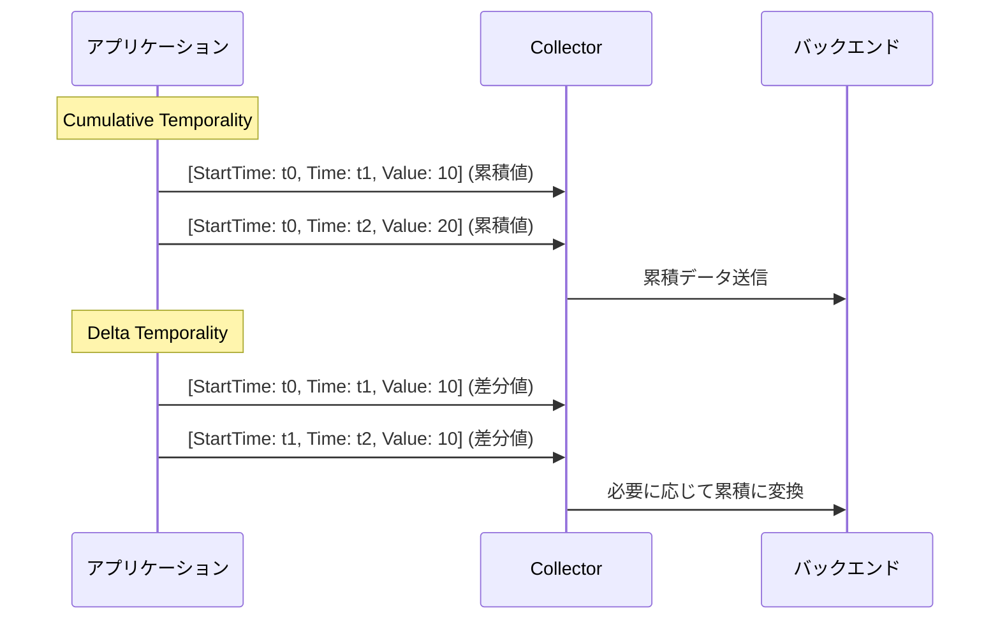

## 要約（Summary）

- OpenTelemetry Protocol (OTLP) では、temporality は Sum, Histogram, ExponentialHistogram の AggregationTemporality フィールドで定義され、DELTA または CUMULATIVE を指定。
- DELTA は時間間隔の値、CUMULATIVE は開始からの累積値を表し、タイムスタンプと StartTimeUnixNano で時間範囲を管理。

## 本文（Body）

### 背景・問題意識

OTLP はメトリクスデータを転送するための標準プロトコルで、temporality はデータポイントの時間的意味を定義する。プロトコルレベルで正しく扱うことで、バックエンドでの変換や集約が可能になる。

### アイデア・主張

- **AggregationTemporality**: DELTA (時間間隔の値) または CUMULATIVE (開始からの累積値)。Sum, Histogram, ExponentialHistogram で必須。
- **タイムスタンプ管理**: TimeUnixNano (観測時刻)、StartTimeUnixNano (オプション、シーケンス開始時刻)。DELTA では StartTimeUnixNano が各ポイントで進む。
- **ポイント構造**: Sum は値と時間範囲、Histogram はバケットとカウント/合計。temporality により解釈が変わる。
- **変換**: OTLP は DELTA-to-CUMULATIVE 変換をサポートし、状態管理が必要。

### 内容を視覚化するMermaid図

### 具体例・ケース

Sum ポイント: DELTA の場合 [StartTime: t0, Time: t1, Value: 5] は t0-t1 の増加分。CUMULATIVE の場合 [StartTime: t0, Time: t1, Value: 10] は t0-t1 の累積。

### 反論・限界・条件

temporality は識別フィールドで、混在するとエラー。変換は状態フルで、スケーリングが課題。Gauge は temporality なし。

## 関連ノート（Links）

- [[20251129172153-opentelemetry-temporality-definition|OpenTelemetry Temporalityの基本概念]] 基本概念
- [[20251129172155-temporality-conversion-challenges|Temporality変換の課題と方法]] 変換課題
- [[20251129173333-delta-to-cumulative-detailed-analysis|Delta to Cumulative Temporality変換の詳細な分析]] 変換分析

## To-Do / 次に考えること

- [ ] OTLP protobuf 定義を確認
- [ ] Collector での temporality 変換の実装を調査