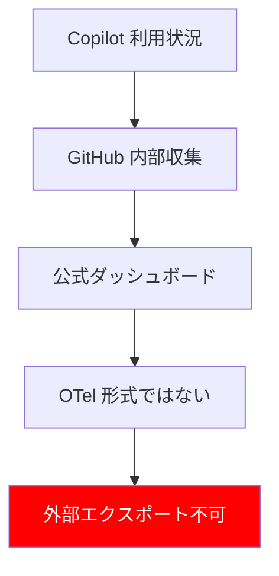

## 要約（Summary）

GitHub Copilot の利用状況テレメトリは GitHub 側で収集されるが、OpenTelemetry 形式で外部にエクスポートする公式機能は存在しない。Copilot 拡張が OTel SDK を組み込んでいないため、OTLP で collector に直接送ることはできない。

## 本文（Body）

### 背景・問題意識

Copilot の提案数や受け入れ率などの詳細な利用状況を OpenTelemetry で収集したいというニーズがある。しかし、公式ドキュメントや環境変数に OTel 関連の設定が見当たらない。

### アイデア・主張

Copilot 拡張は OTel SDK クライアントとして機能しないため、公式な方法で Copilot の内部メトリクスを OTLP で外部 collector に送ることは不可能。

### 内容を視覚化するMermaid図

### 具体例・ケース

組織向けダッシュボードでは利用状況が見られるが、これは GitHub UI/API 経由のみで、OTel 形式ではない。

### 反論・限界・条件

将来的に GitHub が機能を追加する可能性はあるが、現状では公式サポートなし。

## 関連ノート（Links）

- [[OpenTelemetry Temporalityの基本概念]] - OpenTelemetry の基本概念を理解することで、テレメトリ収集の文脈を深める
- [[OpenTelemetry Collector Load Balancing Exporterの概要]] - Collector を用いたメトリクス転送の代替案として参考
- [[AI開発におけるガードレールの重要性]] - AI ツール利用時の安全策として、テレメトリ欠如のリスクを考慮

## To-Do / 次に考えること

- [ ] GitHub の公式ドキュメントを再確認して更新がないかチェック
- [ ] 代替案としての IDE フックの実装を検討