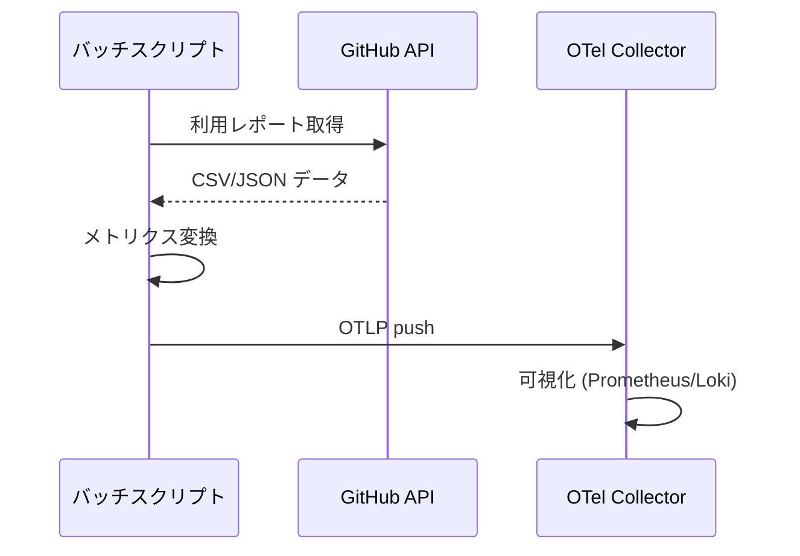

## 要約（Summary）

GitHub の Enterprise/Organization API から Copilot 利用レポートを取得し、スクリプトでメトリクス形式に変換して OTLP で collector に push することで、擬似的な Copilot 利用メトリクスを構成できる。

## 本文（Body）

### 背景・問題意識

IDE レベルだけでは不十分な場合、組織レベルの利用状況を把握する必要がある。

### アイデア・主張

定期バッチで GitHub API から利用データを取得し、メトリクスに変換して OTel 経由で可視化する。

### 内容を視覚化するMermaid図

### 具体例・ケース

- copilot_active_users{org="xxx"} 123 というメトリクスを生成

### 反論・限界・条件

リアルタイム性や詳細度が限定的で、GitHub の内部テレメトリとは完全一致しない。

## 関連ノート（Links）

- [[OpenTelemetry Temporalityの基本概念]] - メトリクスの Temporality 選択に適用
- [[OpenTelemetry Collector Load Balancing Exporterの概要]] - Collector の負荷分散を考慮
- [[Temporality変換の課題と方法]] - レポートデータの変換手法として参考

## To-Do / 次に考えること

- [ ] GitHub API の利用レポートエンドポイントを調査
- [ ] バッチ処理のスケジューリング方法を検討