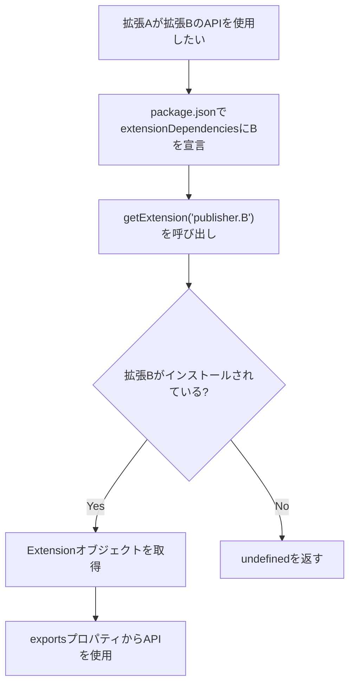

## 要約（Summary）

vscode.extensions.getExtensionは、VS Code拡張が他のインストール済み拡張のAPIにアクセスするための関数である。拡張IDを指定してExtensionオブジェクトを取得し、エクスポートされた機能を活用できる。

## 本文（Body）

### 背景・問題意識

VS Code拡張開発において、拡張同士が連携する必要が生じる場合がある。他の拡張の機能を再利用することで、開発効率を高めたり、機能を拡張したりできる。

### アイデア・主張

getExtension関数は、拡張IDを引数に取り、該当拡張がインストールされていればExtensionオブジェクトを返し、そうでなければundefinedを返す。これにより、拡張間の依存関係を動的に扱える。

関数シグネチャ: `getExtension<T>(extensionId: string): Extension<T> | undefined`

パラメータ: extensionId - publisher.name形式の拡張ID (例: microsoft.python)

戻り値: Extension<T> - 拡張オブジェクト、またはundefined

Extensionオブジェクトの主なプロパティ:
- id: 拡張ID
- extensionUri: 拡張のURI
- extensionPath: 拡張のパス
- isActive: 拡張がアクティブかどうか
- packageJSON: package.jsonの内容
- exports: エクスポートされたAPIオブジェクト

### 内容を視覚化するMermaid図



### 具体例・ケース

例: 拡張Aが数学ライブラリ拡張Bのmul関数を使いたい場合、getExtension('genius.math')で拡張を取得し、ext.exports.mul(42, 1)として呼び出す。

TypeScriptコード例:
```typescript
let mathExt = extensions.getExtension('genius.math');
if (mathExt && mathExt.isActive) {
    let importedApi = mathExt.exports;
    console.log(importedApi.mul(42, 1)); // 42
}
```

vscode.git拡張の使用例 (Git操作が必要な拡張の場合):
```typescript
const gitExtension = vscode.extensions.getExtension('vscode.git');
if (gitExtension && gitExtension.isActive) {
    const gitApi = gitExtension.exports.getAPI(1);
    // gitApi.repositories[0].diff() などでGit操作
}
```

APIエクスポート例 (拡張B側):
```typescript
export function activate(context: vscode.ExtensionContext) {
  let api = {
    sum(a, b) { return a + b; },
    mul(a, b) { return a * b; }
  };
  return api;
}
```

### 反論・限界・条件

拡張がインストールされていない場合、undefinedが返るため、エラーハンドリングが必要。依存関係はpackage.jsonで宣言することが推奨される。

extensions名前空間には、allプロパティですべてのインストール済み拡張を取得可能。また、onDidChangeイベントで拡張のインストール/有効化/無効化を監視できる。

## 関連ノート（Links）

- [[20251129220822-vscode-extensions-getextension-parameters|vscode.extensions.getExtensionのパラメータと戻り値]]
- [[20251129221511-vscode-extension-git-strategy-overview|VS Code拡張でのGit操作戦略の概要]]
- [[20251129221512-vscode-git-api-advantages|vscode.git APIのメリット]]

## To-Do / 次に考えること

- [ ] 実際の拡張開発でこのAPIを使用した例を試す
- [ ] 拡張間のセキュリティ考慮事項を調査する