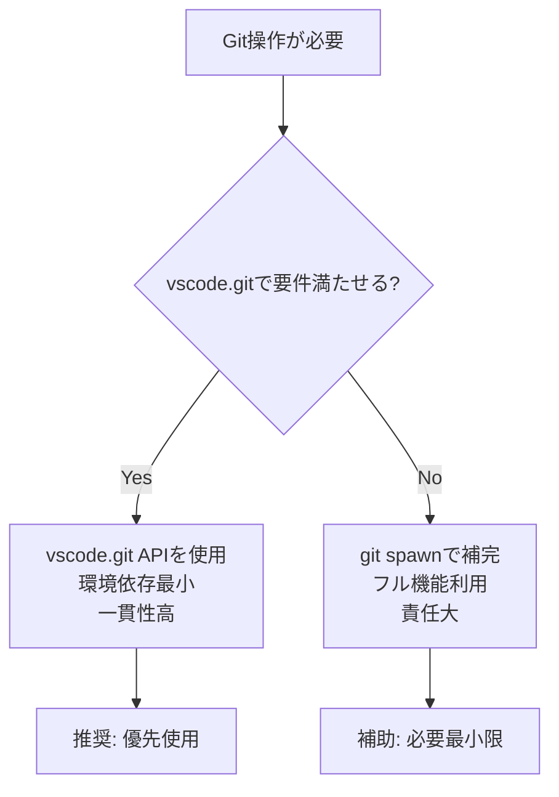

## 要約（Summary）

VS Code拡張でGit操作を行う場合、できる限りvscode.git APIを使い、不足分だけgit spawnで補うのが最適。環境依存を最小限に抑えつつ、必要な機能を確保できる。この戦略は、ユーザ環境の一貫性、認証の容易さ、パフォーマンスのバランスを考慮したものである。

## 本文（Body）

### 背景・問題意識

VS Code拡張開発において、Gitリポジトリの操作が必要になるケースは多い。例えば、変更差分の取得、コミット履歴の参照、ブランチ操作など。これを実現する方法として、VS CodeのビルトインGit拡張（vscode.git）のAPIを使うか、直接gitコマンドをプロセスとしてspawnするかの二つの選択肢がある。どちらを選ぶかは、拡張の用途、ターゲット環境、メンテナンスコストによって決まる。間違った選択は、ユーザ体験の悪化や開発効率の低下を招く。

### アイデア・主張

結論として、「できる限り VS Code の vscode.git を使い、どうしても足りないところだけ git を spawn で補う」のが筋が良い。vscode.gitはユーザ環境に依存しにくく、Remote / Dev Container / WSL / Codespaces などの多様な環境で自動対応可能。拡張同士の一貫性も高く、認証まわりもVS Codeに委譲できる。一方、spawnはGitの全機能をフルに使えるが、環境依存が跳ね上がり、認証・エラー処理・パフォーマンスの責任がすべて開発者に移る。したがって、vscode.gitを第一優先とし、特殊オプションが必要な場合のみspawnを補助的に使う二段構えが最適。

### 内容を視覚化するMermaid図

### 具体例・ケース

例えば、ワークスペース内の変更差分をAIレビューなどに使う場合、vscode.gitのRepository API（repository.diff, repository.getChanges, repository.state.workingTreeChanges）で十分対応可能。これにより、HEADとの差分やインデックスとの差分を効率的に取得できる。一方、空白を無視する--ignore-space-changeオプションが必要な場合、APIでサポートされていないのでspawnを使う。PR差分専用ならrepository.diff、mainブランチとの差分ならmerge-base相当のspawnを検討。

### 反論・限界・条件

vscode.gitは「非公式」な位置づけで、将来の破壊的変更リスクがある。また、拡張が無効化されている場合や初期化前は使えない。特殊なワークフロー（サブモジュール管理、リネーム検出のaggressive設定）には不向き。spawnはWeb環境（ブラウザ拡張）では使えず、移植性を損なう。したがって、VS Code専用拡張ならvscode.git一択、将来的にVS Code以外へ移植予定ならspawn混在を検討。バランスを取るため、まずはvscode.gitで設計し、不足分をspawnユーティリティに切り出す二段構えが良い。

## 関連ノート（Links）

- [[20251129220821-vscode-extensions-getextension-overview|vscode.extensions.getExtension APIの概要]]

## To-Do / 次に考えること

- [ ] vscode.git APIの具体的な使用例を実装する
- [ ] git spawn時のエラーハンドリングを設計する