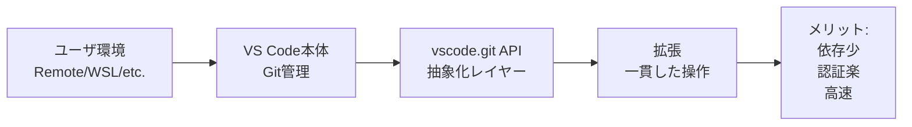

## 要約（Summary）

vscode.git APIはユーザ環境依存が少なく、拡張間の一貫性が高く、認証まわりが楽。パフォーマンスも有利な場合がある。Remote環境での自動対応が強み。

## 本文（Body）

### 背景・問題意識

VS Code拡張でGitを扱う際、ユーザの環境差異が大きな課題となる。Gitのインストール有無、PATH設定、バージョン、認証方法などが環境ごとに異なる。これを自前でハンドリングするのは複雑で、エラーの原因になりやすい。

### アイデア・主張

vscode.git APIを使うことで、これらの環境依存を最小限に抑えられる。VS Code本体がGitの管理を担い、拡張はAPIを呼び出すだけ。ユーザがRemote / Dev Container / WSL / Codespacesを使っていても、その環境のGitに自動で接続される。拡張同士で同じRepositoryモデルを使えるため、一貫性が高く、将来VS CodeがGit実装を変えても互換性が維持されやすい。認証（HTTPS/SSH/GCM）はVS Codeに委譲でき、自前管理不要。一部情報は内部キャッシュで高速。

### 内容を視覚化するMermaid図

### 具体例・ケース

Remote SSH環境で拡張を使う場合、vscode.gitは自動でリモートマシンのGitバイナリを使用。開発者はGitのPATHや設定を気にせず、repository.diff()を呼ぶだけで差分取得可能。別の拡張が同じリポジトリを操作していても、state.workingTreeChangesで一貫した変更情報を得られる。

### 反論・限界・条件

拡張が無効化されている場合や、まだ初期化されていない場合は使えない。APIが「非公式」なため、破壊的変更のリスクはゼロではないが、VS Codeのエコシステム内で広く使われているため、安定性は高い。

## 関連ノート（Links）

- [[20251129221511-vscode-extension-git-strategy-overview|VS Code拡張でのGit操作戦略の概要]]

## To-Do / 次に考えること

- [ ] vscode.gitの初期化チェックを実装する