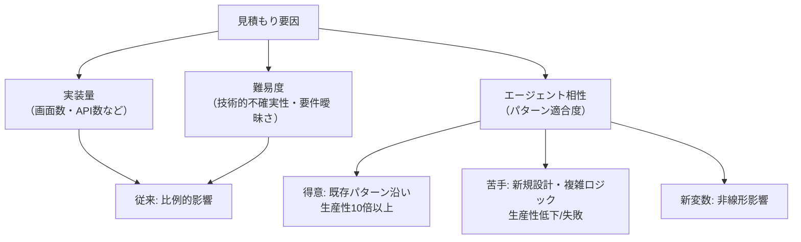

## 要約（Summary）

コーディングエージェントの導入は、ソフトウェア開発の見積もりを根本的に変えた。従来は実装量と難易度の2軸で予測可能だったが、エージェントの「相性」という新しい変数が加わり、生産性が数倍から数十倍に変動するようになった。これにより、見積もりのブレが激増し、従来の経験則が通用しにくくなった。

## 本文（Body）

### 背景・問題意識

ソフトウェア開発の見積もりは元来難しかった。要件の曖昧さ、技術的不確実性、メンバーのスキル差などが要因で、完全に正確な予測は不可能だった。しかし、経験豊富な開発者はこれらの要因をある程度予測でき、技術的な難しさや既存システムとの絡み具合を考慮して見積もりを立てていた。Claude CodeやCodexのようなコーディングエージェントの登場により、この予測可能性が崩れた。

### アイデア・主張

コーディングエージェントはタスクの性質によって生産性が極端に変わる。「エージェントとの相性」が新たな見積もり変数となり、同じ難易度・実装量のタスクでも、エージェントが得意なパターンなら爆速で完了し、苦手なら人間より遅くなることがある。この相性は予測しにくく、見積もりを破壊する主因である。

### 内容を視覚化するMermaid図

### 具体例・ケース

- 既存のCRUD画面追加タスク: 人間で10時間かかるものが、エージェントで1時間で完了。
- 新アーキテクチャ導入: 人間でも難しいタスクが、エージェントでは試行錯誤が続き、数日以上かかる。
- 実体験: 「5日かかるだろう」と思った既存パターン沿いの機能が、エージェントで2日完了。逆に「2日で終わる」と思ったタスクが、過剰実装と修正で5日かかった。

### 反論・限界・条件

エージェントの能力は進化しており、将来的に相性の予測がしやすくなる可能性がある。また、人間のスキル差やチームプロセスも依然として影響する。エージェントが得意なタスクのみに適用すれば、生産性向上は確実だが、苦手分野を避けられない場合、見積もり精度は低下する。

## 関連ノート（Links）

- [[20251129160317-ai-role-division-what-why-how.md|AI連携開発における役割分担の原則]] AI連携開発における役割分担の原則
- [[20251129160318-autonomous-ai-vs-coding-assistant.md|自律型AIとコーディングアシスタントの使い分け]] 自律型AIとコーディングアシスタントの使い分け
- [[20251129160319-ai-guardrails.md|AI開発におけるガードレールの重要性]] AI開発におけるガードレールの重要性
- [[20251129225833-coding-agent-strengths-weaknesses.md|コーディングエージェントの得意・苦手パターン]] コーディングエージェントの得意・苦手パターン

## To-Do / 次に考えること

- [ ] エージェントの相性を評価する定量指標を開発する
- [ ] プロジェクトのタスクを相性別に分類し、見積もり精度を測定する
- [ ] エージェント導入後の見積もり手法をチームで共有する