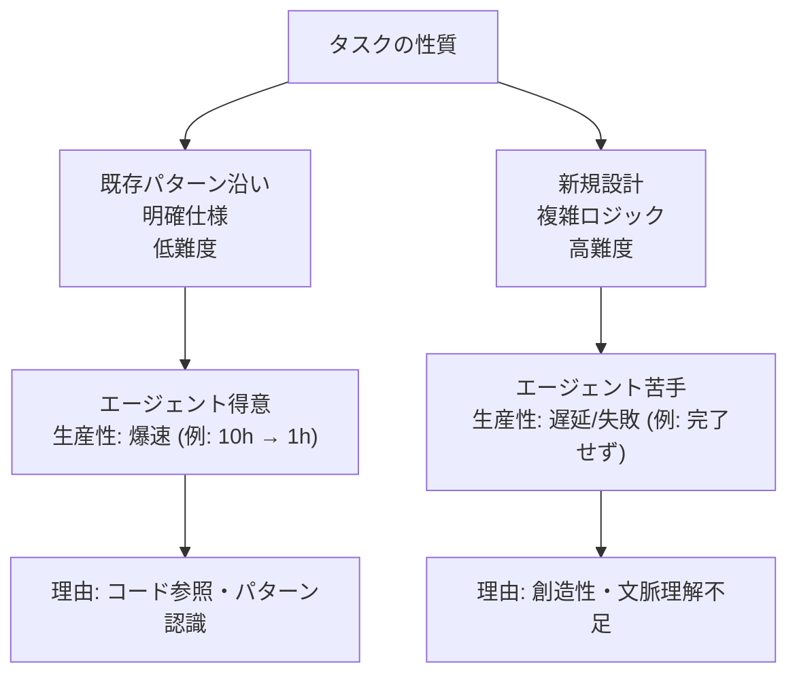

## 要約（Summary）

コーディングエージェントの生産性はタスクの性質に大きく依存する。端的に言うと、「簡単なものを大量に実装するのに非常に向いている」。既存のパターンに沿った明確な仕様の機能追加は圧倒的に速いが、新アーキテクチャ設計や暗黙知の多い複雑なビジネスロジックは苦手で、完了しないか想像以上に時間がかかる。

## 本文（Body）

### 背景・問題意識

コーディングエージェント（例: Claude Code, Codex）は、AIの特性上、既存のコードベースを参照しながらパターン認識を行うのが得意。人間の開発者でも難易度が高いタスクが、エージェントではさらに予測不能になる。タスクの「型」が合うかどうかで、生産性が何倍にも変わるため、見積もり時にこのパターンを理解することが重要。

### アイデア・主張

エージェントの得意パターンは、低難度のタスクを大量にこなすこと。既存実装を模倣できるCRUD操作や、明確な仕様の機能追加は、人間が10時間かかる作業を1時間で終える。一方、苦手パターンは高難度のタスクで、新規アーキテクチャ設計や複数のサービスをまたぐ複雑な修正は、試行錯誤が続き、失敗や大幅遅延を招く。エージェントは「言われたことをやる」のは得意だが、「やらなくていいことを判断する」のは苦手。

### 内容を視覚化するMermaid図

### 具体例・ケース

- 得意例: 既存のユーザー管理画面に似た機能を追加。エージェントはコードベース内の似た実装を参照し、数時間で実装完了。
- 苦手例: 新しい認証基盤の設計。エージェントは過剰な抽象化レイヤーを作ったり、セキュリティ要件を誤解して失敗。人間が設計を先に行い、実装のみ任せる必要がある。
- 経験談: 画面10個の追加はパターン確立後一気に完了したが、コアアルゴリズムの変更はエージェントが迷走し、ロールバックを繰り返す。

### 反論・限界・条件

エージェントのモデルが進化すれば、苦手分野も改善される可能性がある。ただし、現時点では人間の監督が不可欠で、完全に自律させるのはリスクが高い。タスクの粒度を細かくし、エージェントの強みを活かす設計が有効。

## 関連ノート（Links）

- [[20251129225832-coding-agent-estimation-disruption.md|コーディングエージェントが従来の見積もりを破壊する理由]] コーディングエージェントが従来の見積もりを破壊する理由
- [[20251129160318-autonomous-ai-vs-coding-assistant.md|自律型AIとコーディングアシスタントの使い分け]] 自律型AIとコーディングアシスタントの使い分け
- [[20251129160319-ai-guardrails.md|AI開発におけるガードレールの重要性]] AI開発におけるガードレールの重要性
- [[20251215101734-jevons-paradox-concept|Jevonsパラドックス：効率化が消費を増やす逆説]] Jevonsパラドックス：効率化が消費を増やす逆説（簡単なタスクを大量実装できる→要求が増える）

## To-Do / 次に考えること

- [ ] プロジェクトのタスクをパターン別に分類し、エージェント適用可否を評価する
- [ ] 苦手タスクの事前調査手法を確立する