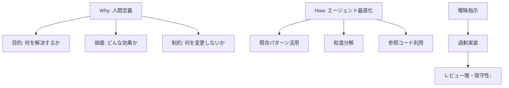

## 要約（Summary）

コーディングエージェント時代では、Why（目的・価値・制約）を人間が明確に定義し、How（実装方法）をエージェントの得意形に柔軟に合わせる必要がある。Whyが曖昧だと過剰実装が生じ、保守性の低いコードになる。

## 本文（Body）

### 背景・問題意識

従来の開発では、実装方針（How）を詳細に決めてから進めるのが一般的だった。しかし、エージェント導入により、実装方法の柔軟性が生産性を最大化する鍵となる。エージェントはパターン認識が得意なので、既存コードに合わせたHowを選べば効率的。

### アイデア・主張

Whyを人間が明確にし、Howをエージェントに最適化する。Whyが解決する価値や制約を定義し、エージェントが既存パターンを活用できる設計にする。曖昧な指示はエージェントが過剰に実装し、レビューと修正で時間がかかる。

### 内容を視覚化するMermaid図

### 具体例・ケース

- 良い例: 「現在のシステムにユーザーの名前とメールアドレスを保存する機能を追加。既存ログイン機能は変更しない。Admin画面で一覧表示。」 → シンプル実装。
- 悪い例: 「ユーザー管理機能を作って」 → エージェントが権限システムや2FAまで実装し、削る作業で半日かかる。
- 示唆: Whyを明確にすることで、エージェントの「やらなくていいことを判断する」弱点を補う。

### 反論・限界・条件

Whyが複雑すぎるとHowの柔軟性が効かない。エージェントの能力次第で最適Howが変わるため、継続的な調整が必要。

## 関連ノート（Links）

- [[20251129225832-coding-agent-estimation-disruption.md|コーディングエージェントが従来の見積もりを破壊する理由]] コーディングエージェントが従来の見積もりを破壊する理由
- [[20251129160317-ai-role-division-what-why-how.md|AI連携開発における役割分担の原則]] AI連携開発における役割分担の原則
- [[20251129225833-coding-agent-strengths-weaknesses.md|コーディングエージェントの得意・苦手パターン]] コーディングエージェントの得意・苦手パターン

## To-Do / 次に考えること

- [ ] タスク定義時にWhyを明確にするチェックリストを作成
- [ ] エージェント指示のテンプレートを開発