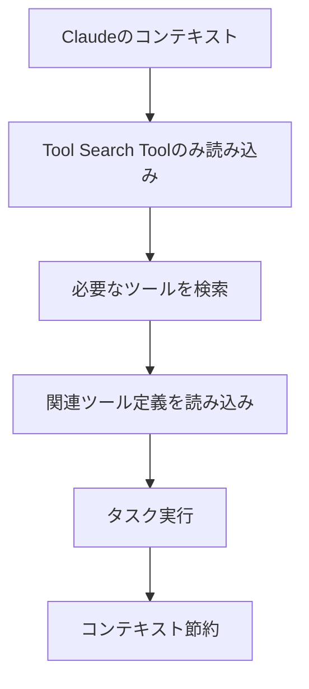

## 要約（Summary）

Tool Search Toolは、Claudeが大量のツール定義を事前にコンテキストに読み込まず、オンデマンドで必要なツールを検索して発見する機能。これにより、コンテキストウィンドウの節約と精度向上が実現される。

## 本文（Body）

### 背景・問題意識

AIエージェントが数百から数千のツールを扱う場合、すべてのツール定義を事前にコンテキストに読み込むと、トークン消費が膨大になり、会話のスペースが圧迫される。これがエージェントの性能を低下させる。

### アイデア・主張

Tool Search Toolを導入することで、Claudeは必要なツールのみを動的に検索・読み込み、全体のツールライブラリにアクセスしながらコンテキストを効率的に管理できる。これにより、85%のトークン削減と精度向上（Opus 4.5で79.5%から88.1%へ）が可能。

### 内容を視覚化するMermaid図

### 具体例・ケース

GitHub、Slack、JiraなどのMCPサーバーを使用する場合、従来は55Kトークンを消費するが、Tool Search Toolで8.7Kトークンに削減。Claude for Excelでは数千行のスプレッドシート操作が可能。

### 反論・限界・条件

検索ステップが追加されるため、レイテンシーが増加する可能性。ツール数が少ない場合や頻繁に使用されるツールが多い場合は効果が薄い。

## 関連ノート（Links）

- [[20251129165837-long-running-agent-context-window-problem|長時間実行AIエージェントのコンテキストウィンドウ問題]] 長時間実行エージェントのコンテキストウィンドウ問題を効率的に管理するための技術的基盤
- [[20251129165841-ai-agent-end-to-end-testing|AIエージェントにおけるエンドツーエンドテスト]] エージェントのテストにおいてツール使用の精度向上を検証する手法
- [[20251129160319-ai-guardrails|AI開発におけるガードレールの重要性]] AI開発における安全性を確保しつつツール使用を拡張するガードレール
- [[20251129165842-long-running-agent-failure-modes-solutions|長時間実行エージェントの失敗モードと対策]] 長時間実行時の失敗を防ぐためのツールオンデマンド発見の活用
- [[20251129225833-coding-agent-strengths-weaknesses|コーディングエージェントの得意・苦手パターン]] コーディングエージェントの強みを活かしたツール統合の可能性

## To-Do / 次に考えること

- [ ] Tool Search Toolの実装方法を調査
- [ ] 自プロジェクトでの適用可能性を検証
- [ ] 他のAIプラットフォームとの比較