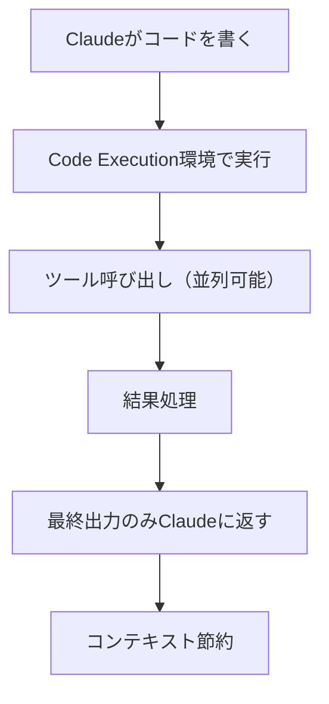

## 要約（Summary）

Programmatic Tool Callingは、Claudeがツールを個別に呼び出すのではなく、コードを書いて複数のツールをオーケストレーションする機能。これにより、中間結果のコンテキスト汚染を防ぎ、効率と精度を向上させる。

## 本文（Body）

### 背景・問題意識

従来のツール呼び出しでは、各ツール結果がClaudeのコンテキストに入り、大量のデータ（例: 10MBログファイル）が蓄積して重要な情報を押し出す。また、各呼び出しごとに推論パスが必要で遅延とエラーが発生。

### アイデア・主張

ClaudeがPythonコードを書いてツールを呼び出し、オーケストレーションすることで、中間結果をコンテキストから除外。最終結果のみをClaudeが見る。これにより、トークン消費を37%削減し、レイテンシーを低減、精度を向上（知識検索で25.6%から28.5%へ）。

### 内容を視覚化するMermaid図

### 具体例・ケース

予算超過チェック: チームメンバーの経費を取得し、予算と比較。従来は2000+行のデータをコンテキストに、Programmaticでは最終の超過者リストのみ。

### 反論・限界・条件

コード実行ステップが追加されるため、単純なツール呼び出しではオーバーヘッド。並列実行やデータ処理が必要な複雑なワークフローで有効。

## 関連ノート（Links）

- [[20251129165837-long-running-agent-context-window-problem|長時間実行AIエージェントのコンテキストウィンドウ問題]] 長時間実行エージェントのコンテキスト汚染を防ぐためのコードベースオーケストレーション
- [[20251129165839-coding-agent-incremental-progress|Coding agentによるインクリメンタル進捗]] インクリメンタルなコード実行による進捗管理との統合
- [[20251129160318-autonomous-ai-vs-coding-assistant|自律型AIとコーディングアシスタントの使い分け]] 自律AIがコードを書いてツールを制御する使い方の例
- [[20251129165841-ai-agent-end-to-end-testing|AIエージェントにおけるエンドツーエンドテスト]] エンドツーエンドテストにおける複雑なワークフロー検証
- [[20251129225832-coding-agent-estimation-disruption|コーディングエージェントが従来の見積もりを破壊する理由]] 従来の見積もりを破壊する効率的なツール実行

## To-Do / 次に考えること

- [ ] Programmatic Tool Callingのコード例を実装
- [ ] 自プロジェクトでのデータ処理タスクに適用
- [ ] セキュリティ面の考慮