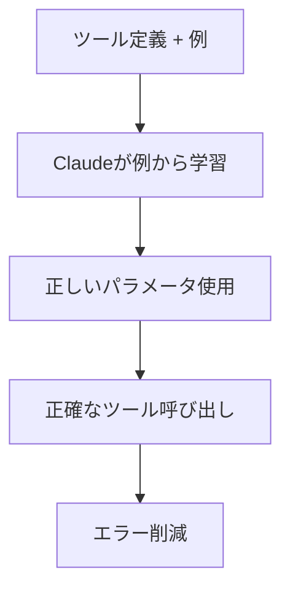

## 要約（Summary）

Tool Use Examplesは、ツール定義に使用例を追加することで、Claudeが正しいパラメータ使用とフォーマットを学習する機能。JSONスキーマだけでは表現できない使用パターンを教える。

## 本文（Body）

### 背景・問題意識

JSONスキーマは構造を定義するが、使用パターン（オプションのパラメータ組み合わせ、フォーマット慣習）を表現できない。これにより、ツール呼び出しのエラーや不正確なパラメータ使用が発生。

### アイデア・主張

ツール定義に具体的な使用例を提供することで、Claudeがパターンを学習。正確性を72%から90%に向上させる。例: 日付フォーマット、ID慣習、ネスト構造の使用方法。

### 内容を視覚化するMermaid図

### 具体例・ケース

サポートチケットAPI: 優先度に応じたエスカレーション設定や連絡先情報の使用パターンを例で示す。

### 反論・限界・条件

例の追加でトークン消費が増加。複雑なツールやオプションが多い場合に有効で、シンプルなツールでは不要。

## 関連ノート（Links）

- [[20251129160319-ai-guardrails|AI開発におけるガードレールの重要性]] AIの正確性を高めるガードレールとしての使用例
- [[20251129165841-ai-agent-end-to-end-testing|AIエージェントにおけるエンドツーエンドテスト]] テストにおけるパラメータ正確性の検証
- [[20251129160322-junior-engineer-growth-with-ai|ジュニアエンジニアの成長戦略としてのAI活用]] ジュニアエンジニアがAIを活用して正確なツール使用を学ぶ
- [[20251129225833-coding-agent-strengths-weaknesses|コーディングエージェントの得意・苦手パターン]] コーディングエージェントの弱点を補う使用例
- [[20251129165842-long-running-agent-failure-modes-solutions|長時間実行エージェントの失敗モードと対策]] 失敗モードを防ぐための正確なツール呼び出し

## To-Do / 次に考えること

- [ ] Tool Use Examplesの作成ガイドラインをまとめる
- [ ] 自APIのツールに例を追加
- [ ] 効果測定