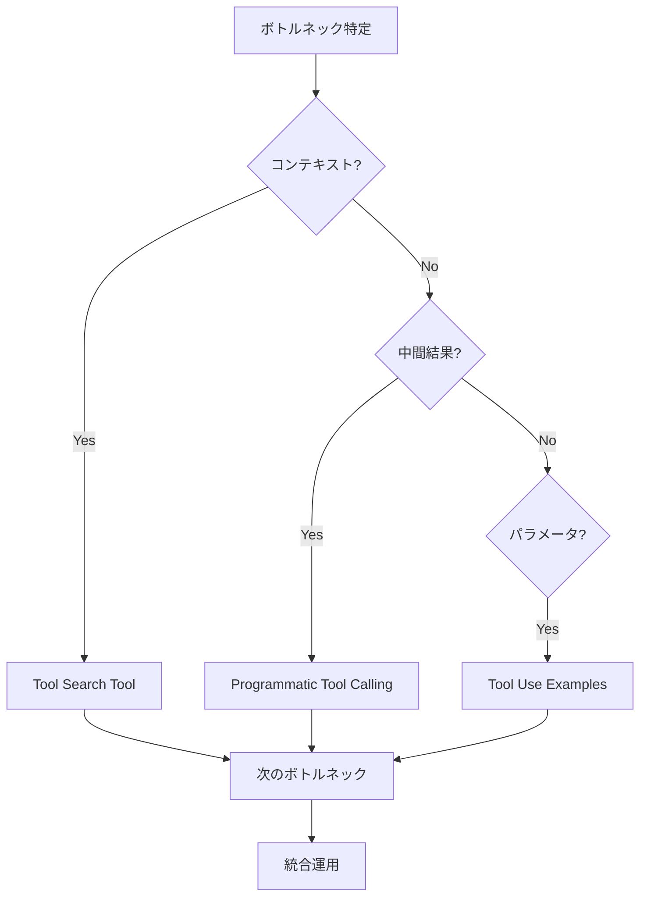

## 要約（Summary）

Tool Search Tool、Programmatic Tool Calling、Tool Use Examplesを戦略的に組み合わせることで、AIエージェントのツール使用を効率的かつ正確に実現。ボトルネックに応じて機能を層状に適用。

## 本文（Body）

### 背景・問題意識

AIエージェントが複雑なワークフローを扱う際、コンテキスト消費、実行効率、パラメータ正確性の課題が同時に発生。これらを個別に解決するのではなく、統合的にアプローチする必要。

### アイデア・主張

最大のボトルネックから始め、機能を層状に追加: コンテキスト膨張→Tool Search Tool、結果汚染→Programmatic Tool Calling、パラメータエラー→Tool Use Examples。これにより、包括的なツールオーケストレーションが可能。

### 内容を視覚化するMermaid図

### 具体例・ケース

MCPサーバー統合: Tool Searchでツール発見、Programmaticで並列実行、Examplesで正確な呼び出し。

### 反論・限界・条件

すべての機能を同時に使用すると複雑さが増す。シンプルなユースケースでは一部のみ適用。

## 関連ノート（Links）

- [[20251129160317-ai-role-division-what-why-how|AI連携開発における役割分担の原則]] AI役割分担におけるツール使用の最適化
- [[20251129165840-feature-list-task-management|フィーチャーリストによるタスク管理]] フィーチャーリスト管理でのツール統合
- [[20251129164130-active-deadline-communication|タスク期日の積極的コミュニケーション]] コミュニケーションにおける効率的ツール使用
- [[20251129160321-ai-delegation-failure-patterns|AI丸投げの失敗パターン]] AI委譲の失敗パターンを避けるためのベストプラクティス
- [[20251129225834-why-how-separation-in-ai-era|AI時代におけるWhyとHowの分離]] Why-How分離におけるツールの役割
- [[20251201000200-tool-use-examples-overview|Tool Use Examplesによるツール使用パターンの学習]]
- [[20251201000100-programmatic-tool-calling-overview|Programmatic Tool Callingによるコードベースのツールオーケストレーション]]
- [[20251201000000-tool-search-tool-overview|Tool Search Toolによるオンデマンドツール発見]]

## To-Do / 次に考えること

- [ ] 自プロジェクトでの組み合わせ適用
- [ ] パフォーマンス測定
- [ ] ドキュメント更新