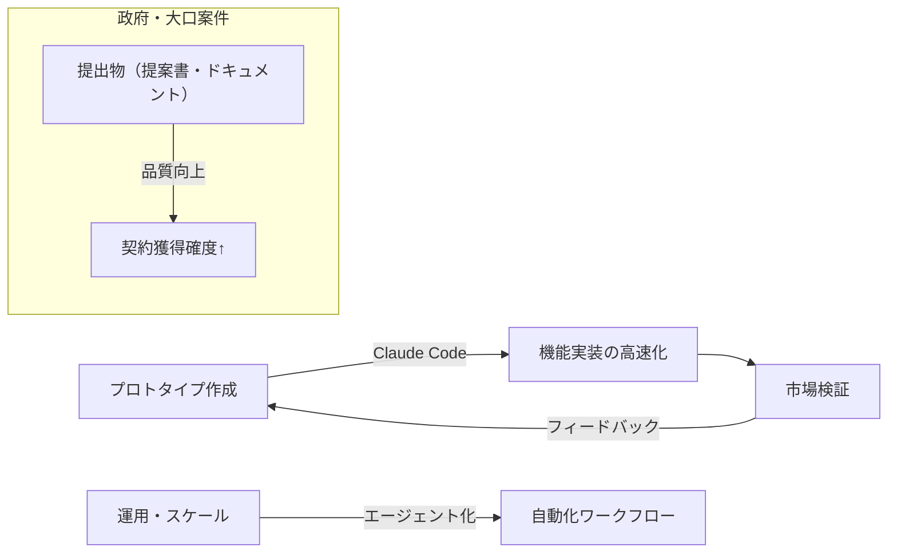

## 要約（Summary）

- Claude Code を活用した YC の 3 社の事例は、共通して「人間＋生成AI」の反復サイクルを設計し、プロダクト開発・契約獲得・運用スケールの各フェーズで明確な利点を生んでいる。
- 重要な学びは「高速なプロトタイピングで市場検証を短縮する」「AI を使ったドキュメント・提出物の品質と一貫性で行政・政府案件を勝ち取る」「エージェント的ワークフローで運用工数を下げスケールさせる」の 3 点。

## 本文（Body）

この記事は個別の企業名や細かな数字に踏み込まず、3 つの代表的な活用パターンとそれぞれの効果を示している。ここでは記事の主要メッセージを再構成し、将来的に使える示唆を抽出する。

### 背景・問題意識

- スタートアップはリソースが限られるため、コード作成・ドキュメント作成・顧客対応の効率化が成長の鍵になる。
- 生成 AI（ここでは Claude Code）は単純なコード補完を超え、設計・提出物作成・部分的な自動化ワークフローで価値を出せる。

### アイデア・主張

- 主張: Claude Code の真価は「開発速度の短縮」だけでなく、「標準化された成果物を安定的に出すことでビジネス機会を広げる」点にある。

根拠:
- 記事内の 3 事例はそれぞれ別のビジネス効果（MVP の高速化、政府契約の獲得、運用スケール）を示しており、どれも人間の検証ループと組み合わせることで実効性が出ている。

### 内容を視覚化するMermaid図

### 具体例・ケース（抽象化）

- 事例 A: Claude Code を使って最初のプロトタイプを短時間で作り、早期顧客フィードバックを得てピボットを高速に進めた。
- 事例 B: 提案書や規格書などの定型ドキュメント生成で品質と一貫性を担保し、形式審査が厳しい政府案件で勝利した。
- 事例 C: 小さな自動化エージェントを複数組み合わせ、保守や定常処理の人手を減らしてプラットフォームをスケールさせた。

### 反論・限界・条件

- 生成 AI による出力は誤りや安全性の問題を含む可能性があるため、人間のレビューとテストが不可欠。
- 法的・倫理的リスク（データの取り扱い、コンプライアンス）に注意。
- 政府案件などでは説明可能性と監査可能な手順が求められるため、AI の出力に対するトレーサビリティを整備する必要がある。

## 関連ノート（Links）

- [[20251129160319-ai-guardrails|AI開発におけるガードレールの重要性]]
- [[20251129160320-ai-task-granularity|AIへのタスク粒度と効率の関係]]
- [[20251129165839-coding-agent-incremental-progress|Coding agentによるインクリメンタル進捗]]
- [[20251129165842-long-running-agent-failure-modes-solutions|長時間実行エージェントの失敗モードと対策]]
- templates/general.md

## To-Do / 次に考えること

- [ ] 記事中の各事例について、可能なら元記事の引用箇所や企業名を調べて追記する（出典の明確化）。
- [ ] 自分のプロジェクトで試す 3 週間ハックの計画を立てる（プロトタイプ→検証→改善）。
