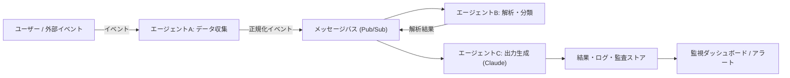

## 要約（Summary）

- 複数の小さな自動化エージェント（タスク指向）を組み合わせることで、機能のスケールと運用コスト削減を両立できる。Claude Code はエージェントのロジック生成、ドキュメント化、応答生成パイプラインの構成要素として有用である。

- ただし、長期実行・状態管理・説明可能性が必要なワークロードでは追加の設計（状態ストア、監査ログ、トレーサビリティ）が不可欠。

## 本文（Body）

このノートは「エージェント的ワークフロー」を、技術的かつ運用上の観点から整理する。

### 背景・問題意識

- スタートアップやプロダクトチームは、少人数で多機能を維持しつつ迅速に改善を回す必要がある。大きなモノリシック自動化は変更コストが高く、障害切り分けが難しい。
- 小さなエージェント（単一責任）を組み合わせると、デプロイ単位・責任範囲が小さくなり、ロールアウトとロールバックが容易になる。
- しかし、エージェント群が増えると「相互依存」「状態整合性」「監視負荷」が課題になる。それらをシステム設計で吸収する必要がある。

### 主張と設計原則

- 主張: Claude Code を "エージェントのコンポーネント"（ロジック・テスト・ドキュメント生成）として設計すると、実装速度と運用効率の両方が改善する。ただしガードレールと監査を前提にする。

設計原則（優先順）:
- 単一責任: 各エージェントは 1 つの明確な機能を持つ（例: データ収集、正規化、解析、通知）。
- 明示的契約: 入力・出力（スキーマ／イベント）を契約として定義し、自動テストを生成する。
- フェイルファースト & リトライ: エラーは早く検出し、意味あるリトライ戦略を持つ。
- 観測可能性: メトリクス・ログ・トレースを必須化し、SLO を定義する。
- トレーサビリティ: Claude に渡したプロンプト、モデル出力、バージョンを保存する（監査ログ）。

実践ポイントの具体例:
- 各エージェントの API 契約を OpenAPI / JSON Schema で記述し、Claude に対して "出力はこのスキーマに従え" と明示する。
- 生成コードは必ずユニットテストと契約テストを自動生成させるワークフローを導入する（CI で実行）。
- 監視: エージェント毎に成功率・レイテンシ・処理数を計測し、閾値超過でエスカレーションする。

例: 入力 / 出力契約（JSON Schema の抜粋）

```json
{
  "$id": "https://example.com/schemas/agent-result.json",
  "type": "object",
  "properties": {
    "request_id": {"type": "string"},
    "status": {"type": "string", "enum": ["ok","retry","error"]},
    "payload": {"type": "object"}
  },
  "required": ["request_id","status"]
}
```

### アーキテクチャ例（PoC）

以下は小さなエージェント 3 つを組み合わせた PoC の概略。各エージェントは小さなマイクロサービスで、メッセージバス（Pub/Sub）でつながる。



各要点:
- メッセージバスは非同期処理とスケールを容易にする。
- Claude を呼ぶエージェントは API 呼び出しのタイムアウトと再試行ポリシーを明確にする。
- 監査ストアにプロンプト／応答を保存して、いつでも再評価できるようにする。


### テスト戦略

- ユニットテスト: 各エージェントのビジネスロジックを小さく分けてテスト。
- 契約テスト: 入出力スキーマに対するテストを自動生成し CI に組み込む。
- インテグレーション: メッセージバスをスタブ化して、エージェント間のやり取りを検証する。
- エンドツーエンド: 本番に近い環境で Claude を用いた E2E を週次で回し、コストと品質を監視する。
- カオステスト: 失敗シナリオ（遅延、タイムアウト、部分的なデータ欠損）を定期的に試して回復性を検証する。

### 監視・観測（Observability）

- 必須メトリクス: success_rate, error_rate, processing_latency_ms, throughput, retry_count
- ログ: 入力イベント、プロンプト、モデル応答、エラー詳細、request_id を含める。ログは検索可能にしておく。
- トレース: 分散トレーシング（OpenTelemetry）でエージェント間の遅延原因を特定する。
- SLO / SLA: 重要なパスに対する期待値（例: 90% のリクエストを 1 秒以内に処理）を定義する。

### セキュリティ・プライバシー

- プロンプトに個人情報や秘匿データを含めない。どうしても必要な場合はデータをマスキング／トークン化する。
- Claude や外部 API に送信するデータの取り扱いは契約とポリシーで明確化する。
- 出力検証: 法的文書・契約条件など重要な出力は必ず人間による確認を義務化する。

### 失敗モードと回復パターン

- 一部のエージェントが異常増加するとメッセージバスにバックプレッシャーが発生する → バックプレッシャー制御（レートリミット、キューの優先度）を導入。
- Claude の応答異常（不整合・幻覚） → 出力スコアリングとポリシーチェックで遮断し、人間レビューパスへフォールバック。
- 長期状態の整合性破壊 → トランザクション境界を明確にし、イベントソーシング／補正ジョブを用意する（補正バッチ処理）。

### 指標（KPI）例

- 平均応答レイテンシ（ms）
- 正常完了率（%）
- 手動レビューが必要になった割合（%）
- Claude によるコスト / リクエスト

### 実践チェックリスト（運用開始時）

1. 入出力契約 (JSON Schema/OpenAPI) を作成したか
2. 生成プロンプトと応答を監査ストアに保存する仕組みがあるか
3. リトライとエスカレーションのポリシーが文書化されているか
4. 監視ダッシュボードが作られ、アラート閾値が設定されているか
5. セキュリティレビュー（データ取り扱い）が完了しているか

## 関連ノート（Links）

- [[20251129165842-long-running-agent-failure-modes-solutions|長時間実行エージェントの失敗モードと対策]]
- [[20251129165839-coding-agent-incremental-progress|Coding agentによるインクリメンタル進捗]]
- [[20251129160319-ai-guardrails|AI開発におけるガードレールの重要性]]

## To-Do / 次に考えること

- [ ] 小さなエージェント 3 つを組み合わせたミニ PoC を設計して実験する（監視・リトライ含む）。
- [ ] PoC のための簡易アーキテクチャ図とタスク分解を作成する（実装担当者 1 名、期間 2 週間）。
