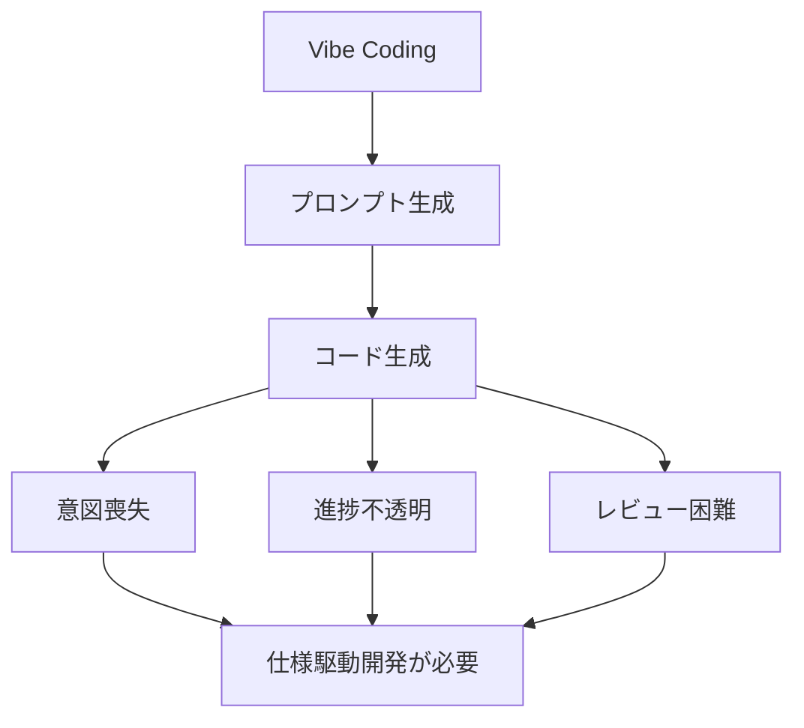

## 要約（Summary）

AIコーディング時代におけるVibe Codingの限界として、意図の喪失、進捗の不透明性、レビューの困難さという3つの構造的問題が存在する。これらは技術的限界ではなく、プロセスそのものに内在する課題である。

## 本文（Body）

### 背景・問題意識

2025年、Andrej Karpathyが提唱した「Vibe Coding」はLLMの進化により可能になったが、8ヶ月後の彼自身のプロジェクトで限界が露呈した。技術的限界（データ分布の偏り）だけでなく、プロセスレベルの問題が浮上している。

### アイデア・主張

Vibe Codingはプロンプトでコード生成するが、開発者の意図が記録されず、進捗が見えず、レビューが困難になる。これを解決するには仕様駆動開発（SDD）が有効である。

### 内容を視覚化するMermaid図

### 具体例・ケース

- 意図の喪失: 在庫切れ通知のプロンプトで生成したが、真の意図は自動削除だった。Slack遡って判明。
- 進捗の不透明性: AI実装中としか答えられず、どこまで完了か把握不能。
- レビューの困難さ: AI生成コードのレビューで「なぜこのロジックか」と質問され、「AIがそうした」としか答えられない。

### 反論・限界・条件

これらの問題はLLMの技術的進化で解決されない。プロセス改革が必要。シンプルなタスクではVibe Codingで十分だが、複雑なものではSDDが必須。

## 関連ノート（Links）

- [[20251129160317-ai-role-division-what-why-how|AI連携開発における役割分担の原則]] AI開発における役割分担とプロセス改善
- [[20251129160318-autonomous-ai-vs-coding-assistant|自律型AIとコーディングアシスタントの使い分け]] AIの使い方と限界
- [[20251129160321-ai-delegation-failure-patterns|AI丸投げの失敗パターン]] AI委譲の失敗と仕様の重要性
- [[20251129225834-why-how-separation-in-ai-era|AI時代におけるWhyとHowの分離]] WhyとHowの分離が意図喪失を防ぐ
- [[20251129165840-feature-list-task-management|フィーチャーリストによるタスク管理]] タスク管理の透明性確保

## To-Do / 次に考えること

- [ ] Vibe Codingの適用ケースをプロジェクトで検証
- [ ] 仕様駆動開発の導入を検討
- [ ] 既存プロジェクトでの意図喪失事例を収集