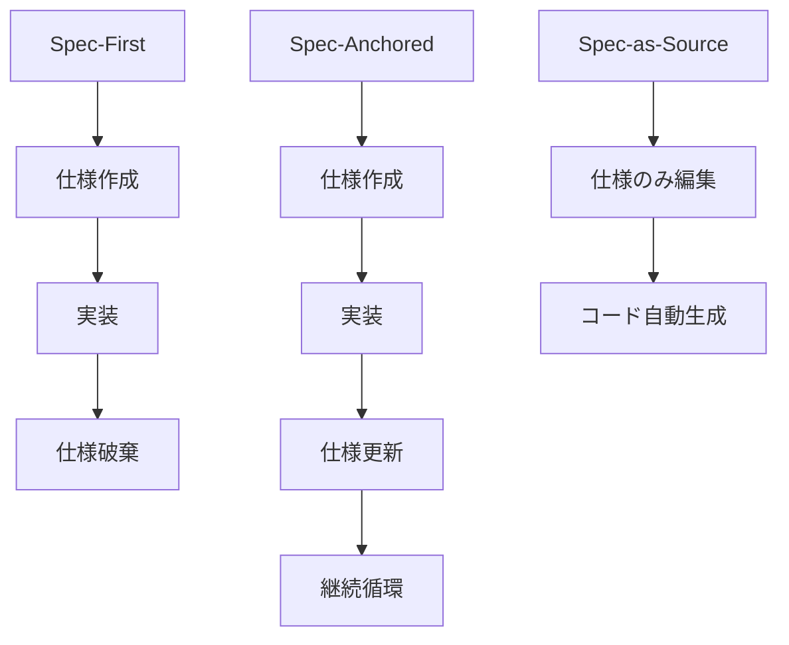

## 要約（Summary）

仕様駆動開発（SDD）はSpec-First、Spec-Anchored、Spec-as-Sourceの3段階で成熟する。Spec-Anchoredが現実的な目標で、仕様を継続的に更新しつつコードも編集可能。ウォーターフォールとは異なり、仕様を循環的に扱う。

## 本文（Body）

### 背景・問題意識

AIコーディング時代のプロセス問題を解決するため、コードより意図を優先するSDDが注目されている。Birgitta Böckelerの分析により、成熟度レベルが定義された。

### アイデア・主張

SDDは仕様を一次成果物とし、継続的に更新する。Spec-Anchoredが最適で、仕様保持とコード編集の柔軟性を両立する。

### 内容を視覚化するMermaid図

### 具体例・ケース

- Spec-First: 仕様書いて実装後破棄。意図喪失のリスク。
- Spec-Anchored: 仕様保持し更新。6ヶ月後のバグ修正で仕様参照可能。
- Spec-as-Source: コード編集禁止。理想だがツール成熟待ち。

### 反論・限界・条件

Spec-as-Sourceは制約が厳しく、現実的でない。ウォーターフォールは直列だがSDDは循環。ほとんどのチームはSpec-Anchoredを目指す。

## 関連ノート（Links）

- [[20251206000000-ai-coding-invisible-problems|AIコーディング時代の「見えない問題」]] SDDが解決する問題
- [[20251129160317-ai-role-division-what-why-how|AI連携開発における役割分担の原則]] 役割分担における仕様の位置づけ
- [[20251129225834-why-how-separation-in-ai-era|AI時代におけるWhyとHowの分離]] Whyを仕様で明確化
- [[20251129165840-feature-list-task-management|フィーチャーリストによるタスク管理]] タスク管理と仕様の統合
- [[20251129164130-active-deadline-communication|タスク期日の積極的コミュニケーション]] コミュニケーションにおける仕様の役割

## To-Do / 次に考えること

- [ ] 現在のプロジェクトのSDD成熟度を評価
- [ ] Spec-Anchored導入のステップを計画
- [ ] ウォーターフォールとの違いをチームで議論