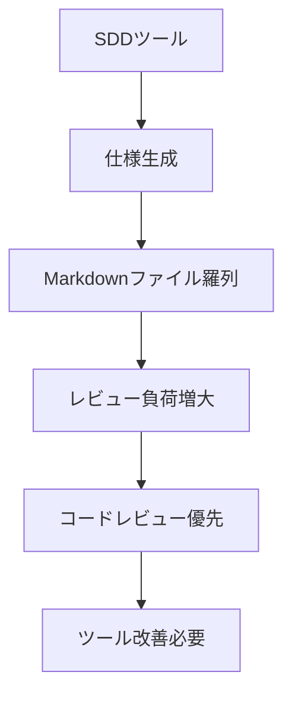

## 要約（Summary）

SDDツールは理念は優れるが、既存ツール（Kiro, Spec Kit）は大量のMarkdownファイル生成によりレビュー負荷を増大させる。開発者はテキストファイルを読むよりコードレビューを好む。

## 本文（Body）

### 背景・問題意識

SDD導入で仕様作成が増えるが、ツールがMarkdown羅列するとレビューが辛くなる。Birgitta Böckelerの分析で指摘された。

### アイデア・主張

SDDツールはレビュー体験を改善する必要がある。テキストベースでは「ハンマーでクルミを割る」ようになる。

### 内容を視覚化するMermaid図

### 具体例・ケース

- Kiro: 小バグ修正で16の受け入れ基準生成。過剰。
- Spec Kit: 重複ファイル生成。著者が「コードレビューしたい」と嘆く。

### 問題の構造化（なぜレビュー負荷が高まるのか）

原因を分解すると主に以下が挙げられる:

- ノイズの多さ: 自動生成されるファイルが冗長で、重要差分が埋もれる
- 重複と碎片化: 同じ情報が複数ファイルに分散しており、一貫性を保つのが難しい
- 優先度の欠如: どの変更がレビュワーにとって重要かを示すメタ情報が不足している
- レビューの粒度ミスマッチ: テキストレベルでの指摘が多く、アーキテクチャ的な判断がしにくい

これらはツール設計（出力粒度、メタデータ付与、差分集約）と運用設計（一次ソースの決定、レビューSLA）に起因する。

### 改善提案（UI/UX と 自動化）

以下は現場で実行可能な改善案のリストで、PoCで検証しやすい順に並べてある。

1) 差分ファーストのUI

- 生成物を一覧表示する際、まずdiff/summaryを表示して重要度が高い変更を上位に見せる。
- 実装: 変更行数、ファイルタイプ、AC関連度でスコアリングする。

2) 自動要約（AIサマリ）

- 各自動生成ドキュメントに対して短い要約（3行）と重要ポイント（5つ）を自動生成し、レビュワーの目を誘導する。

3) 変更のグルーピング/バンドル

- 関連する変更を機能単位で束ね、レビュワーがコンテキストを一度に把握できるようにする（例: 型変更+ユーティリティ+UI変更 を1つのバンドルにする）。

4) メタデータと優先度付け

- 生成物に `impact: low|medium|high` を自動推定して付与。
- 影響がhighのもののみ必須レビューにする等、トリアージルールを導入。

5) レビュー支援ツール（チェックリスト, 自動検証）

- ドキュメント生成時にAC→テストテンプレートを自動紐付けし、CIで自動検証できるゲートを追加する。

### PoCチェックリスト（30分で試せる）

1. 既存SDDツールで1機能分の仕様を生成
2. 自動生成されたドキュメントの要約（AI）を追加する小スクリプトを作成
3. ダッシュボードでdiff-first表示を行い、レビュー時間をサンプルで計測
4. 結果を2週間で比較し、レビュー時間と承認往復回数を評価

### 成功基準（PoC）

- 平均レビュー時間が20%以上短縮される
- 承認往復回数が30%以上減少する
- レビュワーの主観満足度がA/Bで有意に向上する

### 技術的な実装ヒント

- AI要約: small LLM を利用してヘッダー＋箇条書きの要約を作る（内部運用なら軽量モデルで十分）
- 差分スコアリング: git diff の行数、変更ファイルの種類（.ts,.md,.sql）、ACタグのマッチング数で重み付け
- バンドル化: タスクIDやspec-idで変更をグループ化し、ダッシュボード単位で表示

### 運用面の提案

- 一次ソース定義: どのファイルが編集の一次ソースか（例: `product.md`）をチームで明文化
- レビューSLA: 重要変更は24時間以内に初回レビューを実施する等のSLAを義務化
- 定期的なクリーンアップ: 古い/放置されたspecは自動アーカイブしてノイズを減らす

## 関連ノート（Links）

- [[20251206000003-spec-workflow-mcp-overview|仕様の概要]]
- [[20251206000004-spec-workflow-mcp-workflow|ワークフロー詳細]]
- [[20251206000005-spec-workflow-mcp-blueberry-effect|ブルーベリー効果の測定]]

## To-Do / 次に考えること

- [ ] PoCスクリプト（AI要約 + diff-firstビュー）を作る
- [ ] チームで一次ソースの合意を取り付ける
- [ ] 2週間のPoCを設計してデータ収集方法を確定する

## 関連ノート（Links）

- [[20251206000001-sdd-maturity-levels|仕様駆動開発の成熟度レベル]] SDDのレベルとツール課題
- [[20251129160321-ai-delegation-failure-patterns|AI丸投げの失敗パターン]] 委譲失敗とレビュー困難
- [[20251129165840-feature-list-task-management|フィーチャーリストによるタスク管理]] タスク管理の効率化
- [[20251129164130-active-deadline-communication|タスク期日の積極的コミュニケーション]] コミュニケーション改善
- [[20251206000000-ai-coding-invisible-problems|AIコーディング時代の「見えない問題」]] レビューの困難さ

## To-Do / 次に考えること

- [ ] 既存SDDツールのレビュー体験を評価
- [ ] 改善案を検討
- [ ] チームでのレビュー負荷を測定