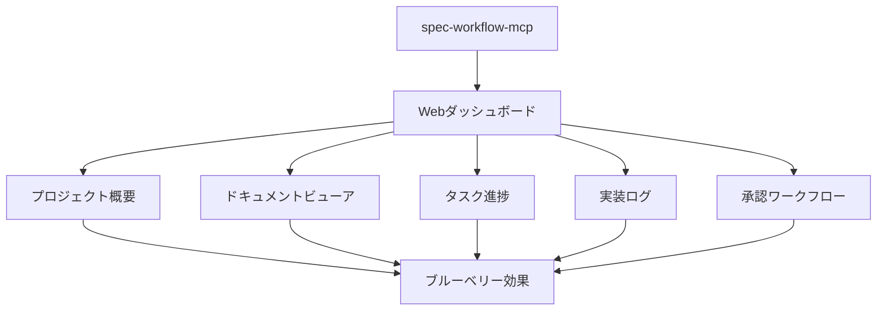
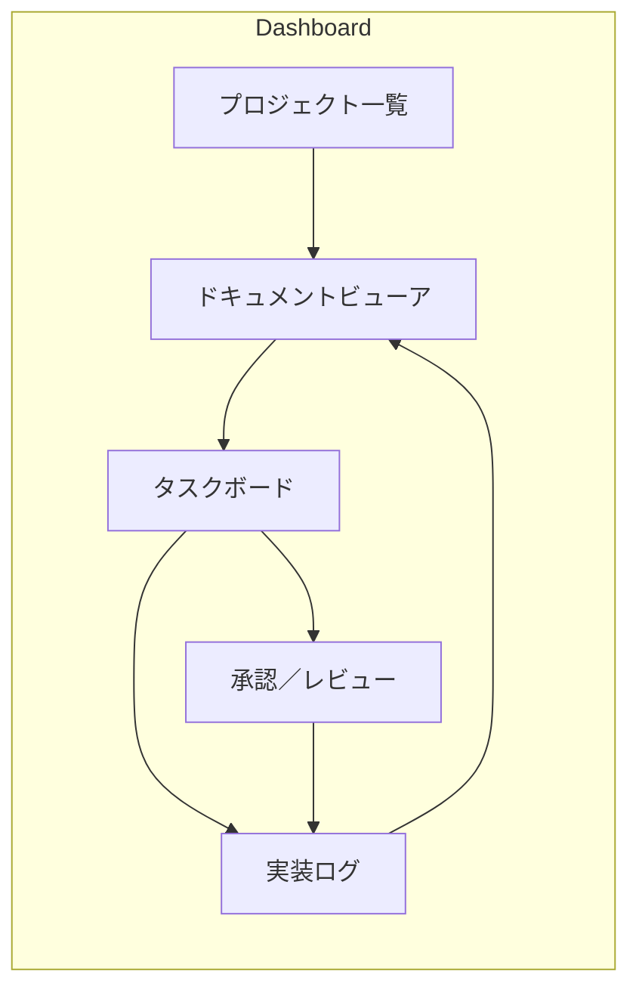

## 要約（Summary）

spec-workflow-mcpはリアルタイムWebダッシュボードを中心に据えた仕様駆動開発（SDD）ツールチェインで、ドキュメント中心の運用が抱える「レビュー負荷」と「進捗不透明性」を視覚化とワークフローで軽減する。マルチプロジェクト対応、承認ワークフロー、実装ログのトレーサビリティが特徴で、組織での採用を意識した運用設計がなされている。

このノートでは、目的・コアコンポーネント・導入手順（最小限）・実装例（TODOアプリの期限機能）・評価指標・運用上の注意点まで、実用的に掘り下げる。

## 本文（Body）

### 背景・問題意識

SDDを導入すると仕様文書が増え、レビュワーの負担が増大しがちである（Markdownファイルの羅列は可読性が低い）。さらに、AIと人間が混在するワークフローでは進捗や「意図」のトレーサビリティが失われやすい。spec-workflow-mcpはこの文脈で設計され、ドキュメントを単なるファイルの集合ではなく「操作できるオブジェクト」として扱うことでレビュー体験を改善する。

### アイデア・主張

リアルタイムダッシュボードは単なる表示ではなく、以下の機能を通して開発体験を変える:

- 即時フィードバック: 仕様→実装→ログ の循環をダッシュボード上で追跡できる。
- 構造化レビュー: ドキュメント上で箇所指定の注釈、全体コメント、承認フローを回せる。
- タスク実行と証跡: 各タスクに対して実行ログや差分が紐づき、誰が何をやったかを追跡できる。

これにより、レビュワーは「何を読むべきか」「どの差分が重要か」を気軽に判別できるようになる。

### 内容を視覚化するMermaid図





### 具体例・ケース

- プロジェクト概要: 全spec一覧、ステータス表示。
- ドキュメントビューア: Markdownレンダリング、アノテーション。
- タスク進捗: 視覚的バー、依存関係。
- 実装ログ: 検索可能ログ、コード統計。
- 承認ワークフロー: レビュー統合。

事例（TODOアプリに期限機能を追加）

- Steering: `product.md` に「期限での優先度管理を簡易に行う」方針を記載。
- Requirements: EARS 形式で Acceptance Criteria を作成（期限設定、警告表示、詳細表示など）。
- Design: `Todo` 型に `dueDate?: string` を追加、`dateUtils` を作成。
- Tasks: 型定義追加、ユーティリティ作成、フォーム/リスト/詳細の UI 変更をタスク化。
- Implementation: 各タスクの実行ログがダッシュボードに残り、レビュワーは差分と実装ログを合わせて承認できる。

### 反論・限界・条件

注意点と制約

- セットアップと運用コスト: ダッシュボード＋MCPサーバーの部署導入には設定と運用ルールの定着が必要。
- ドキュメントの質依存: 自動生成だけで品質は担保されない。テンプレートとレビューポリシーが必要。
- 情報の冗長化: Markdownとダッシュボードの二重管理が発生しうる。取り扱いルール（どちらを編集の一次ソースにするか）を明確にすること。

これらは運用ルールと小さなPoCで早期に検証することで緩和可能である。

## 関連ノート（Links）

- [[20251206000002-sdd-tools-review-burden|SDDツールのレビュー負荷問題]] このツールが解決する問題
- [[20251129165840-feature-list-task-management|フィーチャーリストによるタスク管理]] タスク管理の視覚化
- [[20251129164130-active-deadline-communication|タスク期日の積極的コミュニケーション]] コミュニケーション改善
- [[20251129160317-ai-role-division-what-why-how|AI連携開発における役割分担の原則]] 役割分担とツール
- [[20251206000000-ai-coding-invisible-problems|AIコーディング時代の「見えない問題」]] 進捗不透明性の解決
- [[20251206000004-spec-workflow-mcp-workflow|spec-workflow-mcpのワークフロー]] ワークフローの詳細
- [[20251206000005-spec-workflow-mcp-blueberry-effect|spec-workflow-mcpのブルーベリー効果]] 効果の整理

## To-Do / 次に考えること

- [ ] 小規模PoCでダッシュボードを起動してみる
- [ ] チーム向けのレビューガイドラインを作成する
- [ ] 2週間運用してレビュー負荷が軽減するか計測する（KPI を定義すること）

---

### 最小限のセットアップ例（ローカルで試す）

1. ダッシュボード起動（npx 例）

```bash
npx -y @pimzino/spec-workflow-mcp@v2.0.9 --dashboard
```

2. プロジェクトを追加（claude mcp 経由の例）

```bash
cd /path/to/your/project
current_path=$(pwd)
claude mcp add spec-workflow npx @pimzino/spec-workflow-mcp@v2.0.9 -- "$current_path"
```

3. ブラウザで http://localhost:5000 を開く（デフォルトポート）

4. クイックチェック項目

- ダッシュボードにプロジェクトが表示されるか
- Steering/Requirements/Design/Tasks の各ドキュメントが `.spec-workflow/` 配下に作成されているか
- 承認フローで「Annotate」「Request change」「Approve」が機能するか

---

### 成功指標（KPI）

- レビュー時間の短縮: 平均レビュー時間（分）をPoC前後で比較
- 承認サイクル回数: 仕様提出から承認までの平均往復回数
- 意図の再現率: バグ修正時に「なぜこの設計か」が仕様で説明できる割合（サンプリング調査）

---

### 運用上の推奨ルール

- Spec-Anchored を採用: 仕様は成果物として保持し、変更時に必ず理由を記載する。
- 1つのソース・オブ・トゥルースを決める：通常は`product.md`/`requirements.md`を一次編集点とする。
- 小さなタスクは簡略化: 小規模修正は軽量な承認フローに切り替えるガバナンスを用意する。
- 定期的なドキュメント整理: 生成されるMarkdownや古いSpecsを一定期間で掃除するジョブを設定する。

---

### 参考（外部）

- spec-workflow-mcp リポジトリ: https://github.com/Pimzino/spec-workflow-mcp
- spec-workflow-mcp npm: https://www.npmjs.com/package/@pimzino/spec-workflow-mcp
- SDD の成熟度解説（Martin Fowler 記事）

---

上記を追加しました。内容の追加・語調の調整や、さらに深掘りしたいセクション（例：セキュリティ、CI 統合用の具体的設定、VSCode拡張との組合せ）を教えてください。