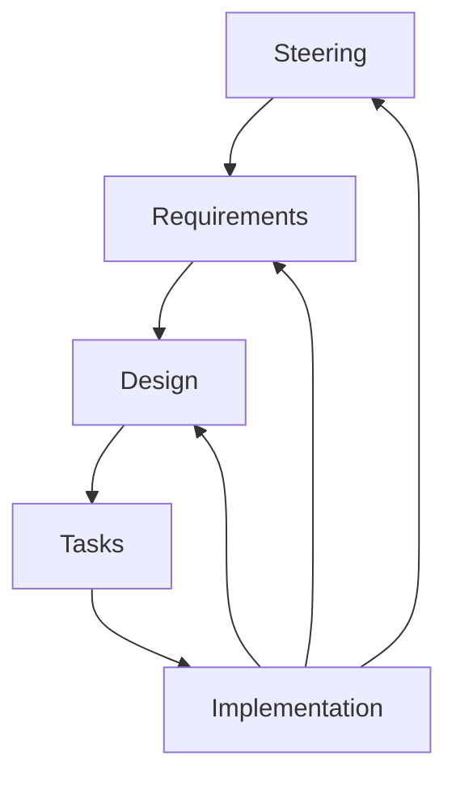

## 要約（Summary）

spec-workflow-mcpはSteering、Requirements、Design、Tasks、Implementationの5フェーズで開発。ダッシュボードで進捗管理、アノテーションでレビュー。TODOアプリ期限機能追加例で実践的。

## 本文（Body）

### 背景・問題意識

SDDを実践的に運用するため、フェーズ分けが必要。spec-workflow-mcpは5フェーズで構造化。

### アイデア・主張

各フェーズで仕様生成、レビュー、承認を繰り返す。ダッシュボードで視覚化し、効率化。

### フェーズ別に深掘り（Steering → Requirements → Design → Tasks → Implementation）

各フェーズでの期待成果物、関係者の役割、AIとのインタラクション例、承認基準を具体的にまとめる。

1) Steering（プロジェクト方針）

- 目的: プロダクトの目的、制約、主要な非機能要件、リスク、スコープを定義する。
- 成果物: `product.md`, `tech.md`, `structure.md`。
- 関係者: プロダクトマネージャ、アーキテクト、チームリード。
- AIの役割: 初期ドラフト作成、テンプレート充填、既存ドキュメントからのサマリ抽出。
- 承認基準: 主要KPIが明記されていること、非機能要件が技術的制約と合致していること。

プロンプト例:

```
Role: Product Manager
Task: Create a steering document for feature X that explains scope, non-functional constraints (privacy, storage), and success metrics.
Output: product.md with sections: Vision, Scope, Constraints, Success Metrics
```

2) Requirements（要件）

- 目的: 仕様をテスト可能な単位（Acceptance Criteria）に落とし込む。
- 成果物: `requirements.md`（EARS や Gherkin 形式のシナリオ）、受け入れ基準、オプトイン/オプトアウトの条件。
- 関係者: プロダクト/QA/エンジニア。
- AIの役割: 要件草案生成、ユースケース列挙、矛盾検出（簡易静的検査）。
- 承認基準: 全ての受け入れ基準が自動テスト化可能であること（少なくともテストの期待値が定義されている）。

Acceptance Criteriaの例:

- WHEN ユーザーが期限日時を入力 THEN システムは ISO 8601 形式で保存する
- WHEN 期限が過ぎた AND タスク未完了 THEN システムは期限超過フラグを表示する

3) Design（設計）

- 目的: 実装の契約（インターフェース、型定義、API仕様、データモデル）を決め、AIに渡せる形にする。
- 成果物: `design.md`（インターフェース図、型定義、UIモック）、技術的選択理由のメモ。
- 関係者: エンジニア、アーキテクト。
- AIの役割: 設計案の雛形作成、代替案提示、コードスニペット生成。
- 承認基準: 主要インターフェースが定義され、互換性・移行計画が書かれていること。

Designのチェック項目:

- 型（Type）の互換性
- データ永続化フォーマット（ISO 8601等）
- パフォーマンス制約（初期ロード2秒等）

4) Tasks（タスク）

- 目的: 実装単位までタスクを分解し、PRやAIに渡すためのプロンプトを作る。
- 成果物: `tasks.md`（各タスクの目的、担当、PRテンプレート、テスト要件）
- 関係者: エンジニア、担当者、AIエージェント。
- AIの役割: タスクに対する実装（コード/テスト）を生成、差分を作成。
- 承認基準: 各タスクが成功基準を満たすテストを持つこと。

タスク例（短い）:

- Task: Add `dueDate` to `Todo` type
  - File: `src/types/todo.ts`
  - Acceptance: TypeScript compile passes, unit tests for serialization

5) Implementation（実装と検証）

- 目的: 実装の適用、CIでの検証、ダッシュボードでの差分レビューと承認。
- 成果物: PR、実装ログ、CI結果、承認履歴。
- 関係者: 実装担当、レビュワー、QA。
- AIの役割: PRの草案、ユニットテスト、簡易修正（リファクタ）。
- 承認基準: CIが全てのテストに合格し、レビュワーが仕様準拠を確認すること。

### フェーズ間のフィードバックループ

フェーズは直列ではなくループとして運用する。Implementationで見つかった仕様の曖昧さはRequirementsへフィードバックされ、Designが更新される。ダッシュボードはこのフィードバックを時系列で追えることが重要である。



### 承認ワークフロー（実務ルール例）

- 小変更（コードのみ、影響範囲が限定）: 1人のレビューで承認可
- 中変更（インターフェース変更、DBスキーマ）: 2人以上のレビュー + テストフルパス
- 大変更（アーキテクチャ、非互換）: Steering の再承認が必要

### チェックリスト（フェーズ毎のCI/Gate）

- Requirements Gate: すべてのACに対応するテストケースが定義されているか
- Design Gate: API/型の互換性が明文化されているか
- Task Gate: PRテンプレートが埋まっているか（目的/AC/テスト）
- Implementation Gate: CIパス、実装ログ、承認記録があるか

## 具体例・ケース（TODOアプリの期限機能）

- Steering: 期限機能はローカル保存を前提とする。通知は将来拡張。
- Requirements: EARSで 6つのAC を定義（期限追加、表示、並び替え、フィルタ、詳細表示、互換性）
- Design: `Todo`型に `dueDate?: string`、`DueDateStatus` enum、`dateUtils` API を定義
- Tasks: 8つのタスクに分解（型変更、ユーティリティ、フォーム、リスト、詳細、CSS、Hook、テスト）
- Implementation: 各タスクはPR単位で管理。ダッシュボードでステータスを確認し、レビュー後にマージ。

## 反論・限界・条件

フェーズを区切ることでプロセスが複雑に見えるが、ダッシュボードと自動化が整備されればレビュー効率は向上する。重要なのは「どの程度まで自動化するか」「どのドキュメントを一次ソースにするか」をチームで合意すること。

## 関連ノート（Links）

- [[20251206000003-spec-workflow-mcp-overview|spec-workflow-mcpの概要と特徴]] ワークフローの基盤
- [[20251129165840-feature-list-task-management|フィーチャーリストによるタスク管理]] タスク分解の類似
- [[20251129160317-ai-role-division-what-why-how|AI連携開発における役割分担の原則]] フェーズごとの役割
- [[20251129164130-active-deadline-communication|タスク期日の積極的コミュニケーション]] コミュニケーション
- [[20251206000001-sdd-maturity-levels|仕様駆動開発の成熟度レベル]] SDDの文脈

## To-Do / 次に考えること

- [ ] ワークフローの各フェーズを学習
- [ ] 小プロジェクトで試用
- [ ] チームでの適用計画