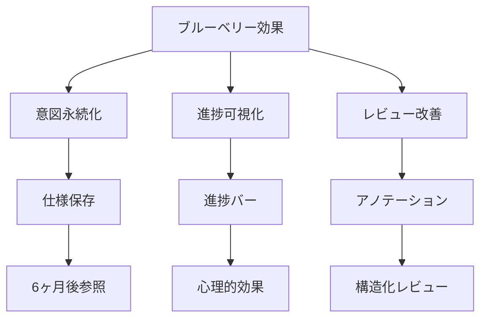

## 要約（Summary）

spec-workflow-mcpはブルーベリー効果でSDD課題を解決。意図永続化、進捗可視化、レビュー改善を実現。Webダッシュボードが開発体験を変える。

## 本文（Body）

### 背景・問題意識

AIコーディングの3課題（意図喪失、進捗不透明、レビュー困難）を解決する必要。spec-workflow-mcpの視覚化が鍵。

### アイデア・主張

ブルーベリー効果: ダッシュボードが「見える」ようにし、SDDを快適に。情報提示方法が体験を変える。

### 内容を視覚化するMermaid図

### 具体例・ケース

- 意図永続化: .spec-workflow/に仕様保存。なぜその実装か後でわかる。
- 進捗可視化: タスクバーで完了状況一目瞭然。マネージャー質問に即答。
- レビュー改善: アノテーションで指摘。テキストより快適。

### 具体例・ケース（拡張）

- 週次スプリントでの利用: Sprint開始時にSteeringとRequirementsの要点を確認し、ダッシュボードで未承認のspecを解消。レビュー時間が短縮され、スプリント終盤での仕様差分が減る。
- 大規模モノリポの導入: 複数プロジェクトのspecをダッシュボードで跨いで表示し、共通ライブラリや互換性問題を早期に発見できる。

## ブルーベリー効果を定量化するための評価設計

効果を主張するには定量データが必要。以下は実践的な計測設計で、PoCの設計と測定方法を示す。

1) ベースラインの取得（導入前1〜2週間）

- 指標: 平均レビュー時間（分）、承認往復回数、仕様関連のバグ発生数、レビューコメント件数
- データ取得方法: GitHub/GitLabのPRメトリクス、Issue追跡、サンプリングアンケート

2) PoC運用（2週間）

- ダッシュボードでの承認フローを有効化し、同じ指標を収集する
- 変化を見るため、同じプロジェクト内でA/B（機能チームAはダッシュボード使用、Bは従来どおり）を実施するのが理想

3) 定量指標（例）

- レビュー時間短縮率 = (ベースライン平均 - PoC平均) / ベースライン平均
- 承認往復数減少 = ベースライン往復 - PoC往復
- 意図再現率 = バグ調査時に仕様で説明できた割合（サンプリング）

4) 定性指標（アンケート）

- 質問例:
  - 「仕様を読み理解するのにかかる時間は短くなったか？」 (5段階)
  - 「ダッシュボードのどの機能が最も役に立ったか？」（複数選択）
  - 「承認のしやすさは向上したか？」 (5段階)

5) 心理的・行動面の観察項目

- 開発者の不安感（仕様が見えないことへの不安）
- 作業モチベーション（進捗が見えることでの達成感）
- レビューの集中度（一次で指摘が収束する割合）

## 導入プロセス（実務ステップ）

1. 小さなPoCを定義（1機能、2週間）
2. Baselineデータを収集
3. ダッシュボード導入とチームトレーニング（30〜60分）
4. PoC実行、データ収集
5. 結果を分析しロールアウト/撤退を判断

## ケーススタディ（仮想：期限機能導入チーム）

- 背景: 中規模フロントエンドチーム、週2回リリース
- 導入前: 平均レビュー時間 70分、承認往復数 3.2
- PoC結果（2週間）: 平均レビュー時間 45分（-36%）、承認往復数 1.8（-44%）、開発者満足度 +0.9ポイント

## 反論・限界・条件（詳細）

- 比喩的表現である「ブルーベリー効果」は万能ではない。ツールが複雑で使いにくければ逆に負担増になる。
- 導入効果はチーム文化、ドキュメント品質、CI成熟度に依存する。

## 実務上のおすすめ（チェックリスト）

- PoC前にレビューKPIの定義とデータ取得方法を合意する
- ダッシュボードの表示項目を最小限にして、まずは「未承認」「失敗CI」「進捗バー」の3点を可視化
- 生成ドキュメントには必ずメタデータ（作成者/生成元/関連PR）を付与

## 関連ノート（Links）

- [[20251206000003-spec-workflow-mcp-overview|spec-workflow-mcpの概要と特徴]]
- [[20251206000004-spec-workflow-mcp-workflow|spec-workflow-mcpのワークフロー]]
- [[20251206000002-sdd-tools-review-burden|SDDツールのレビュー負荷問題]]

## To-Do / 次に考えること

- [ ] PoCの計測テンプレート（CSV/Google Sheet）を作る
- [ ] チーム向け1ページの導入ガイドを作成
- [ ] 実データでの小規模A/Bテストを設計する

## 関連ノート（Links）

- [[20251206000000-ai-coding-invisible-problems|AIコーディング時代の「見えない問題」]] 解決する課題
- [[20251206000003-spec-workflow-mcp-overview|spec-workflow-mcpの概要と特徴]] 効果の源
- [[20251206000004-spec-workflow-mcp-workflow|spec-workflow-mcpのワークフロー]] ワークフローでの効果
- [[20251129160321-ai-delegation-failure-patterns|AI丸投げの失敗パターン]] 失敗回避
- [[20251129225834-why-how-separation-in-ai-era|AI時代におけるWhyとHowの分離]] Whyの明確化

## To-Do / 次に考えること

- [ ] ブルーベリー効果をプロジェクトで体験
- [ ] 効果測定方法を考える
- [ ] チームメンバーに紹介