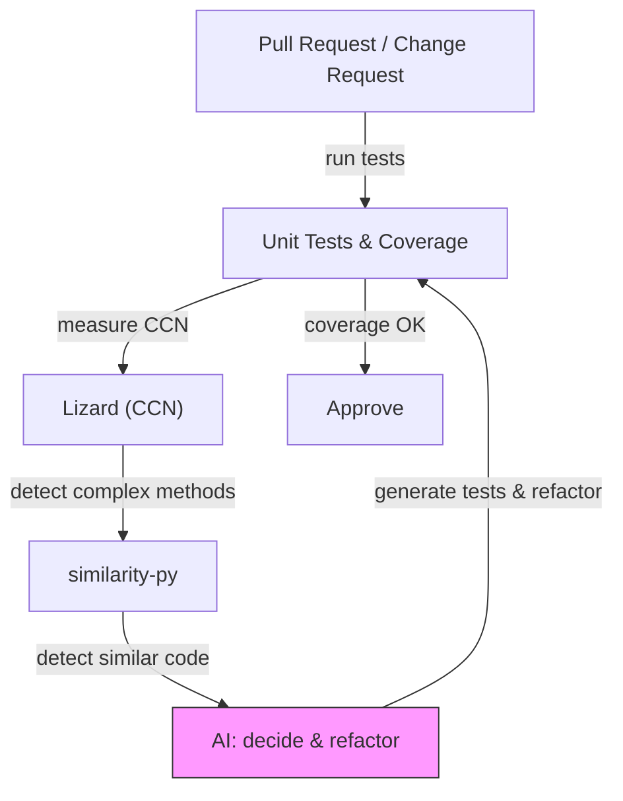

## 要約（Summary）

- 生成AIにより「コードの変更量」と「発散（エントロピー）」の時間発展が速くなる。放置すると似たような責務の短いメソッドが増え、保守性が低下する。
- 有効な対策はテストカバレッジ、サイクロマティック複雑度（CCN）の管理、そして類似度検出による早期検出と自動リファクタである。

## 本文（Body）

1つのアイデア：生成AIは開発スピード（エネルギー）を爆速で供給するため、ソフトウェアの“エントロピー”が従来より速く増大する。エントロピー増大を抑止するには同等かそれ以上の秩序化（ガードレールと自動化）を継続的に投入する必要がある。

なぜ重要か
- AIに機能追加やリファクタを任せると、作業は速く進むが判断基準（どこをまとめるか、何が同種か）は個別の要求ごとにばらける。結果として同種のコード断片が多数生じやすい。

主張（要点）
- 生成AIを“エネルギー源”と見做し、テスト（挙動保証）・複雑度計測（構造の健全性）・類似度検出（重複・汎化候補）を組み合わせて閉ループ化することで、Vibe Codingの恩恵を受けつつ秩序を保てる。

### 背景・問題意識

記事著者は小さなツール開発で実際にAIを多用した体験から、コードが短期間で肥大化・発散する様を観察した。単純に人がやってもエントロピーは増すが、AIで増速した分だけ早めて対処すべき。

### 内容を視覚化するMermaid図

### 具体例・ケース

- 運用ルールの一例:
  - ファイル単位85%カバレッジ目標
  - CCN>10のメソッドはリファクタ対象
  - similarity-pyで同一ファイル内/横断して類似度>=0.8かつ行数>=8のメソッドは差分レビューでAIに判定・必要ならリファクタ

### 反論・限界・条件

- 自動化は万能ではない。UIロジックや外部依存の重いコードは false-positive が増える。
- 類似度しきい値を下げ過ぎると“意図的な類似”まで壊してしまう。

## 関連ノート（Links）

- [[20251129160320-ai-task-granularity|AIへのタスク粒度と効率の関係]] 前提となるタスク細分化
- [[20251129165839-coding-agent-incremental-progress|Coding agentによるインクリメンタル進捗]] コーディングエージェントの小刻み進行
- [[20251129160321-ai-delegation-failure-patterns|AI丸投げの失敗パターン]] AI委譲の失敗パターン

## To-Do / 次に考えること

- [ ] 現行プロジェクトに上記ルールをCIに組み込んでPoCを回す
- [ ] similarity-pyのレポートを2週間ごとにダッシュボード化
- [ ] AI判断のログを保存して誤判定パターンを収集する
