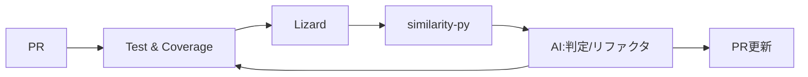

## 要約（Summary）

- PR→テスト→Lizard(CCN)→similarity-py→AI判断→自動リファクタ/テスト生成→再テスト の自動化パイプラインを作ると、Vibe Codingで生じる発散を抑止できる。

## 本文（Body）

このノートは実務で使えるワークフローを示す。目的は「AIで生まれる高速な変化をCIで常時評価し、問題（高CCN・高類似度）を自動で検出してAIに改善を委譲する」こと。

ステップ（具体的）

1. PR作成時にユニットテストとカバレッジを実行。ファイル単位で85%未満のファイルがあればFailか警告。
2. Lizardを実行して各メソッドのCCNを算出。CCN>10のメソッドを抽出して次段階へ通知。
3. similarity-pyを走らせ、しきい値（例: 0.8）かつ最小行数（例: 8行）を満たす類似メソッドを列挙。
4. AIに一覧を渡して「この類似は意図的か？リファクタすべきか？」を判定させる。不要ならコメントで理由を残す。
5. リファクタが必要ならAIにブランチ上で自動変更/テスト生成を行わせ、再度テストを回す。成功したらPRに自動でコメント/更新。

コマンド例

```bash
# similarity-py の実行例
similarity-py src/vtt2minutes/ --threshold 0.8 --min-lines 8

# lizard の実行 (Python例)
lizard -l py src/ | tee lizard-report.txt
```

Mermaidでのフロー図



AIプロンプト例

- 短縮版: "このメソッドAとBは類似度0.85・行数12です。これらをまとめるべきですか？もしまとめるなら具体案とテストを生成してください。"
- 詳細版: "リポジトリのcontext: <repo root>. 対象ファイル: ...（コードスニペット2件）. 類似度0.85, 12行. それぞれの依存関係、公開APIへの影響、パフォーマンスを考慮して、統合案または抽象化案を提案し、対応するユニットテストを生成してください。"

レビュー用チェックリスト

- [ ] テストが追加・修正されており挙動がカバーされている
- [ ] CCNが低下している（対象メソッド）
- [ ] 新設・変更APIの互換性が確保されている
- [ ] AIの説明（理由付け）がPRコメントに残されている

測定指標（KPI）

- 平均CCN（週次）
- 類似検出件数/週（閾値超過）
- 生成AIによる自動修正のマージ率

反論・限界

- 大規模リファクタや設計変更は自動化向きではない。人の判断が必要なケースをAIが過度に自動化すると設計劣化を招く。

## 関連ノート（Links）

- [[20251129172154-backend-temporality-choice|バックエンドによるTemporality選択基準]] 時間的制約と一貫性の選択
- [[20251129160320-ai-task-granularity|AIへのタスク粒度と効率の関係]] タスク細分化とAI委譲の粒度
- [[20251129160318-autonomous-ai-vs-coding-assistant|自律型AIとコーディングアシスタントの使い分け]] 自律エージェントとコーディング支援の違い

## To-Do / 次に考えること

- [ ] 現行リポジトリでCIワークフローを作り、1ヶ月運用して誤検出率を集計
- [ ] AIの判定結果をログ化して評価指標を作る
