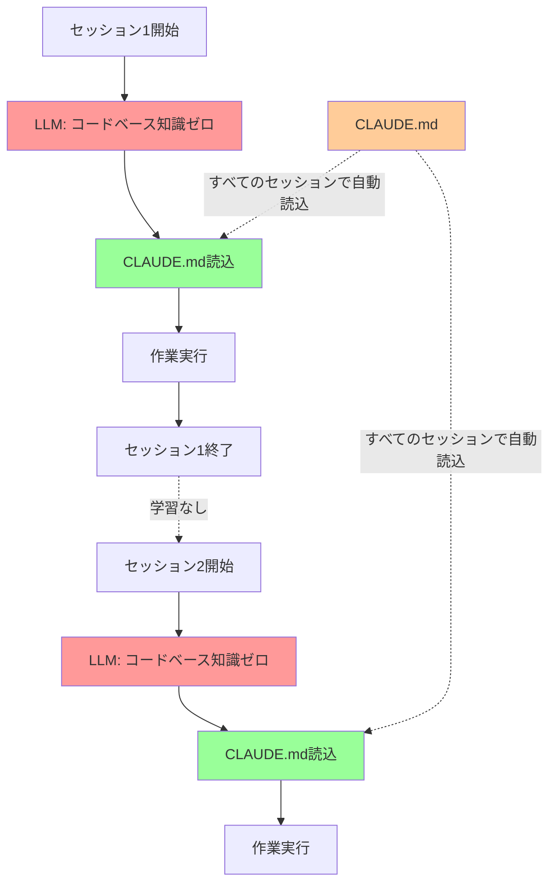

## 要約（Summary）

- LLMは推論時に重みが凍結されたステートレス関数であり、セッション間で学習しない
- コーディングエージェントは各セッション開始時にコードベースについて何も知らない状態からスタートする
- `CLAUDE.md`や`AGENTS.md`のような設定ファイルは、すべてのセッションに自動的に含まれる唯一のファイルであり、コードベースへのオンボーディングに最適

## 本文（Body）

### 背景・問題意識

AIコーディングエージェントを使う際、同じ質問を何度も繰り返したり、プロジェクトの基本的な構造を毎回説明する必要があることに気づく。これはLLMの根本的な特性に起因する問題である。

### アイデア・主張

**LLMのステートレス性は、設定ファイルの役割を極めて重要にする。** LLMは推論時に重みが凍結されており、時間経過による学習は発生しない。モデルがコードベースについて知っているのは、入力されたトークンの内容のみである。

この特性から3つの重要な含意が生まれる：

1. **完全な無知状態からの開始**：コーディングエージェントは各セッション開始時にコードベースについて一切何も知らない
2. **明示的な再教育の必要性**：重要な情報は毎回セッションごとに伝える必要がある
3. **設定ファイルの戦略的重要性**：`CLAUDE.md`や`AGENTS.md`はすべてのセッションに自動的に含まれる唯一のファイルであり、この再教育の最適な手段となる

### 内容を視覚化するMermaid図



### 具体例・ケース

**モノレポでの典型的な問題：**
- エージェントがモノレポ内の異なるアプリケーションの違いを理解せず、間違った場所にコードを書こうとする
- 共有パッケージの役割や依存関係を毎回説明する必要がある
- 採用しているパッケージマネージャ（bun、npm、pnpm等）を毎回指定する必要がある

**`CLAUDE.md`による解決：**
```markdown
# Project Structure
- apps/frontend: Next.js app for user-facing UI
- apps/admin: React admin dashboard
- packages/shared: Common utilities used by both apps
- packages/api-client: Type-safe API client

# Tools
- We use `bun` instead of `npm` or `node`
- Run tests with `bun test`
```

この情報が常にコンテキストに含まれることで、エージェントは毎回正しい場所に正しいツールで作業できる。

### 反論・限界・条件

**限界：**
- 設定ファイルに全情報を詰め込むと、かえって無視される可能性が高まる（後述の「Claudeは`CLAUDE.md`を無視する」問題）
- プロジェクト固有の一時的な指示を入れると、他のタスクで邪魔になる可能性がある
- 設定ファイルのサイズが大きすぎると、コンテキストウィンドウを圧迫する

**成立条件：**
- 設定ファイルの内容が「普遍的に適用可能」である必要がある
- プロジェクトの本質的な構造や方針のみを記述し、詳細は別ファイルで段階的に開示する必要がある

## 関連ノート（Links）

- [[20251129165837-long-running-agent-context-window-problem|長時間実行AIエージェントのコンテキストウィンドウ問題]] コンテキストウィンドウの制約問題
- [[20251129160319-ai-guardrails|AI開発におけるガードレールの重要性]] AI開発におけるガードレールの必要性
- [[20251129165838-initializer-agent-environment-setup|Initializer agentによる環境初期化]] エージェントの環境セットアップ戦略
- [[20251129160317-ai-role-division-what-why-how|AI連携開発における役割分担の原則]] AI連携開発における役割分担（WHY/WHAT/HOWの分離）
- [[20251206-123000-claude-code-agentic-coding-workflows|エージェント的コーディングワークフローとスケール]] Claude Codeのワークフロー全体像

## To-Do / 次に考えること

- [ ] 自分のプロジェクトの`CLAUDE.md`をレビューし、普遍的に適用可能な情報のみに絞り込む
- [ ] 他の設定ファイル管理手法（Progressive Disclosure等）との組み合わせを検討する
- [ ] 設定ファイルの最適な長さと情報密度を実験で検証する
