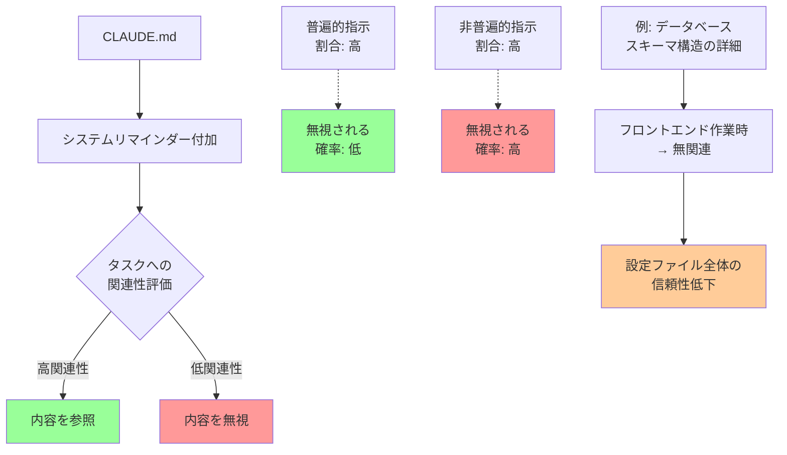

## 要約（Summary）

- Claude Codeは設定ファイルと共にシステムリマインダーを注入し、タスクに関連しない場合は内容を無視するよう指示する
- 普遍的に適用できない指示が多いほど、エージェントが設定ファイル全体を無視する可能性が高まる
- 設定ファイルには「すべてのタスクで普遍的に適用可能な情報」のみを含めるべき

## 本文（Body）

### 背景・問題意識

AIコーディングエージェントに対して設定ファイルで詳細な指示を与えたにもかかわらず、エージェントがそれを完全に無視して動作することがある。これはユーザーにとって混乱を招き、設定ファイルの信頼性を損なう。

### アイデア・主張

**エージェントが設定ファイルを無視するのは、意図的な設計である。** Claude Codeは`CLAUDE.md`の内容と共に、以下のシステムリマインダーをユーザーメッセージに注入している：

```
<system-reminder>
      IMPORTANT: this context may or may not be relevant to your tasks. 
      You should not respond to this context unless it is highly relevant to your task.
</system-reminder>
```

この結果、Claudeは現在のタスクに関連しないと判断した場合、`CLAUDE.md`の内容を無視する。**関連性が低い情報が多いほど、ファイル全体が無視される確率が上がる。**

Anthropicがこの設計を採用した理由は推測だが、多くのユーザーが「望ましくない振る舞いへのホットフィックス」として、普遍的でない指示を`CLAUDE.md`に追加し続けた結果、設定ファイルの品質が低下したためと考えられる。悪い指示を無視させることで、全体としてより良い結果が得られることを発見したのだろう。

### 内容を視覚化するMermaid図



### 具体例・ケース

**悪い例：普遍的でない指示を含む設定ファイル**
```markdown
# CLAUDE.md

## Database Schema
When creating a new user table, always include:
- id (UUID primary key)
- created_at (timestamp)
- updated_at (timestamp)
- email (unique)
- ...20 more lines of schema details...

## API Conventions
All API endpoints should return...
...detailed formatting rules...
```

この設定でフロントエンドのスタイリング作業を依頼すると：
- データベーススキーマの指示は完全に無関係
- エージェントは設定ファイル全体を「このタスクに関連なし」と判断し無視する可能性がある
- 本来従うべきAPI規約すら無視される

**良い例：普遍的な指示のみの設定ファイル**
```markdown
# CLAUDE.md

## Project Structure
- apps/frontend: Next.js UI
- apps/backend: Node.js API
- packages/shared: Common utilities

## Tools
- Use `bun` instead of `npm`
- Run tests: `bun test`
- Format code: `bun run format`

## Verification
Always run type checking and tests before completing a task.
```

この設定は、どのタスクでも関連性が高く、無視される可能性が低い。

### 反論・限界・条件

**潜在的な問題：**
- 「普遍的に適用可能」の判断基準が曖昧で、プロジェクトによって異なる
- 本当に重要な指示でも、他の無関係な指示に埋もれると無視される可能性がある

**対策の条件：**
- タスク固有の詳細指示は、別の段階的開示メカニズム（Progressive Disclosure）で提供する
- 設定ファイルは300行未満、理想的には60行未満に保つ
- 定期的にレビューし、普遍性が失われた指示を削除する

**成立条件：**
- プロジェクトの性質が比較的安定している（頻繁に根本的な変更がない）
- チームメンバー間で「普遍的な指示」の定義が共有されている

## 関連ノート（Links）

- [[20251214135546-llm-stateless-configuration-implication|LLMのステートレス性が設定ファイルに与える影響]] LLMのステートレス性と設定ファイルの役割
- [[20251129160319-ai-guardrails|AI開発におけるガードレールの重要性]] AI開発におけるガードレール設計
- [[20251129165837-long-running-agent-context-window-problem|長時間実行AIエージェントのコンテキストウィンドウ問題]] コンテキストウィンドウの制約
- [[20251129160320-ai-task-granularity|AIへのタスク粒度と効率の関係]] AIへのタスク粒度と効率
- [[20251206-123000-claude-code-agentic-coding-workflows|エージェント的コーディングワークフローとスケール]] Claude Codeの全体的なワークフロー

## To-Do / 次に考えること

- [ ] 現在の`CLAUDE.md`をレビューし、タスク固有の指示を特定して別ファイルに移動する
- [ ] プロジェクトで「普遍的に適用可能」の定義をチームで合意する
- [ ] 設定ファイル無視の発生頻度を計測する仕組みを検討する
- [ ] Progressive Disclosureの具体的な実装方法を調査する
