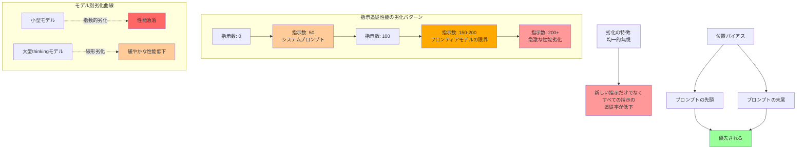

## 要約（Summary）

- 最先端のthinking LLMでも一貫して追従できる指示数は150-200個程度に制限される
- 小型モデルは指数的に、大型モデルは線形に指示追従性能が劣化する
- 指示数が増えると、新しい指示だけでなくすべての指示が均一的に無視されるようになる

## 本文（Body）

### 背景・問題意識

AIエージェントに詳細な指示を与えるほど、エージェントがそれらの指示に従わなくなる現象が観察される。「もっと指示を追加すれば良くなる」という直感は、実際には逆効果になる可能性がある。

### アイデア・主張

**LLMの指示追従能力には明確な定量的限界が存在し、その劣化パターンはモデルサイズと思考能力に依存する。**

研究結果によると：

1. **絶対的限界**：フロンティアthinking LLM（Claude 3.5 Sonnet等）でも、合理的な一貫性を保って追従できる指示数は150-200個程度
2. **モデル依存の劣化パターン**：
   - 小型モデル：指示数増加に対して**指数的な劣化**
   - 大型thinking モデル：**線形的な劣化**
   - 非thinking モデル：thinking モデルより少ない指示数で劣化開始
3. **位置バイアス**：LLMはプロンプトの周辺部（最初と最後）の指示を優先する傾向がある
4. **均一的劣化**：指示数が増えると、新しい指示だけでなく**すべての指示が均一的に無視される**ようになる

**実務への含意：**
Claude Codeのシステムプロンプトには約50個の個別指示が含まれている。これは、利用可能な指示追従キャパシティの約3分の1を占める（150-200個の容量のうち50個）。ユーザーが`CLAUDE.md`で追加できる指示は、実質的に100-150個程度が限界となる。

### 内容を視覚化するMermaid図



### 具体例・ケース

**Claude Codeでの実践的な計算：**

```
システムプロンプト: ~50指示
CLAUDE.md: 30指示（控えめ）
追加プラグイン/スキル: 20指示
合計: 100指示
→ まだ余裕がある（150-200の範囲内）
```

```
システムプロンプト: ~50指示
CLAUDE.md: 100指示（詳細）
追加プラグイン/スキル: 30指示
ユーザーメッセージでの追加指示: 40指示
合計: 220指示
→ 限界を超過、すべての指示の追従率が低下
```

**悪い例：指示過多の`CLAUDE.md`**
```markdown
# コードスタイル
1. インデントは2スペース
2. セミコロンは常に使用
3. 変数名はcamelCase
...（50個の詳細なスタイル指示）

# データベース規約
1. テーブル名は複数形
2. 主キーはid
3. タイムスタンプカラムは必須
...（30個のスキーマ規則）

# API設計
1. RESTful原則に従う
2. HTTPステータスコードは...
...（40個のAPI規則）
```

合計120個の指示は、システムプロンプトの50個と合わせて170個となり、限界に近づく。さらにユーザーが具体的なタスク指示を追加すると、すべての指示の追従率が低下する。

### 反論・限界・条件

**研究の限界：**
- 引用された研究は「厳密に検証された」レベルではない（論文では認めている）
- 実際の限界値は、タスクの複雑さやモデルのバージョンによって変動する可能性がある
- 日本語など非英語言語での限界値は異なる可能性がある

**実務での考慮事項：**
- 150-200という数字は目安であり、絶対的な閾値ではない
- 指示の複雑さや相互依存性も性能に影響する
- 重要な指示をプロンプトの先頭か末尾に配置することで、位置バイアスを活用できる

**成立条件：**
- この限界は「個別の指示」の数を指す（複数の規則を1つの指示にまとめることで実効的な指示数を減らせる）
- 指示が明確で曖昧性が低い場合に最も当てはまる

## 関連ノート（Links）

- [[20251214135704-agent-configuration-ignore-mechanism|AIエージェントによる設定ファイル無視の仕組みと対策]] 設定ファイルが無視される仕組み
- [[20251214135546-llm-stateless-configuration-implication|LLMのステートレス性が設定ファイルに与える影響]] LLMのステートレス性と設定ファイル
- [[20251129165837-long-running-agent-context-window-problem|長時間実行AIエージェントのコンテキストウィンドウ問題]] コンテキストウィンドウの制約問題
- [[20251129160320-ai-task-granularity|AIへのタスク粒度と効率の関係]] タスク粒度と効率の関係
- [[20251129160318-autonomous-ai-vs-coding-assistant|自律型AIとコーディングアシスタントの使い分け]] 自律型AIとアシスタントの使い分け

## To-Do / 次に考えること

- [ ] 現在の`CLAUDE.md`の指示数を実際にカウントし、150個以下に収まっているか確認する
- [ ] 複数の詳細指示を、より抽象的な1つの指示にまとめられないか検討する
- [ ] 重要な指示をプロンプト構造の先頭または末尾に配置する方法を調査する
- [ ] 小型モデルを使う場合の指示数制限（より厳しい）を実験で確認する
