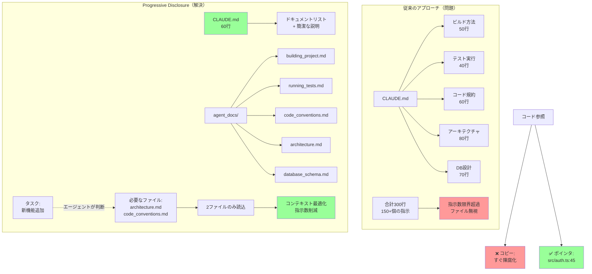

## 要約（Summary）

- Progressive Disclosure（段階的開示）は、必要な情報を必要なときにのみエージェントに提供する設計パターン
- 詳細な指示を自己説明的な名前の別ファイルに分割し、設定ファイルにはファイルリストと簡潔な説明のみを記載する
- エージェント自身が必要なファイルを判断して読み込むことで、コンテキストウィンドウと指示数を最適化できる

## 本文（Body）

### 背景・問題意識

AIエージェント用の設定ファイルに、プロジェクトのビルド方法、テスト実行、コード規約、アーキテクチャなど、すべての詳細を詰め込むと：
- 指示数が限界（150-200）を超える
- 無関係な情報が多く含まれ、設定ファイル全体が無視される
- コンテキストウィンドウが圧迫される

しかし、これらの情報は特定のタスクでは必要不可欠である。

### アイデア・主張

**Progressive Disclosure（段階的開示）は、エージェントのコンテキストウィンドウと指示追従能力の制約を克服する設計パターンである。**

核心的な原則：
1. **情報の外部化**：タスク固有の詳細指示を、自己説明的な名前の別ファイルに分離する
2. **ポインタの提供**：設定ファイルには、ファイルの場所と簡潔な説明のみを記載する
3. **エージェントの自律判断**：エージェント自身が現在のタスクに必要なファイルを判断して読み込む
4. **参照の保持**：ファイル内では実際のコードをコピーせず、`file:line`形式で権威あるソースへの参照を使う

これにより：
- 設定ファイルは短く（60行未満など）、普遍的な情報のみを含む
- 詳細情報は必要なときのみロードされ、コンテキストウィンドウを効率的に使用
- 指示数の限界内に収まる

### 内容を視覚化するMermaid図



### 具体例・ケース

**Progressive Disclosureの実装例：**

`CLAUDE.md`（60行）:
```markdown
# Project Overview
This is a monorepo with frontend and backend services.

## Important Documentation
The following files contain detailed guidelines. 
Read the relevant ones before starting work:

- `agent_docs/building_project.md`: How to build and run the project
- `agent_docs/running_tests.md`: Test execution and CI integration
- `agent_docs/code_conventions.md`: Code style and patterns
- `agent_docs/service_architecture.md`: System architecture overview
- `agent_docs/database_schema.md`: Database design principles
- `agent_docs/api_communication.md`: Inter-service communication patterns

## Quick Start
- Use `bun` for package management
- Run tests before submitting: `bun test`
```

`agent_docs/architecture.md`:
```markdown
# Service Architecture

## Overview
See the architecture diagram at `docs/architecture.png`

## Authentication Service
Implementation: `src/services/auth/index.ts:1-150`
Key pattern: JWT with refresh tokens
Database tables: `users`, `sessions` (see db/schema.sql:45-78)

## API Gateway
Implementation: `src/gateway/routes.ts:1-200`
...
```

**エージェントの動作：**
1. ユーザー：「新しい認証エンドポイントを追加して」
2. エージェント：タスクに必要な情報を判断
3. エージェント：`architecture.md`と`api_communication.md`を読み込み
4. エージェント：参照されたファイル（`src/services/auth/index.ts:1-150`等）を読み込み
5. エージェント：実装開始

**Claude Skillsとの類似性：**
このアプローチは、Claude Skillsの設計思想と似ている。Skillsはツール使用に焦点を当てているが、Progressive Disclosureは指示とコンテキストに焦点を当てている。

### 反論・限界・条件

**潜在的な問題：**
- エージェントが必要なファイルを正しく判断できない可能性がある
- ファイルの読み込みに追加のAPI呼び出しが必要で、レイテンシが増加する
- ファイル間の参照が複雑になると、管理が困難になる

**対策：**
- 必要に応じて、ユーザーがファイルを明示的に指定できるようにする（「`architecture.md`を読んでから実装して」）
- ファイルの説明を明確にし、エージェントが判断しやすくする
- 定期的にドキュメントをレビューし、参照が最新であることを確認する

**成立条件：**
- プロジェクトが十分に大きく、詳細情報の分離が意味を持つ規模である
- ドキュメントファイルの命名が自己説明的で、エージェントが内容を推測できる
- コードベースが比較的安定しており、頻繁な参照更新が不要

## 関連ノート（Links）

- [[20251214135849-llm-instruction-following-limits|LLM指示追従能力の定量的限界と劣化特性]] LLMの指示追従能力の限界
- [[20251214135704-agent-configuration-ignore-mechanism|AIエージェントによる設定ファイル無視の仕組みと対策]] 設定ファイル無視の仕組み
- [[20251214135546-llm-stateless-configuration-implication|LLMのステートレス性が設定ファイルに与える影響]] LLMのステートレス性と設定ファイル
- [[20251129165837-long-running-agent-context-window-problem|長時間実行AIエージェントのコンテキストウィンドウ問題]] コンテキストウィンドウの問題
- [[20251206-123000-claude-code-agentic-coding-workflows|エージェント的コーディングワークフローとスケール]] Claude Codeのワークフロー

## To-Do / 次に考えること

- [ ] 現在の`CLAUDE.md`を分析し、どの情報を別ファイルに分離できるか特定する
- [ ] `agent_docs/`ディレクトリを作成し、タスク固有の詳細をカテゴリ別に分離する
- [ ] ドキュメント内の参照形式（`file:line`）の標準化を検討する
- [ ] エージェントが適切なファイルを選択する精度を測定する
- [ ] Claude Skillsとの組み合わせによる相乗効果を実験する
