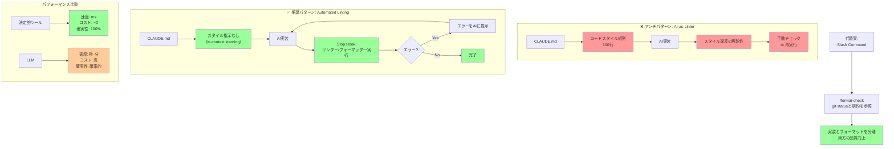

## 要約（Summary）

- コードスタイルのチェックをAIに任せるのはアンチパターンである
- LLMは決定的ツール（リンター・フォーマッター）と比較して遅く高コストで不確実
- LLMはin-context learningで既存コードパターンを学習するため、明示的なスタイル指示は不要

## 本文（Body）

### 背景・問題意識

AIコーディングエージェントの設定ファイルで最もよく見られるのが、詳細なコードスタイルガイドラインである。「インデントは2スペース」「セミコロンは常に使用」「命名規則はcamelCase」など、数十から数百の規則を記述するケースが多い。

しかし、これらの規則は：
- 設定ファイルを肥大化させる（数百行に及ぶことも）
- 指示数の限界を圧迫する
- ほとんどのタスクで無関係な情報としてコンテキストウィンドウを浪費する

### アイデア・主張

**コードスタイルのチェックにLLMを使うのは、根本的な道具の選択ミスである。** 「決定的ツールで可能なことは常に決定的ツールを使うべき」という原則に反する。

**LLM vs 決定的ツールの比較：**

| 観点 | リンター/フォーマッター | LLM |
|------|------------------------|-----|
| 速度 | ミリ秒単位 | 秒〜分単位 |
| コスト | ほぼゼロ | 高額（APIコール） |
| 確実性 | 100%確定的 | 確率的（ミスあり） |
| 一貫性 | 完全一貫 | セッション間でブレる |

**LLMのin-context learning能力：**
LLMは既存のコードベースを検索・閲覧することで、暗黙的にコードパターンと規約を学習する。良質なコードベースでは、明示的なスタイル指示がなくても、LLMは自然と既存パターンに従う。

**推奨アプローチ：**
1. リンター/フォーマッター（ESLint、Prettier、Biome等）で機械的にチェックできるものはすべて自動化
2. 自動修正可能なルールは可能な限り有効化
3. Claude Code Hooksを使い、タスク完了時に自動的にリンター/フォーマッターを実行
4. エラーがあればエージェントにフィードバックして修正させる

### 内容を視覚化するMermaid図



### 具体例・ケース

**悪い例：スタイルガイドを設定ファイルに含める**
```markdown
# CLAUDE.md

## Code Style Guidelines
1. Use 2 spaces for indentation
2. Always use semicolons
3. Use camelCase for variables
4. Use PascalCase for classes
5. Maximum line length: 80 characters
6. Use single quotes for strings
7. Add trailing commas in arrays/objects
...（50個以上の規則）

## Naming Conventions
1. Boolean variables should start with is/has/can
2. Event handlers should start with handle
3. Async functions should have async suffix
...（30個以上の規則）
```

この設定は80個以上の指示を含み、システムプロンプトの50個と合わせて130個に達する。

**良い例：リンター/フォーマッターに委譲**

`.eslintrc.js`:
```javascript
module.exports = {
  extends: ['airbnb', 'prettier'],
  rules: {
    'max-len': ['error', { code: 80 }],
    quotes: ['error', 'single'],
    semi: ['error', 'always'],
    // ... すべてのスタイル規則
  }
};
```

`CLAUDE.md`:
```markdown
# Project Setup
- Run tests and type checking before completing: `bun test && bun typecheck`
- Code is automatically formatted on commit
```

Claude Code `stop` hook:
```json
{
  "stop": "bun run lint --fix && bun run format"
}
```

エージェントが実装完了すると、自動的にリンターとフォーマッターが実行され、エラーがあればエージェントに提示される。

**推奨ツール例：**
- **Biome**：高速で自動修正能力が高い
- **ESLint + Prettier**：広く使われている組み合わせ
- **rustfmt、gofmt**：言語標準のフォーマッター

### 反論・限界・条件

**潜在的な反論：**
- 「既存コードが低品質な場合、LLMがその悪いパターンを学習してしまうのでは？」
  - → この場合でも、リンターで機械的にチェックすべき。設定ファイルに書くより効果的
- 「リンターで表現できない高レベルなアーキテクチャパターンもあるのでは？」
  - → そのような高レベルな規則は別。スタイル規則（機械的にチェック可能）との混同に注意

**限界：**
- アーキテクチャパターンや設計原則など、決定的にチェックできない規則は、依然として文書化が必要
- しかし、それらも`CLAUDE.md`ではなく、Progressive Disclosureで提供すべき

**成立条件：**
- 適切なリンター/フォーマッターがプロジェクトにセットアップされている
- CI/CDパイプラインでリンターが実行されている
- チームがリンターのルールセットに合意している

## 関連ノート（Links）

- [[20251214140010-progressive-disclosure-agent-context|Progressive Disclosureによる段階的コンテキスト開示]] Progressive Disclosureによる情報の段階的開示
- [[20251214135849-llm-instruction-following-limits|LLM指示追従能力の定量的限界と劣化特性]] LLMの指示追従能力の限界
- [[20251214135704-agent-configuration-ignore-mechanism|AIエージェントによる設定ファイル無視の仕組みと対策]] 設定ファイルが無視される仕組み
- [[20251129160319-ai-guardrails|AI開発におけるガードレールの重要性]] AI開発におけるガードレール設計
- [[20251206-123000-claude-code-agentic-coding-workflows|エージェント的コーディングワークフローとスケール]] Claude Codeワークフロー全体

## To-Do / 次に考えること

- [ ] 現在の`CLAUDE.md`からスタイル規則をすべて削除し、リンター設定に移行する
- [ ] Claude Code Stop Hookをセットアップし、自動リンター/フォーマッター実行を統合する
- [ ] Biomeなど自動修正能力の高いツールへの移行を検討する
- [ ] 「リンターで表現できない規則」と「できる規則」を明確に区別する
- [ ] アーキテクチャパターンなど高レベルな規則の文書化方法を別途検討する
