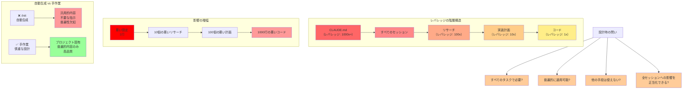

## 要約（Summary）

- 設定ファイル（`CLAUDE.md`等）はエージェントハーネスの最高レバレッジポイントであり、すべてのワークフローフェーズに影響する
- 悪い設定の影響は、コード→実装計画→リサーチと遡るほど増幅される
- 自動生成（`/init`等）に頼らず、すべての行を慎重に検討して手作業で作成すべき

## 本文（Body）

### 背景・問題意識

多くの開発者が、Claude Codeの`/init`コマンドや他のハーネスの自動生成機能を使って、`CLAUDE.md`や`AGENTS.md`を作成する。手軽で便利だが、これは設定ファイルの重要性を軽視したアプローチである。

### アイデア・主張

**設定ファイルは、エージェントハーネス全体における最高レバレッジポイントである。** その影響力は、ワークフローの各フェーズで段階的に増幅される。

**レバレッジの階層構造：**

1. **悪いコード（レバレッジ: 1x）**
   - 影響範囲：その1行のコードのみ
   
2. **悪い実装計画（レバレッジ: 10x）**
   - 影響範囲：計画から生成される多数のコード行
   - 1つの悪い計画が100行の悪いコードを生む
   
3. **悪いリサーチ（レバレッジ: 100x）**
   - 影響範囲：リサーチに基づく複数の計画、それらから生成される多数のコード
   - システムの誤解が複数の悪い計画を生み、さらに多くの悪いコードを生む
   
4. **悪い設定ファイル（レバレッジ: 1000x+）**
   - 影響範囲：**すべてのセッション、すべてのリサーチ、すべての計画、すべてのコード**
   - すべてのワークフローフェーズに影響し、あらゆる成果物に影響する

**なぜ自動生成を避けるべきか：**
- 自動生成は汎用的な内容を生成し、プロジェクト固有の文脈を欠く
- 不要な情報や普遍的でない指示が含まれる可能性が高い
- 生成された内容を精査せずに使うと、設定ファイルの品質が低下する

**推奨アプローチ：**
設定ファイルのすべての行を、以下の観点で慎重に検討して手作業で作成する：
- この情報は本当にすべてのタスクで必要か？
- この指示は普遍的に適用可能か？
- この内容は他の手段（Progressive Disclosure等）で提供すべきではないか？
- この1行がすべてのセッションに与える影響を正当化できるか？

### 内容を視覚化するMermaid図



### 具体例・ケース

**レバレッジの具体的な影響例：**

**シナリオ1: 悪いコード（レバレッジ: 1x）**
```typescript
// 悪いコード: マジックナンバー
const timeout = 5000;
```
影響：この1行のみ。簡単に修正可能。

**シナリオ2: 悪い実装計画（レバレッジ: 10x）**
```markdown
Plan:
1. Create user authentication with MD5 hashing (悪い選択)
2. Store passwords in plain text format (危険)
3. Implement session management...
```
影響：認証システム全体（数百行のコード）がセキュリティ上の欠陥を持つ。

**シナリオ3: 悪いリサーチ（レバレッジ: 100x）**
```markdown
Research Result:
The system uses MongoDB for user data. (実際はPostgreSQL)
Authentication is handled by Auth0. (実際は自前実装)
```
影響：このリサーチに基づく複数の計画とコードがすべて間違った前提の上に構築される。

**シナリオ4: 悪い設定ファイル（レバレッジ: 1000x+）**
```markdown
# CLAUDE.md
All database operations should use MongoDB queries.
Always prefer NoSQL patterns over relational patterns.
```
（実際はPostgreSQLを使用）

影響：
- すべてのリサーチで誤った前提が使われる
- すべての計画がNoSQLパターンを採用する
- 大量のコードが間違ったデータベースパターンで実装される
- すべてのセッションで同じ問題が繰り返される

**手作業での慎重な設計例：**

悪い自動生成：
```markdown
# CLAUDE.md (auto-generated, 250 lines)
## Code Style
Use 2 spaces...
(50 lines of style rules)

## Database Guidelines
When creating tables...
(80 lines of specific schema rules)

## API Patterns
All endpoints should...
(60 lines of API conventions)

...
```

良い手作業設計：
```markdown
# CLAUDE.md (handcrafted, 55 lines)
## Project Structure
- apps/: Application code
- packages/: Shared libraries

## Tools & Commands
- Package manager: bun
- Tests: bun test
- Type check: bun typecheck

## Important Documentation
See agent_docs/ for detailed guidelines:
- building_project.md
- architecture.md
- code_conventions.md

## Verification
Always run tests and type checks before completing.
```

### 反論・限界・条件

**潜在的な反論：**
- 「手作業は時間がかかる。自動生成を出発点にして修正すればいいのでは？」
  - → 可能だが、生成された内容を精査する手間と、ゼロから書く手間はあまり変わらない
  - → 自動生成の内容に引きずられ、不要な情報を残してしまうリスクがある

**実践上の課題：**
- プロジェクト初期段階では、「何が普遍的か」の判断が難しい
- チームメンバー間で設計品質にばらつきが出る可能性がある

**成立条件：**
- 設定ファイルの設計者が、プロジェクトの全体像を理解している
- 定期的なレビューと改善のプロセスが存在する
- チームが設定ファイルの重要性を理解し、品質維持にコミットしている

## 関連ノート（Links）

- [[20251214135546-llm-stateless-configuration-implication|LLMのステートレス性が設定ファイルに与える影響]] LLMのステートレス性と設定ファイルの役割
- [[20251214140010-progressive-disclosure-agent-context|Progressive Disclosureによる段階的コンテキスト開示]] Progressive Disclosureによる情報の段階的開示
- [[20251214135849-llm-instruction-following-limits|LLM指示追従能力の定量的限界と劣化特性]] LLMの指示追従能力の限界
- [[20251214135704-agent-configuration-ignore-mechanism|AIエージェントによる設定ファイル無視の仕組みと対策]] 設定ファイルが無視される仕組み
- [[20251129160319-ai-guardrails|AI開発におけるガードレールの重要性]] AI開発におけるガードレール設計
- [[20251206-123000-claude-code-agentic-coding-workflows|エージェント的コーディングワークフローとスケール]] Claude Codeワークフロー全体

## To-Do / 次に考えること

- [ ] 現在の設定ファイルをゼロベースでレビューし、各行の必要性を再評価する
- [ ] 自動生成された設定ファイルを使っている場合、手作業での再設計を検討する
- [ ] 設定ファイルのレビュープロセスをチームのワークフローに組み込む
- [ ] 「普遍的な情報」の判断基準をチーム内で明文化する
- [ ] 設定ファイルの品質が成果物に与える影響を定量的に測定する方法を検討する
