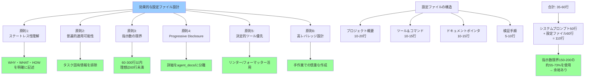

## 要約（Summary）

- AIエージェントの設定ファイルは「WHY・WHAT・HOW」でコードベースにオンボーディングする役割を持つ
- 効果的な設定ファイルは、普遍的に適用可能な情報のみを含み、簡潔（60-300行、理想は60行未満）である
- Progressive Disclosure、決定的ツールの活用、手作業での慎重な設計が成功の鍵

## 本文（Body）

### 背景・問題意識

Claude Code、Cursor、Zed等のAIコーディングエージェントは、`CLAUDE.md`や`AGENTS.md`という設定ファイルを通じてプロジェクト固有の知識を得る。しかし、多くの開発者がこの設定ファイルを誤って使い、エージェントの性能を低下させている。

### アイデア・主張

**効果的な設定ファイル設計は、AIエージェントの成功を左右する最重要要素である。** 以下の6つの原則に基づいて設計すべきである。

#### 1. LLMのステートレス性を理解する

LLMは推論時に重みが凍結されたステートレス関数であり、セッション間で学習しない。設定ファイルはすべてのセッションに自動的に含まれる唯一のファイルであり、コードベースへのオンボーディングの中核となる。

**含意：**
- プロジェクトのWHY（目的）、WHAT（構造・技術スタック）、HOW（作業方法）を明確に記述する
- 毎回伝える必要がある重要情報を厳選する

#### 2. 「普遍的適用可能性」を最優先する

エージェントは、タスクに関連しないと判断した場合、設定ファイルの内容を無視する。無関係な情報が多いほど、ファイル全体が無視される確率が上がる。

**原則：**
- タスク固有の詳細指示は含めない
- すべてのタスクで関連性がある情報のみを記述する

#### 3. 指示数の限界を尊重する

フロンティアthinking LLMでも、一貫して追従できる指示数は150-200個程度に制限される。Claude Codeのシステムプロンプトだけで約50個の指示を消費している。

**原則：**
- 設定ファイルは300行未満、理想は60行未満に保つ
- 「Less is more」の精神で、必要最小限の指示に絞る

#### 4. Progressive Disclosureを活用する

すべての詳細を設定ファイルに詰め込むのではなく、詳細情報を自己説明的な名前の別ファイルに分離する。

**実装：**
- `agent_docs/`ディレクトリを作成し、タスク固有の詳細を分離
- 設定ファイルにはファイルリストと簡潔な説明のみを記載
- エージェント自身が必要なファイルを判断して読み込む
- コードのコピーではなく`file:line`形式の参照を使う

#### 5. 決定的ツールを優先する

コードスタイルなど機械的にチェック可能なものは、LLMではなくリンター/フォーマッターに任せる。

**理由：**
- LLMは遅く、高コストで、不確実
- LLMはin-context learningで既存コードパターンを学習する
- Claude Code Hooksで自動実行を統合できる

#### 6. 高レバレッジポイントとして慎重に設計する

設定ファイルはすべてのワークフローフェーズに影響する最高レバレッジポイントである。自動生成（`/init`等）に頼らず、すべての行を手作業で慎重に検討する。

**影響の階層：**
- 悪いコード（1x）< 悪い計画（10x）< 悪いリサーチ（100x）< 悪い設定（1000x+）

### 内容を視覚化するMermaid図



### 具体例・ケース

**効果的な設定ファイルの実例：**

```markdown
# CLAUDE.md (55 lines)

## Purpose
This project is a SaaS platform for team collaboration with 
real-time messaging and document sharing capabilities.

## Project Structure
- apps/web: Next.js frontend
- apps/api: Node.js backend API
- packages/shared: Shared types and utilities
- packages/ui: Component library

## Tech Stack
- Frontend: Next.js 14, React, TypeScript, Tailwind
- Backend: Node.js, Express, PostgreSQL, Redis
- Tools: bun (package manager), Biome (linter)

## Development Commands
- Install: `bun install`
- Dev server: `bun dev`
- Tests: `bun test`
- Type check: `bun typecheck`
- Format: `bun run format`

## Important Documentation
Detailed guidelines are in `agent_docs/`:
- architecture.md: System design and patterns
- database_schema.md: DB structure and conventions
- api_conventions.md: REST API standards
- testing_strategy.md: Test patterns and coverage

Read relevant docs before starting work.

## Verification
Before completing any task:
1. Run type checking: `bun typecheck`
2. Run tests: `bun test`
3. Ensure code compiles without errors

## Notes
- Code is auto-formatted on commit (Biome)
- We use Postgres, not MongoDB
- Authentication is handled by Supabase
```

この設定ファイルは：
- 55行と簡潔
- プロジェクトの目的、構造、ツールを明確に説明
- 詳細はProgressive Disclosureで提供
- スタイル規則はリンターに委譲
- すべてのタスクで普遍的に関連

**実装の段階的アプローチ：**

フェーズ1: 最小限の設定（35行）
- プロジェクト構造とツールのみ

フェーズ2: ドキュメントポインタ追加（50行）
- `agent_docs/`への参照を追加

フェーズ3: 検証手順の統合（60行）
- テスト・タイプチェックの指示を追加

各フェーズで実際の使用状況を観察し、必要に応じて調整する。

### 反論・限界・条件

**実践上の課題：**
- プロジェクト初期段階では「普遍的な情報」の判断が難しい
- 小規模プロジェクトでは、Progressive Disclosureが過剰な場合がある
- チームメンバーのスキルレベルによって最適な設計が異なる可能性がある

**段階的な導入：**
1. まず既存の設定ファイルを簡潔化（不要な情報を削除）
2. スタイル規則をリンターに移行
3. 詳細情報をProgressive Disclosureで分離
4. 定期的にレビューして改善

**成立条件：**
- プロジェクトが一定以上の規模と複雑さを持つ
- チームが設定ファイルの重要性を理解している
- 定期的なレビューと改善のプロセスが存在する

## 関連ノート（Links）

- [[20251214135546-llm-stateless-configuration-implication|LLMのステートレス性が設定ファイルに与える影響]] LLMのステートレス性と設定ファイルの役割
- [[20251214135704-agent-configuration-ignore-mechanism|AIエージェントによる設定ファイル無視の仕組みと対策]] 設定ファイルが無視される仕組み
- [[20251214135849-llm-instruction-following-limits|LLM指示追従能力の定量的限界と劣化特性]] LLMの指示追従能力の限界
- [[20251214140010-progressive-disclosure-agent-context|Progressive Disclosureによる段階的コンテキスト開示]] Progressive Disclosureパターン
- [[20251214140142-ai-as-linter-antipattern|AI-as-Linterアンチパターンと決定的ツールの優位性]] AI-as-Linterアンチパターン
- [[20251214140318-agent-config-high-leverage-point|エージェント設定ファイルの高レバレッジ特性と慎重な設計の必要性]] 設定ファイルの高レバレッジ特性
- [[20251206-123000-claude-code-agentic-coding-workflows|エージェント的コーディングワークフローとスケール]] Claude Codeワークフロー全体
- [[20251129160317-ai-role-division-what-why-how|AI連携開発における役割分担の原則]] WHY・WHAT・HOWの分離原則
- [[20251129165837-long-running-agent-context-window-problem|長時間実行AIエージェントのコンテキストウィンドウ問題]] コンテキストウィンドウ問題

## To-Do / 次に考えること

- [ ] 現在のプロジェクトの設定ファイルをこれらの原則に基づいてレビューする
- [ ] 設定ファイルのテンプレートを作成し、新規プロジェクトで活用する
- [ ] チーム内で設定ファイル設計のベストプラクティスを共有する
- [ ] Progressive Disclosure用の`agent_docs/`ディレクトリ構造を標準化する
- [ ] 設定ファイルの品質が開発速度と品質に与える影響を測定する
