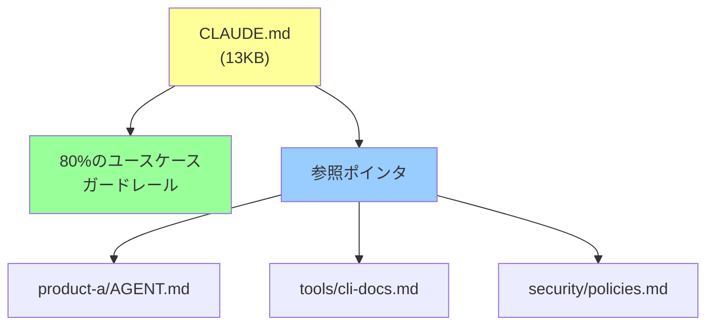

## 要約（Summary）

- `CLAUDE.md` はエージェントの「憲法」であり、リポジトリ固有の動作を定義する最重要ファイル。ガードレール中心・参照ポインタ活用・代替案提示・ツール簡素化の強制という4つの原則で設計すると効果的。
- エンタープライズ環境では、このファイルのサイズ制限（13KB〜25KB程度）を設け、各ツールのドキュメントに「広告枠」のような token 割り当てを行うことで、簡潔さと網羅性のバランスを取る。

## 本文（Body）

### 背景・問題意識

Claude Code のようなエージェント型ツールは、リポジトリ固有のルール・ツール・ベストプラクティスをどこかから学ばなければならない。多くの開発者は最初に詳細なマニュアルを書こうとするが、これはコンテキストウィンドウを圧迫し、エージェントの判断を鈍らせる。

一方で、情報が少なすぎるとエージェントは誤った判断を繰り返し、手戻りが増える。`CLAUDE.md` は「何を書くか」以上に「何を書かないか」の設計が重要になる。

### 4つの戦略的設計原則

#### 1. ガードレール中心設計（Start with Guardrails）

- 最初から完全なマニュアルを書こうとしない
- Claude が**実際に間違えたこと**だけを文書化する
- 「やってはいけないこと」を明確にし、代替案を示す

**良い例:**
```markdown
## Python Testing
- Never use pytest with --parallel flag in CI
- Instead, use our custom test runner: `./scripts/run_tests.sh`
```

**悪い例（詳細すぎる）:**
```markdown
## Python Testing
Python is a dynamically typed language...
We use pytest version 7.4.2...
To run tests, you can use various flags...
```

#### 2. 参照ポインタ戦略（Don't @-File Docs）

- 詳細ドキュメントを `@` でインクルードしない（コンテキスト圧迫）
- ファイルパスだけを書いても無視される
- **いつ・なぜ** そのドキュメントを読むべきかを「売り込む」

**良い例:**
```markdown
## Internal CLI Tool
- Use `tool-cli --simple-mode` for 80% of cases
- For complex workflows or if you encounter `FooBarError`, 
  see `docs/tool-cli-advanced.md` for troubleshooting
```

#### 3. 代替案提示（Always Provide Alternatives）

- 「〜してはいけない」だけでは不十分
- エージェントは「やるべきこと」が不明だと行き詰まる
- 必ず代替手段を併記する

**良い例:**
```markdown
- Never use `--foo-bar` flag in production
- Instead, use `--safe-mode` or consult security team
```

**悪い例:**
```markdown
- Never use `--foo-bar` flag
```

#### 4. ツール簡素化の強制関数（Use as Forcing Function）

- 複雑なCLIコマンドを長々と説明するのは人間の問題
- `CLAUDE.md` を短く保つために、**ツール自体を簡素化する**
- 「説明が長い = ツールが悪い」と考える

**実践例:**
複雑なコマンド:
```bash
docker run --rm -v $(pwd):/workspace \
  -e ENV=prod -e DEBUG=false \
  my-tool:latest execute --config=/workspace/config.yaml \
  --output=/workspace/out --verbose
```

シンプルなラッパー:
```bash
./scripts/run-tool.sh prod
```

`CLAUDE.md` には後者だけを記載し、前者の複雑さは隠蔽する。

### エンタープライズでの運用例

大規模モノレポでの実践：

- **13KB 制限**: 現在のファイルサイズ上限
- **30% ルール**: 30% 以上のエンジニアが使うツールのみ記載
- **トークン広告枠**: 各チームに割り当て上限を設ける（例: 各ツール 500 トークンまで）
- **製品固有ドキュメント**: 個別の `.md` に分離し、`CLAUDE.md` からは参照のみ



### 具体的な構造例

```markdown
# Monorepo Overview

## Python
- Always use Poetry for dependency management
- Test with `./scripts/test.py` (not raw pytest)
- Lint with `./scripts/lint.sh` before commit

## Internal CLI Tool
- Basic usage: `cli-tool run --env dev`
- For complex scenarios or `AuthError`, see `docs/cli-advanced.md`

## Never
- Never commit directly to main branch
- Never use `--force` flag without approval
- Instead, create PR and request review
```

### 実践チェックリスト

- [ ] ファイルサイズは 25KB 以下か？
- [ ] すべての「禁止」に代替案があるか？
- [ ] 詳細ドキュメントへの参照に「いつ読むべきか」を記載しているか？
- [ ] 80% のユースケースをカバーしているか？
- [ ] 複雑なコマンドをラッパー化できないか検討したか？

## 関連ノート（Links）

- [[20251214140418-effective-agent-config-design-principles|効果的なAIエージェント設定ファイル設計の原則]]
- [[20251214140318-agent-config-high-leverage-point|エージェント設定ファイルの高レバレッジ特性と慎重な設計の必要性]]
- [[20251214140010-progressive-disclosure-agent-context|Progressive Disclosureによる段階的コンテキスト開示]]
- [[20251129160319-ai-guardrails|AI開発におけるガードレールの重要性]]
- [[20251214135704-agent-configuration-ignore-mechanism|AIエージェントによる設定ファイル無視の仕組みと対策]]

## To-Do / 次に考えること

- [ ] 現在のプロジェクトの `CLAUDE.md` をレビューし、4原則に沿って簡素化する
- [ ] 複雑なCLIコマンドをラッパー化できないか検討する
- [ ] エージェントが繰り返し失敗するパターンを収集し、ガードレールとして追記する
