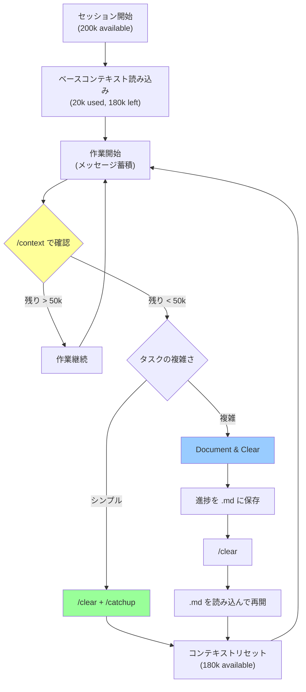

## 要約（Summary）

- Claude Code の 200k トークンコンテキストは有限リソース。`/compact` は不透明で信頼性が低いため避け、`/clear` + `/catchup`（シンプル再起動）または「Document & Clear」（複雑タスク用）の2つのワークフローで明示的に管理する。
- コンテキストウィンドウを「ディスクスペース」のように扱い、定期的に `/context` で使用状況を監視し、埋まる前に計画的にクリアする。

## 本文（Body）

### 背景・問題意識

Claude Code はコンテキストウィンドウ（200k トークン、最新では 1M）を持つが、実際には次の問題がある：

1. **ベースライン消費**: エンタープライズのモノレポでは、セッション開始時に約 20k トークン（10%）を消費
2. **急速な蓄積**: 数分〜数時間の作業で残りの 180k が埋まる
3. **不透明な自動圧縮**: `/compact` は内部動作が不明瞭で、重要な情報を失う可能性がある

特に長時間実行タスクでは、コンテキストが飽和してエージェントの判断精度が低下する。明示的な管理戦略が必要。

### 3つのコンテキスト管理ワークフロー

#### ワークフロー1: `/compact` **（非推奨）**

**問題点:**
- 圧縮アルゴリズムが不透明
- 何が削除され、何が残るか予測不能
- エラーが発生しやすい
- 最適化が不十分

**推奨度: ❌ 避ける**

#### ワークフロー2: `/clear` + `/catchup` **（シンプル再起動）**

**用途:** 短〜中期タスク（数時間）のリセット

**手順:**
1. `/clear`: すべてのメッセージ履歴をクリア
2. `/catchup`: カスタムコマンドで git branch の変更ファイルを読み込む

**利点:**
- 動作が明確で予測可能
- 変更ファイルだけをコンテキストに戻すため効率的
- コンテキストの「初期化」が確実

**実装例（カスタムコマンド）:**
```json
{
  "commands": {
    "catchup": {
      "prompt": "Read all changed files in my current git branch and summarize the changes"
    }
  }
}
```

**推奨度: ✅ デフォルト選択**

#### ワークフロー3: Document & Clear **（複雑タスク用）**

**用途:** 長期タスク（数日〜数週間）で進捗・プラン・決定事項を保持したい場合

**手順:**
1. Claude に作業計画と進捗を `.md` ファイルに書き出させる
2. `/clear` で履歴をクリア
3. 新セッションで Claude にその `.md` を読ませて続行

**利点:**
- 長期タスクの「外部メモリ」として機能
- セッションをまたいで文脈を保持
- ドキュメントを人間がレビュー可能

**実装例:**
```
User: "Dump your current plan and progress to `PROGRESS.md`"
Claude: [writes PROGRESS.md]
User: "/clear"
User: "Read `PROGRESS.md` and continue from where you left off"
```

**推奨度: ✅ 複雑タスクに必須**

### コンテキストウィンドウの可視化

`/context` コマンドで現在の使用状況を確認：

```
Total: 200k tokens
- Base context (CLAUDE.md, etc.): 20k (10%)
- Messages (conversation history): 150k (75%)
- Available: 30k (15%)
```

メッセージ（紫色）が大部分を占める場合、そろそろクリアが必要。



### 実践的な運用パターン

**パターン1: 定期的チェックポイント**
```bash
# 30分ごとに自動チェック（スクリプト例）
while true; do
  sleep 1800
  echo "Run /context to check token usage"
done
```

**パターン2: タスク境界でクリア**
```
User: "Feature A is done. /clear"
User: "/catchup"
User: "Now let's work on Feature B"
```

**パターン3: 進捗ドキュメント駆動**
```
User: "Update SPRINT.md with today's progress"
User: "/clear"
User: "Read SPRINT.md and continue tomorrow's tasks"
```

### アンチパターン

❌ **自動圧縮に依存**
```
# Claude が自動的に /compact を実行
# → 何が失われたか不明
```

❌ **コンテキスト枯渇まで待つ**
```
# 残り 5k トークンまで作業継続
# → エージェントの判断精度が低下
```

❌ **クリア後の情報不足**
```
User: "/clear"
User: "Continue"
# → 何を続けるべきか Claude が分からない
```

### 実践チェックリスト

- [ ] `/context` を定期的に実行して残量を確認しているか？
- [ ] `/catchup` カスタムコマンドを設定したか？
- [ ] 複雑タスクで進捗ドキュメント戦略を採用しているか？
- [ ] タスク境界（機能完成時など）でクリアしているか？
- [ ] `/compact` に依存していないか？

## 関連ノート（Links）

- [[20251129165837-long-running-agent-context-window-problem|長時間実行AIエージェントのコンテキストウィンドウ問題]]
- [[20251214140010-progressive-disclosure-agent-context|Progressive Disclosureによる段階的コンテキスト開示]]
- [[20251129165842-long-running-agent-failure-modes-solutions|長時間実行エージェントの失敗モードと対策]]
- [[20251129160320-ai-task-granularity|AIへのタスク粒度と効率の関係]]

## To-Do / 次に考えること

- [ ] `/catchup` コマンドを自プロジェクトに実装する
- [ ] 複雑タスク用のテンプレート `.md`（PROGRESS.md など）を作成する
- [ ] セッションの平均トークン消費量を計測し、クリアタイミングを最適化する
