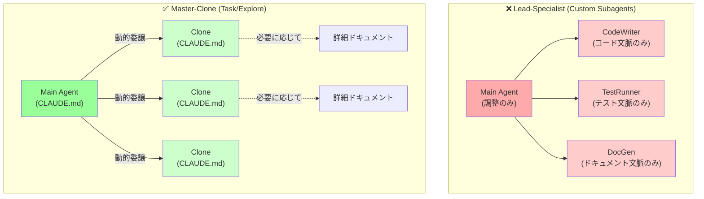

## 要約（Summary）

- カスタムサブエージェントは理論上はコンテキスト節約に有効だが、実際には「コンテキストのゲートキーピング」と「ワークフロー硬直化」という2つの重大な問題を引き起こす。
- メインエージェントに `CLAUDE.md` の共通コンテキストを渡し、内蔵の `Task(...)` 機能で動的に委譲させる「Master-Clone」アーキテクチャの方が柔軟で効果的。

## 本文（Body）

### 背景・問題意識

Claude Code のカスタムサブエージェント機能は、コンテキスト管理の銀の弾丸に見える：

**理論上の利点:**
- タスク 1 つあたり `X`（入力）+ `Y`（作業）+ `Z`（出力）トークンが必要
- `N` タスクを実行すると `(X + Y + Z) × N` トークンをメインウィンドウで消費
- サブエージェントに委譲すると、メインウィンドウは `Z × N` だけで済む

**実際の問題:**
この最適化は、2つの深刻なトレードオフを伴う。

### 問題1: コンテキストのゲートキーピング

カスタムサブエージェント（例: `PythonTests`）を作ると、そのドメイン知識がメインエージェントから**隔離**される。

**具体例:**
```json
{
  "subagents": {
    "PythonTests": {
      "context": ["docs/testing.md", "pytest.ini"],
      "role": "Run Python tests and report results"
    }
  }
}
```

**問題:**
- メインエージェントはテストの実行方法を知らない
- コード変更時にテスト戦略を考慮できない
- 「このコードは本当にテスト可能か？」を判断できない
- サブエージェントを呼び出すことしかできない

**結果: 全体的推論の喪失**

メインエージェントは変更の全体像（コード + テスト + ドキュメント）を理解できず、サブタスクの調整者に格下げされる。

### 問題2: ワークフローの硬直化

カスタムサブエージェントは、**人間が定義したワークフロー**を強制する。

**典型的な設計:**
```
Main Agent
  ├─ CodeWriter (コード生成)
  ├─ TestRunner (テスト実行)
  └─ DocGenerator (ドキュメント生成)
```

**問題:**
- この順序は人間が事前に決めたもの
- エージェント自身は「今何が必要か」を判断できない
- 状況に応じた柔軟な委譲ができない
- 並列実行や順序変更の最適化が不可能

**例:**
```
# 人間が定義した硬直ワークフロー
1. CodeWriter でコード生成
2. TestRunner でテスト
3. 失敗したら CodeWriter に戻る
4. 成功したら DocGenerator

# エージェントが望む柔軟ワークフロー
"このコードは簡単だから直接テストして、
 ドキュメントとコードを並行生成したい"
```

### 代替案: Master-Clone アーキテクチャ

`CLAUDE.md` の共通コンテキスト（ガードレールと参照ポインタ）をメインエージェントに与え、必要に応じて**自身のクローン**に委譲させる。

**設計:**
```
Main Agent (CLAUDE.md のコンテキスト)
  ├─ Task("Run tests") → Clone Agent (同じ CLAUDE.md)
  ├─ Task("Update docs") → Clone Agent (同じ CLAUDE.md)
  └─ Explore("Check API") → Clone Agent (同じ CLAUDE.md)
```

**利点:**
1. **コンテキスト共有**: すべてのクローンが同じガードレールと参照情報を持つ
2. **動的委譲**: メインエージェントが「いつ・何を」委譲するか自律的に判断
3. **柔軟なオーケストレーション**: 並列実行・順序変更・条件分岐を自由に選択

**実装:**
```markdown
# CLAUDE.md（簡潔なガードレールと参照）
## Testing
- Use pytest with `--maxfail=1`
- For complex scenarios, see `docs/testing-guide.md`

## Documentation
- Update README.md for user-facing changes
- For API docs format, see `docs/api-template.md`
```

```python
# メインエージェントのプロンプト例
"Implement feature X. Use Task(...) to delegate 
 testing and documentation as you see fit."
```

Claude が自動的に：
```python
Task("Run tests for new feature")
Task("Update API docs")
Task("Check integration impact")
```

### アーキテクチャ比較図



### 実践例

**悪い例（カスタムサブエージェント）:**
```json
{
  "subagents": {
    "Tester": {
      "context": ["tests/", "docs/testing.md"],
      "commands": ["pytest"]
    }
  }
}
```

**良い例（Master-Clone with 簡潔な CLAUDE.md）:**
```markdown
# CLAUDE.md（簡潔さと網羅性のバランス）
## Testing
- Always run tests before commit
- Use `./scripts/test.sh`
- For advanced testing scenarios, see `docs/testing-guide.md`

## Delegation
- For long-running tasks, use Task("description")
- For exploration, use Explore("question")
```

```
User: "Add new API endpoint with tests"
Claude: 
  1. Implements endpoint
  2. Task("Run full test suite")  ← 自律的に判断
  3. Task("Update API docs")       ← 順序を最適化
```

### いつカスタムサブエージェントを使うべきか？

**使うべき場合（稀）:**
- 完全に独立したドメイン（例: フロントエンドとバックエンドが完全分離）
- 明確なインターフェース境界がある
- 両者の相互作用が最小限

**使うべきでない場合（ほとんど）:**
- コード・テスト・ドキュメントなど相互依存するタスク
- ワークフローが動的に変わりうる場合
- エージェントに全体最適化を期待する場合

## 関連ノート（Links）

- [[20251206-123000-claude-code-agentic-coding-workflows|エージェント的コーディングワークフローとスケール]]
- [[20251129165842-long-running-agent-failure-modes-solutions|長時間実行エージェントの失敗モードと対策]]
- [[20251129165839-coding-agent-incremental-progress|Coding agentによるインクリメンタル進捗]]
- [[20251214235249-context-window-management-strategy|コンテキストウィンドウ管理戦略]]
- [[20251214235033-claude-md-strategic-design-principles|CLAUDE.mdファイルの戦略的設計原則]]

## To-Do / 次に考えること

- [ ] 既存のカスタムサブエージェントを Master-Clone パターンに移行できないか検証
- [ ] `Task(...)` と `Explore(...)` の使い分けパターンを整理する
- [ ] メインエージェントのコンテキストサイズと委譲頻度の関係を測定する
