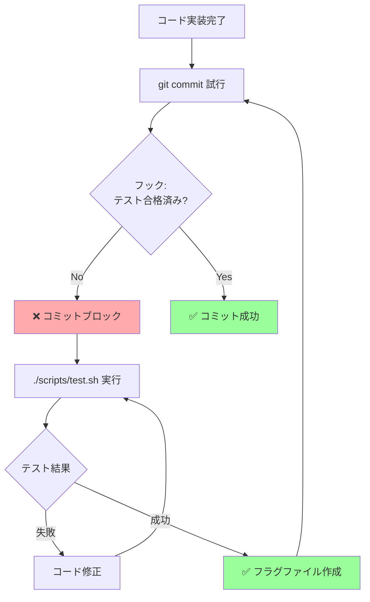

## 要約（Summary）

- Claude Code のフックは、エージェントの動作を決定論的に制御する強力な機能。commit 時にテスト結果を検証する「Block-at-Submit」戦略が最も効果的で、エージェントを「テスト＆修正」ループに確実に導く。
- write/edit 時にブロックする「Block-at-Write」は避けるべき。エージェントの計画を途中で中断し、混乱や「フラストレーション」を引き起こす。

## 本文（Body）

### 背景・問題意識

Claude Code は強力だが、時として：
- テストを実行せずにコミットする
- 不完全なコードを書いて先に進む
- セキュリティやコーディング規約を無視する

`CLAUDE.md` の「should-do」ガイドラインだけでは不十分な場合がある。**決定論的な「must-do」ルール**が必要になる。

これが**フック（Hooks）**の役割。

### 2つのフック戦略

#### 戦略1: Block-at-Submit（推奨）✅

**タイミング:** `git commit` の直前（`PreToolUse` hook on `Bash(git commit)`）

**仕組み:**
1. エージェントがコミットしようとする
2. フックがテスト結果ファイル（例: `/tmp/agent-pre-commit-pass`）の存在を確認
3. ファイルがなければコミットを**ブロック**
4. エージェントは「テストを実行して合格する」まで繰り返す

**実装例:**
```javascript
// hooks.js
module.exports = {
  PreToolUse: async (tool, args) => {
    if (tool === 'Bash' && args.command.includes('git commit')) {
      const fs = require('fs');
      const passFile = '/tmp/agent-pre-commit-pass';
      
      if (!fs.existsSync(passFile)) {
        throw new Error(
          'Tests have not passed. Run ./scripts/test.sh first.'
        );
      }
      
      // テスト合格後はファイルを削除（次回のために）
      fs.unlinkSync(passFile);
    }
    return { tool, args };
  }
};
```

**テストスクリプト例:**
```bash
#!/bin/bash
# scripts/test.sh

# テスト実行
if pytest --maxfail=1; then
  # 合格したらフラグファイルを作成
  touch /tmp/agent-pre-commit-pass
  echo "✅ Tests passed"
  exit 0
else
  # 失敗したらフラグファイルを削除
  rm -f /tmp/agent-pre-commit-pass
  echo "❌ Tests failed"
  exit 1
fi
```

**利点:**
- エージェントは完全な計画を実行できる
- 最終結果（コミット時）でのみ検証
- 「テスト→修正→再テスト」ループが自然に形成される
- エージェントの思考プロセスを妨げない

**エージェントの動作フロー:**


#### 戦略2: Block-at-Write（非推奨）❌

**タイミング:** `Edit` や `Write` ツール実行時

**問題点:**
1. **計画の中断**: エージェントは「A→B→C を実装」と計画しているのに、A の途中でブロックされる
2. **コンテキストの喪失**: なぜブロックされたかを理解しにくい
3. **フラストレーション**: エージェントが「混乱」し、同じエラーを繰り返す
4. **部分的実装**: 不完全なコードが残り、デバッグが困難になる

**悪い例:**
```javascript
// ❌ 悪い例
Edit: (file, content) => {
  if (content.includes('TODO')) {
    throw new Error('TODOs are not allowed');
  }
}
```

**問題:**
```
Claude: "I'll implement feature X in 3 steps..."
Claude: [Step 1] Edit file.py (with TODO comment)
Hook: ❌ "TODOs are not allowed"
Claude: "Uh... let me try again..."
Claude: [Step 1 again] Edit file.py (still with TODO)
Hook: ❌ "TODOs are not allowed"
# 無限ループ
```

#### 戦略3: Hint Hooks（補助的）💡

**タイミング:** 任意（ブロックしない）

**用途:** 警告や最適化ヒントの提供

**例:**
```javascript
// Hint hook
PostToolUse: async (tool, args, result) => {
  if (tool === 'Bash' && args.command.includes('npm install')) {
    console.warn('💡 Hint: Consider using yarn for faster installs');
  }
  return result;
}
```

**利点:**
- ブロックしないため、エージェントの流れを妨げない
- 「より良い方法」を提案するのに適している
- 学習データとして活用できる

### エンタープライズでの実践例

大規模モノレポでの Block-at-Submit フック：

```javascript
// enterprise-hooks.js
module.exports = {
  PreToolUse: async (tool, args) => {
    // 1. テスト必須チェック
    if (tool === 'Bash' && args.command.includes('git commit')) {
      const fs = require('fs');
      
      // テスト合格フラグ
      if (!fs.existsSync('/tmp/tests-passed')) {
        throw new Error('Run ./scripts/test.sh before commit');
      }
      
      // セキュリティスキャン合格フラグ
      if (!fs.existsSync('/tmp/security-passed')) {
        throw new Error('Run ./scripts/security-scan.sh before commit');
      }
      
      // Linter 合格フラグ
      if (!fs.existsSync('/tmp/lint-passed')) {
        throw new Error('Run ./scripts/lint.sh before commit');
      }
      
      // すべてクリア
      fs.unlinkSync('/tmp/tests-passed');
      fs.unlinkSync('/tmp/security-passed');
      fs.unlinkSync('/tmp/lint-passed');
    }
    
    return { tool, args };
  }
};
```

### CLAUDE.md との連携

フックは `CLAUDE.md` と連携して使う：

```markdown
# CLAUDE.md
## Pre-Commit Requirements
Before committing, you MUST:
1. Run `./scripts/test.sh` (creates /tmp/tests-passed)
2. Run `./scripts/security-scan.sh` (creates /tmp/security-passed)
3. Run `./scripts/lint.sh` (creates /tmp/lint-passed)

If commit fails, check which validation is missing.
```

エージェントは：
1. `CLAUDE.md` でルールを理解
2. コード実装
3. 3つのスクリプトを実行
4. コミット試行
5. フックが検証
6. 失敗したら該当スクリプトを再実行

### 実践チェックリスト

- [ ] Block-at-Submit フックを設定したか？
- [ ] テストスクリプトがフラグファイルを作成するか？
- [ ] `CLAUDE.md` にフックの要件を記載したか？
- [ ] Block-at-Write フックを避けているか？
- [ ] フックのエラーメッセージは明確か？（何をすべきかを示す）

### アンチパターン

❌ **複雑すぎるフック**
```javascript
// 悪い例: フックで複雑なビジネスロジックを実装
if (file.includes('user') && !file.includes('auth')) {
  // 100行のチェックロジック...
}
```

❌ **曖昧なエラーメッセージ**
```javascript
throw new Error('Invalid'); // ← 何が無効？
```

✅ **明確で実行可能なメッセージ**
```javascript
throw new Error(
  'Tests not passed. Run ./scripts/test.sh to validate your changes.'
);
```

## 関連ノート（Links）

- [[20251214235033-claude-md-strategic-design-principles|CLAUDE.mdファイルの戦略的設計原則]]
- [[20251129160319-ai-guardrails|AI開発におけるガードレールの重要性]]
- [[20251129165841-ai-agent-end-to-end-testing|AIエージェントにおけるエンドツーエンドテスト]]
- [[20251214140142-ai-as-linter-antipattern|AI-as-Linterアンチパターンと決定的ツールの優位性]]

## To-Do / 次に考えること

- [ ] 現プロジェクトに Block-at-Submit フックを実装する
- [ ] テスト・lint・セキュリティスキャンのスクリプトを統一する
- [ ] フックのエラーログを収集し、エージェントの学習データとして活用する
