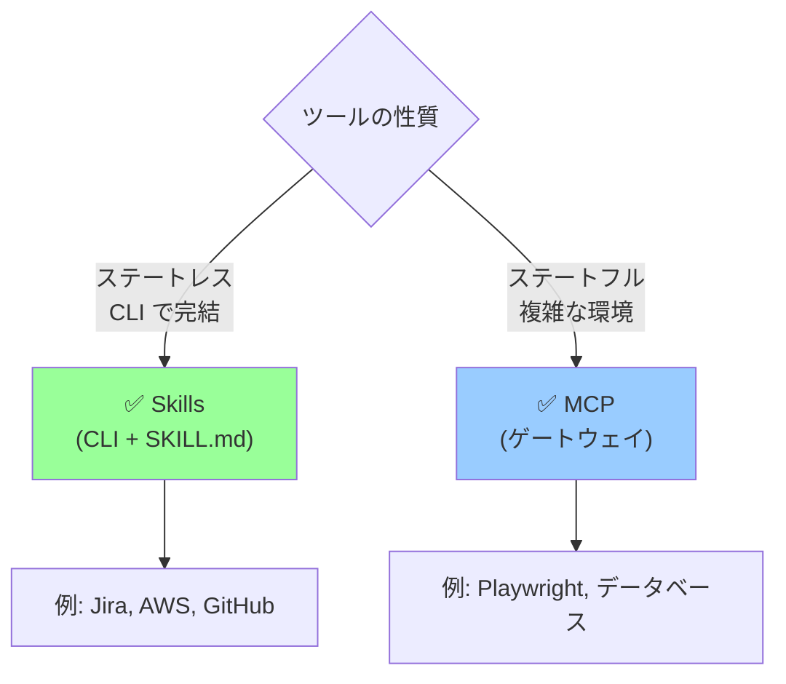

## 要約（Summary）

- Agent Skills は、エージェント自律性の進化における「スクリプティング」段階を形式化したもの。エージェントが生環境（CLI・バイナリ・ドキュメント）に直接アクセスし、必要に応じてコードを書いて対応する。
- MCP のような手作りツール抽象化より柔軟で、`SKILL.md` による発見可能性と共有性を持つ。Skills は MCP を置き換えるのではなく、より適切な役割分担を実現する。

## 本文（Body）

### エージェント自律性の3段階進化

エージェント設計の抽象化レベルは、3つの段階で進化してきた：

#### 段階1: Single Prompt（単一プロンプト）

すべてのコンテキストを1つの巨大プロンプトに詰め込む。

**特徴:**
- シンプルだが脆弱
- コンテキストが大きくなると破綻
- スケールしない

**例:**
```
"Here's our entire codebase architecture, API docs, 
 database schema, security policies... Now implement feature X."
```

#### 段階2: Tool Calling（ツール呼び出し）

手作りのツール抽象化を作り、エージェントに提供する。

**特徴:**
- 環境の複雑さを隠蔽
- 新しい抽象化レイヤーを作る（学習コスト）
- ツール設計が硬直化しやすい
- MCP の典型的パターン

**例:**
```javascript
tools = [
  read_thing_a(),
  read_thing_b(),
  update_thing_c(),
  delete_thing_d()
]
```

**問題:**
- ツールが増えると管理が困難
- エージェントがツールの「使い方」を学ぶ必要がある
- 現実の複雑さを完全に抽象化できない

#### 段階3: Scripting（スクリプティング）✅

生の環境（CLI・バイナリ・ドキュメント）にアクセスさせ、エージェントがその場でコードを書いて対応する。

**特徴:**
- 最も柔軟
- 既存ツールをそのまま活用
- エージェントが「学習」ではなく「発見」する
- **Skills が形式化するモデル**

**例:**
```markdown
# SKILL.md
## Jira Integration
- CLI: `jira-cli` (installed at /usr/local/bin/jira-cli)
- Docs: `docs/jira-cli-guide.md`
- Auth: Use $JIRA_TOKEN environment variable
- Common commands:
  - List issues: `jira-cli list --project=PROJ`
  - Create issue: `jira-cli create --title="..." --desc="..."`
```

エージェントは：
1. `SKILL.md` を読む
2. `jira-cli --help` を実行して詳細を確認
3. 必要なコマンドを**その場で書く**

### Skills の設計哲学

Skills は「CLI favored over MCP」アプローチを正式に productize したもの。

**Skills の本質:**
- **発見可能性**: `SKILL.md` でツールの存在を知らせる
- **共有性**: チーム間でスキルを共有できる
- **柔軟性**: エージェントが現場で適応できる
- **透明性**: CLI は人間もデバッグできる

### Skills vs MCP の使い分け



**Skills が適している:**
- Jira 操作（CRUD は CLI で可能）
- AWS リソース管理（aws-cli）
- GitHub 操作（gh cli）
- ファイル処理（標準UNIXツール）

**MCP が適している:**
- Playwright（ブラウザの状態管理が必要）
- データベース接続（長時間接続の管理）
- 複雑な認証フロー（OAuth など）
- サンドボックス化された実行環境

### 具体的な実装パターン

#### パターン1: Simple CLI Skill

```markdown
# skills/aws.md

## AWS CLI Skill
- CLI: `aws` (pre-installed)
- Docs: https://awscli.amazonaws.com/v2/documentation/api/latest/index.html
- Auth: Uses AWS_PROFILE environment variable

### Common Operations
- List S3 buckets: `aws s3 ls`
- Upload file: `aws s3 cp <file> s3://<bucket>/`
- Query EC2: `aws ec2 describe-instances --filters "Name=tag:Name,Values=prod-*"`

### When to use
- Infrastructure queries
- Resource management
- Deployment automation
```

#### パターン2: Custom Tool with Skill

```markdown
# skills/internal-deploy.md

## Internal Deployment Tool
- CLI: `./tools/deploy.sh`
- Source: `tools/deploy.sh` (you can read the source)
- Docs: `docs/deployment-guide.md`

### Usage
```bash
./tools/deploy.sh <env> <version>
# Example: ./tools/deploy.sh staging v1.2.3
```

### Environments
- staging: Auto-approved
- production: Requires manual approval (see docs)
```

#### パターン3: Scripting-First Approach

エージェントが独自スクリプトを生成：

```python
# Claude が生成したスクリプト例
import subprocess
import json

# SKILL.md に記載された jira-cli を使用
result = subprocess.run(
    ['jira-cli', 'list', '--project=PROJ', '--format=json'],
    capture_output=True,
    text=True
)

issues = json.loads(result.stdout)
high_priority = [i for i in issues if i['priority'] == 'High']
print(f"Found {len(high_priority)} high-priority issues")
```

### 従来の MCP アンチパターン

**悪い MCP 設計（ツール爆発）:**
```json
{
  "tools": [
    "jira_list_issues",
    "jira_get_issue",
    "jira_create_issue",
    "jira_update_issue",
    "jira_delete_issue",
    "jira_add_comment",
    "jira_list_comments",
    ... // 50+ tools
  ]
}
```

**問題:**
- コンテキストウィンドウを大量消費
- ツール選択の複雑さ
- REST API をそのままツール化しただけ

**Skills による改善:**
```markdown
# SKILL.md
## Jira CLI
- `jira-cli <command>` で操作
- ドキュメント: `jira-cli --help`
```

エージェントは `jira-cli` を直接叩き、必要なコマンドを自分で発見する。

### 実装のベストプラクティス

1. **CLI First**: 可能な限り CLI として提供
2. **自己文書化**: `--help` を充実させる
3. **冪等性**: 同じコマンドを繰り返し実行しても安全
4. **明確なエラー**: 何が間違ったか、どう修正するかを示す
5. **人間でもデバッグ可能**: エージェントが生成したコマンドを人間が再現できる

### Skills の今後

Skills は MCP の「上位互換」ではなく、**適切な役割分担**を実現する：

- **Skills**: ステートレスな操作、既存 CLI の活用
- **MCP**: ステートフルな環境、セキュリティゲートウェイ

両方を組み合わせることで、最も柔軟で保守可能なエージェントシステムが構築できる。

## 関連ノート（Links）

- [[20251214235033-claude-md-strategic-design-principles|CLAUDE.mdファイルの戦略的設計原則]]
- [[20251201000000-tool-search-tool-overview|Tool Search Toolによるオンデマンドツール発見]]
- [[20251201000300-claude-advanced-tool-use-combination|Claude Advanced Tool Useの戦略的組み合わせ]]

## To-Do / 次に考えること

- [ ] 既存の MCP ツールを Skills + 簡易 CLI に移行できないか検証
- [ ] 社内ツールの `SKILL.md` テンプレートを作成
- [ ] Skills の発見可能性を高めるディレクトリ構造を設計（`skills/` フォルダ）
