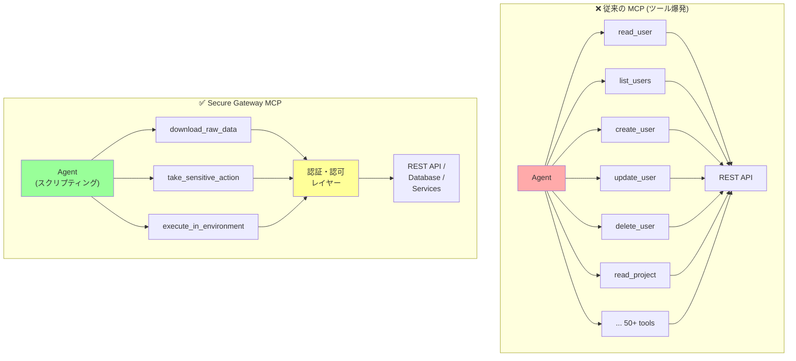
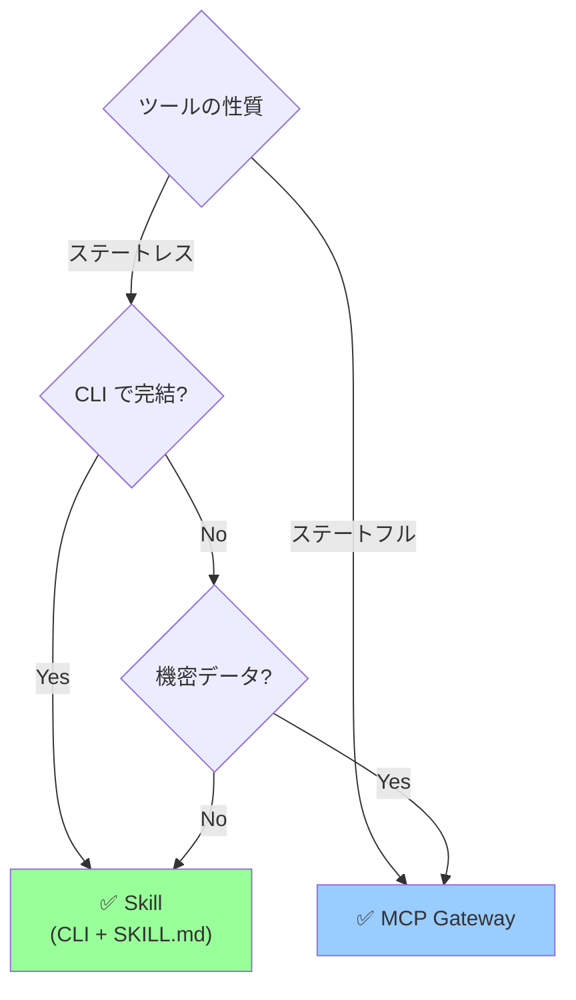

## 要約（Summary）

- Skills の登場により、MCP の役割は「REST API のミラーツール群」から「セキュアゲートウェイ」へシフトすべき。少数の高レベルツール（生データ取得・機密アクション実行・コード実行環境）を提供し、エージェントがスクリプティングで柔軟に処理する。
- MCP の責務は「現実の抽象化」ではなく「認証・ネットワーク・セキュリティ境界の管理」に集中する。

## 本文（Body）

### 従来の MCP アンチパターン

多くの MCP 実装は、REST API をそのままツール化していた：

**典型的な設計:**
```javascript
const tools = [
  read_user(id),
  list_users(filters),
  create_user(data),
  update_user(id, data),
  delete_user(id),
  read_project(id),
  list_projects(filters),
  create_project(data),
  update_project(id, data),
  delete_project(id),
  // ... 数十〜数百のツール
]
```

**問題:**
1. **ツール爆発**: API エンドポイント数だけツールが増える
2. **コンテキスト圧迫**: 各ツールの説明でコンテキストウィンドウを消費
3. **硬直性**: 新しい操作には新しいツールが必要
4. **抽象化の罠**: 「簡単にする」つもりが新しい学習コストを生む

### 新しい MCP の役割: Secure Gateway

Skills（スクリプティングモデル）の登場で、MCP の役割は明確になる：

**MCP の新しい責務:**
1. 認証・認可の管理
2. ネットワーク境界の制御
3. セキュリティポリシーの適用
4. 少数の高レベルゲートウェイツールの提供

**MCP がすべきでないこと:**
- ビジネスロジックの実装
- 細かいCRUD操作の個別ツール化
- エージェントのワークフロー制御

### Secure Gateway パターン

MCPは **3種類の高レベルツール** だけを提供する：

#### ツール1: `download_raw_data(filters...)`

**目的:** 生データへのアクセス

**例:**
```python
# MCP tool
download_raw_data(
  resource="users",
  filters={"role": "admin", "active": true},
  format="json"
) -> raw_json_data
```

**エージェントの使い方:**
```python
# Claude が生成するスクリプト
data = mcp.download_raw_data(resource="users", filters={...})
users = json.loads(data)

# 自由にスクリプティング
admins = [u for u in users if u['role'] == 'admin']
active = [u for u in admins if u['last_login'] > '2025-01-01']
print(f"Active admins: {len(active)}")
```

#### ツール2: `take_sensitive_action(action, args...)`

**目的:** 機密性の高い操作（削除・変更など）

**例:**
```python
# MCP tool
take_sensitive_action(
  action="delete_user",
  user_id="12345",
  reason="GDPR request",
  approval_token="..."
) -> result
```

**特徴:**
- アクションログを自動記録
- 承認フローとの統合
- ロールバック可能性

#### ツール3: `execute_in_environment(code, context...)`

**目的:** サンドボックス化されたコード実行

**例:**
```python
# MCP tool
execute_in_environment(
  code="""
    import pandas as pd
    df = pd.read_csv('/data/users.csv')
    result = df[df['active'] == True].groupby('role').size()
    print(result.to_json())
  """,
  environment="sandbox",
  timeout=30
) -> execution_result
```

**特徴:**
- セキュアなサンドボックス
- リソース制限（CPU・メモリ・時間）
- 監査ログ

### アーキテクチャ比較



### 実装例: Jira MCP の Before/After

#### Before: ツール爆発アプローチ

```javascript
// ❌ 悪い例
const jiraMCP = {
  tools: [
    {
      name: "jira_list_issues",
      description: "List Jira issues",
      parameters: { project, status, assignee, ... }
    },
    {
      name: "jira_get_issue",
      description: "Get a single Jira issue",
      parameters: { issueKey }
    },
    {
      name: "jira_create_issue",
      description: "Create a new issue",
      parameters: { project, summary, description, ... }
    },
    // ... 30+ more tools
  ]
};
```

#### After: Secure Gateway アプローチ

```javascript
// ✅ 良い例
const jiraMCP = {
  tools: [
    {
      name: "jira_query",
      description: "Query Jira data (read-only)",
      parameters: {
        jql: "JQL query string",
        fields: "Fields to return"
      },
      handler: async (jql, fields) => {
        // 認証チェック
        await authenticateUser();
        
        // JQL クエリ実行（生データ返却）
        const response = await jiraAPI.search(jql, fields);
        return JSON.stringify(response);
      }
    },
    {
      name: "jira_execute_action",
      description: "Execute a write action (logged)",
      parameters: {
        action: "create|update|delete",
        payload: "Action-specific data"
      },
      handler: async (action, payload) => {
        // 認証・認可チェック
        await authenticateUser();
        await authorizeAction(action);
        
        // 監査ログ記録
        await auditLog.write({
          action,
          payload,
          timestamp: Date.now(),
          user: getCurrentUser()
        });
        
        // アクション実行
        return await jiraAPI.executeAction(action, payload);
      }
    }
  ]
};
```

**SKILL.md での補完:**
```markdown
# skills/jira.md

## Jira Integration
Use the `jira_query` MCP tool to fetch data, then process with scripts.

### Example: List high-priority bugs
```python
import json

# MCP tool を使ってデータ取得
raw_data = mcp.jira_query(
  jql="project=PROJ AND priority=High AND type=Bug",
  fields="summary,status,assignee"
)

issues = json.loads(raw_data)
for issue in issues['issues']:
    print(f"{issue['key']}: {issue['fields']['summary']}")
```

### Create an issue
Use `jira_execute_action`:
```python
result = mcp.jira_execute_action(
  action="create",
  payload={
    "project": "PROJ",
    "summary": "Bug: ...",
    "issuetype": "Bug"
  }
)
```
```

### 使うべき MCP の判断基準



**Skill (CLI) で十分:**
- AWS CLI
- GitHub CLI (gh)
- kubectl
- terraform

**MCP Gateway が必要:**
- Playwright（ブラウザ状態管理）
- データベース直接アクセス（長時間接続）
- 企業内部 API（認証・監査が必須）
- リアルタイムストリーム処理

### 実装のベストプラクティス

1. **最小ツールセット**: 3〜5個のツールに抑える
2. **生データ返却**: JSON/CSV など、エージェントがスクリプト可能な形式
3. **監査ログ必須**: すべての書き込みアクションを記録
4. **明確なエラー**: 認証失敗・権限不足を明示
5. **タイムアウト設定**: 長時間実行を防ぐ

## 関連ノート（Links）

- [[20251215000254-claude-skills-scripting-model|Claude Skills の抽象化レベルとスクリプティングモデル]]
- [[20251201000100-programmatic-tool-calling-overview|Programmatic Tool Callingによるコードベースのツールオーケストレーション]]
- [[20251201000300-claude-advanced-tool-use-combination|Claude Advanced Tool Useの戦略的組み合わせ]]
- [[20251214235033-claude-md-strategic-design-principles|CLAUDE.mdファイルの戦略的設計原則]]

## To-Do / 次に考えること

- [ ] 既存の MCP を Secure Gateway パターンに移行するコストを見積もる
- [ ] 3つの高レベルツール（data・action・execute）の共通インターフェースを設計
- [ ] 監査ログのスキーマと保存戦略を定義
