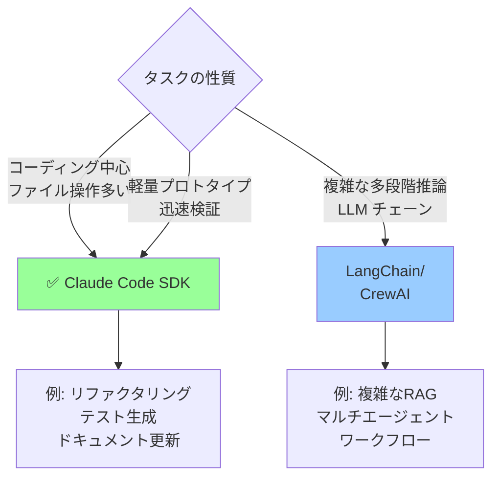

## 要約（Summary）

- Claude Code SDK は対話型 CLI だけでなく、プログラマブルなエージェントフレームワークとして活用できる。大規模並列スクリプティング・非技術者向けチャットツール構築・エージェントプロトタイピングの3つの主要パターンがある。
- LangChain/CrewAI より軽量で、コーディングタスク以外（脅威調査・データ分析など）にも応用可能。

## 本文（Body）

### Claude Code SDK の本質

Claude Code は「対話型 CLI」としての顔だけでなく、**プログラマブルなエージェント SDK** としての顔を持つ。

**SDK としての特徴:**
- コーディング特化のツールセット（Edit, Write, Bash など）を内蔵
- フック・サブエージェント・MCP を統合
- 200k〜1M トークンのコンテキストウィンドウ
- ストリーミング応答とエラーハンドリング

これを活用すると、LangChain や CrewAI に頼らず、軽量でカスタマイズ性の高いエージェントシステムを構築できる。

### パターン1: 大規模並列スクリプティング

**用途:** 大量のファイル・リポジトリに対する一括変更

**問題意識:**
- 大規模なリファクタリング（例: API 名変更を 500 ファイルに適用）
- バグ修正の一括適用（例: 特定の脆弱性パターンを検出・修正）
- マイグレーション（例: レガシー API から新 API へ移行）

対話型 Claude Code では、1つのセッションで数十ファイルを扱うのが限界。並列化も難しい。

**解決策: Bash スクリプト + Claude CLI**

```bash
#!/bin/bash
# parallel-refactor.sh

# 変更対象のディレクトリリスト
DIRS=(
  "services/user-service"
  "services/payment-service"
  "services/notification-service"
  # ... 100+ services
)

# 並列実行（最大10並列）
parallel -j 10 claude -p "In {} change all references from foo to bar" ::: "${DIRS[@]}"
```

**利点:**
- スケーラブル（数百〜数千のディレクトリに対応）
- 制御可能（失敗したタスクだけリトライ）
- 監査可能（各ディレクトリのログを個別に保存）

**実践例:**
```bash
# 例1: セキュリティパッチの一括適用
find . -name "*.py" -type f | \
  parallel -j 20 \
    claude -p "In {} replace insecure random.random() with secrets.SystemRandom()"

# 例2: ドキュメント更新
ls -d docs/*/ | \
  parallel -j 5 \
    claude -p "In {} update all code examples to use new API v2"

# 例3: テストカバレッジ向上
git ls-files 'src/**/*.ts' | \
  parallel -j 10 \
    'claude -p "Add unit tests for {} if coverage < 80%"'
```

**監視とロギング:**
```bash
#!/bin/bash
# parallel-refactor-with-logging.sh

LOGDIR="logs/refactor-$(date +%Y%m%d-%H%M%S)"
mkdir -p "$LOGDIR"

for dir in "${DIRS[@]}"; do
  {
    echo "Processing $dir..."
    claude -p "In $dir change foo to bar" 2>&1
    echo "Exit code: $?"
  } > "$LOGDIR/$(basename $dir).log" &
done

wait
echo "All done. Check logs in $LOGDIR"
```

### パターン2: 非技術者向けチャットツール

**用途:** 複雑なプロセスを簡単なチャットインターフェースでラップ

**問題意識:**
- エラー時のインストーラーが失敗すると、非技術者は対処できない
- デザイナーがモックを作るために複雑な UI フレームワークを学ぶ必要がある
- 内部ツールの使い方が複雑すぎる

**解決策: Claude Code SDK でカスタムチャットツールを構築**

#### 例1: セルフヒーリングインストーラー

```javascript
// installer.js
const { ClaudeCode } = require('claude-code-sdk');

async function installWithAutoFix() {
  console.log("Installing application...");
  
  const result = await runInstaller();
  
  if (result.success) {
    console.log("✅ Installation successful!");
    return;
  }
  
  // エラーが発生したら Claude に修復させる
  console.log("❌ Installation failed. Auto-fixing...");
  
  const claude = new ClaudeCode({
    context: {
      errorLog: result.errorLog,
      system: getSystemInfo(),
      env: process.env
    }
  });
  
  await claude.chat(
    `Installation failed with this error:
    ${result.errorLog}
    
    Please diagnose and fix the problem.
    You can:
    - Install missing dependencies
    - Fix configuration files
    - Adjust permissions
    
    Then retry the installation.`
  );
}
```

#### 例2: デザイナー向け UI モックジェネレーター

```javascript
// design-chat.js
const { ClaudeCode } = require('claude-code-sdk');

async function designerChat() {
  const claude = new ClaudeCode({
    context: {
      uiFramework: 'our-internal-design-system',
      componentsDir: './src/components',
      examplesDir: './examples'
    },
    systemPrompt: `
      You are a UI code generator for our design system.
      Generate high-fidelity React components that:
      - Use our design tokens (colors, spacing, typography)
      - Follow accessibility guidelines (WCAG AA)
      - Are production-ready (not just prototypes)
    `
  });
  
  // デザイナーとの対話
  const response = await claude.chat(
    "Create a user profile card with avatar, name, bio, and follow button"
  );
  
  console.log("✅ Component generated at:", response.files);
}
```

**利点:**
- 非技術者でも複雑なコードを生成できる
- エラー時の自動回復
- 社内ツールの民主化

### パターン3: エージェントプロトタイピング

**用途:** 新しいエージェント型ツールのアイデアを迅速に検証

**問題意識:**
- LangChain/CrewAI は重厚で、プロトタイプには過剰
- カスタム MCP やツールを統合したい
- コーディング以外のタスク（調査・分析など）にも使いたい

**解決策: Claude Code SDK でミニマルエージェントを構築**

#### 例: セキュリティ脅威調査エージェント

```javascript
// security-investigator.js
const { ClaudeCode } = require('claude-code-sdk');

async function investigateThreat(alertId) {
  const claude = new ClaudeCode({
    tools: [
      // カスタム MCP
      'security-logs-mcp',
      'threat-intel-mcp',
      'network-graph-mcp'
    ],
    context: {
      alert: await getAlert(alertId),
      recentIncidents: await getRecentIncidents()
    }
  });
  
  const report = await claude.chat(`
    Investigate this security alert: ${alertId}
    
    1. Query security logs for related events
    2. Check threat intelligence databases
    3. Analyze network connections
    4. Determine if this is a true positive
    5. Generate a summary report with recommended actions
  `);
  
  // レポートを Slack/Jira に自動投稿
  await postToSlack(report.summary);
  await createJiraTicket(report.details);
}
```

#### 例: データ分析エージェント

```python
# data-analyst-agent.py
from claude_code_sdk import ClaudeCode

def analyze_customer_churn():
    claude = ClaudeCode(
        tools=['data-warehouse-mcp', 'visualization-tool'],
        context={
            'schema': load_schema('customer_data'),
            'metrics': ['churn_rate', 'ltv', 'engagement']
        }
    )
    
    report = claude.chat("""
        Analyze customer churn for Q4 2025:
        1. Query data warehouse for churned customers
        2. Identify common patterns (demographics, usage, support tickets)
        3. Generate visualizations
        4. Recommend retention strategies
        
        Save the report as PDF.
    """)
    
    return report
```

**利点:**
- プロトタイプを数時間で構築
- 既存の MCP/CLI を統合可能
- コーディング以外のタスクにも適用
- 成功したら本番システムに移行

### 実装のベストプラクティス

1. **コンテキスト設計**: 必要最小限のコンテキストを渡す（コスト削減）
2. **エラーハンドリング**: タイムアウト・リトライ・フォールバックを実装
3. **ロギング**: すべてのプロンプト・応答・エラーを記録
4. **コスト監視**: トークン消費量を追跡し、予算超過を防ぐ
5. **人間の関与**: 重要な決定は人間に確認させる

### 他フレームワークとの比較



**Claude Code SDK が優れている:**
- ファイル操作が中心のタスク
- git・bash との統合が必要
- 迅速なプロトタイピング
- 軽量なエージェント

**LangChain/CrewAI が優れている:**
- 複雑な推論チェーン
- 多様な LLM の組み合わせ
- エージェント間の複雑な協調
- 大規模な RAG システム

## 関連ノート（Links）

- [[20251206-123000-claude-code-agentic-coding-workflows|エージェント的コーディングワークフローとスケール]]
- [[20251129165839-coding-agent-incremental-progress|Coding agentによるインクリメンタル進捗]]
- [[20251215000254-claude-skills-scripting-model|Claude Skills の抽象化レベルとスクリプティングモデル]]
- [[20251215000506-mcp-secure-gateway-model|MCP の新しい役割定義：セキュアゲートウェイモデル]]

## To-Do / 次に考えること

- [ ] 社内の大規模リファクタリングを並列スクリプトで自動化する PoC を作る
- [ ] デザイナー向け UI モックジェネレーターのプロトタイプを構築
- [ ] エージェントプロトタイピングのテンプレートリポジトリを作成
