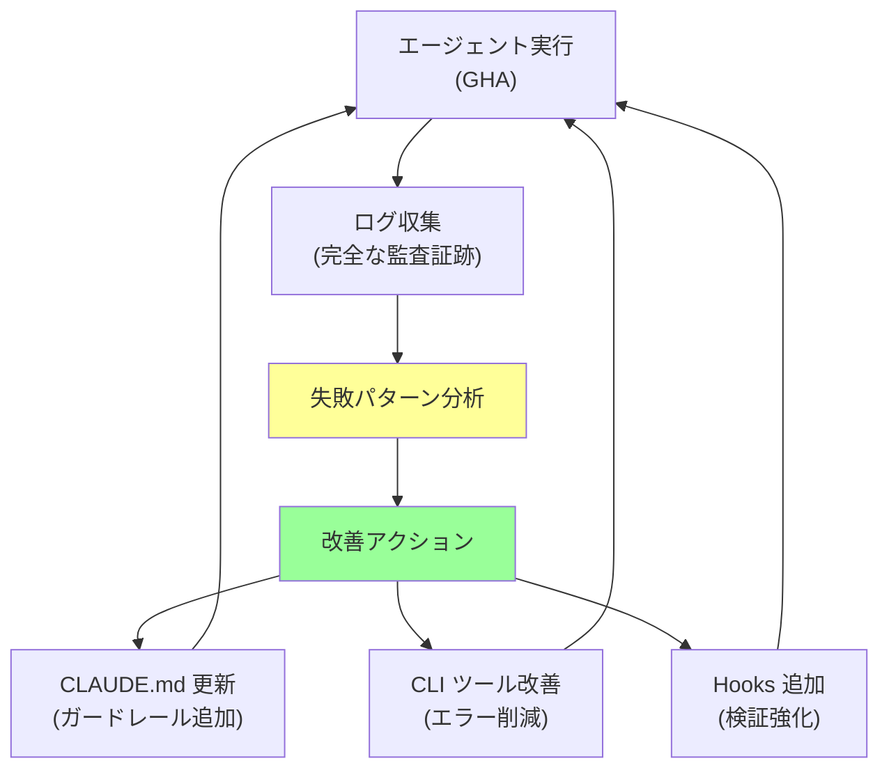

## 要約（Summary）

- Claude Code GitHub Action（GHA）は、Cursor のバックグラウンドエージェントより柔軟で、フルコントロール可能な CI/CD エージェント。任意のトリガー（Slack・Jira・CloudWatch アラート）から PR を自動生成できる。
- GHA ログは完全な監査証跡となり、エージェントの失敗パターンを組織レベルで分析し、`CLAUDE.md` や CLI ツールの継続的改善を実現する「データ駆動フライホイール」を構築できる。

## 本文（Body）

### Claude Code GHA の位置づけ

**他製品との比較:**
- **Cursor バックグラウンドエージェント**: マネージド環境、カスタマイズ制限あり
- **Codex Web UI**: ブラウザベース、監査機能が弱い
- **Claude Code GHA**: フルコントロール、最強のカスタマイズ性と監査性

**GHA の特徴:**
1. コンテナ環境を完全制御
2. すべての高度機能（Hooks・MCP・Subagents）をサポート
3. 完全な監査ログ（GitHub Actions ログ）
4. 任意のトリガーから起動可能

### ユースケース1: PR-from-Anywhere

**コンセプト:** あらゆる場所から PR を自動生成

#### トリガー例

**1. Slack から PR 作成:**
```
User in Slack: "@bot fix bug in user-service timeout issue"
↓
Slack Bot → GitHub Actions (repository_dispatch)
↓
Claude Code GHA runs
↓
PR created with fix + tests
↓
Notification back to Slack
```

**2. Jira チケットから自動実装:**
```
Jira ticket created: "Add API rate limiting"
↓
Jira webhook → GitHub Actions
↓
Claude Code reads ticket, implements feature
↓
PR linked to Jira ticket
```

**3. CloudWatch アラートから自動修正:**
```
CloudWatch alarm: "High error rate in payment-service"
↓
SNS → Lambda → GitHub Actions
↓
Claude Code analyzes logs, fixes bug
↓
PR with hotfix + rollback plan
```

#### 実装例

**GitHub Actions ワークフロー:**
```yaml
# .github/workflows/claude-pr-bot.yml
name: Claude PR Bot

on:
  repository_dispatch:
    types: [create-pr-from-slack, create-pr-from-jira, hotfix-from-alert]

jobs:
  claude-code:
    runs-on: ubuntu-latest
    steps:
      - uses: actions/checkout@v3
      
      - name: Setup Claude Code
        uses: anthropics/claude-code-action@v1
        with:
          anthropic-api-key: ${{ secrets.ANTHROPIC_API_KEY }}
      
      - name: Run Claude Code
        run: |
          claude -p "${{ github.event.client_payload.prompt }}" \
                 --context="${{ github.event.client_payload.context }}"
      
      - name: Create PR
        uses: peter-evans/create-pull-request@v5
        with:
          title: "[Auto] ${{ github.event.client_payload.title }}"
          body: |
            🤖 Auto-generated by Claude Code
            
            **Trigger:** ${{ github.event.action }}
            **Context:** ${{ github.event.client_payload.context }}
            
            **Changes:**
            ${{ steps.claude-code.outputs.summary }}
            
            **Logs:** [View full logs](${{ github.server_url }}/${{ github.repository }}/actions/runs/${{ github.run_id }})
          branch: auto/${{ github.event.client_payload.branch-name }}
          labels: automated, needs-review
```

**Slack ボットからのトリガー:**
```javascript
// slack-bot.js
const { Octokit } = require('@octokit/rest');

async function triggerClaudeBot(slackMessage) {
  const octokit = new Octokit({ auth: process.env.GITHUB_TOKEN });
  
  await octokit.repos.createDispatchEvent({
    owner: 'your-org',
    repo: 'your-repo',
    event_type: 'create-pr-from-slack',
    client_payload: {
      prompt: slackMessage.text,
      title: `Fix requested by ${slackMessage.user}`,
      context: {
        user: slackMessage.user,
        channel: slackMessage.channel,
        timestamp: slackMessage.ts
      },
      branchName: `slack-${Date.now()}`
    }
  });
  
  return "✅ Claude is working on it! You'll be notified when PR is ready.";
}
```

### ユースケース2: データ駆動フライホイール

**コンセプト:** GHA ログを分析し、組織全体のエージェント品質を継続的に改善

#### フライホイールの仕組み



#### 実装例

**ログ分析スクリプト:**
```bash
#!/bin/bash
# analyze-claude-logs.sh

# 過去5日間の GHA ログを取得
gh run list --workflow=claude-pr-bot.yml \
            --limit=100 \
            --json conclusion,databaseId,createdAt > runs.json

# 失敗したログを抽出
jq -r '.[] | select(.conclusion=="failure") | .databaseId' runs.json | \
while read run_id; do
  gh run view "$run_id" --log > "logs/failed-$run_id.log"
done

# よくあるエラーパターンを集計
grep -h "Error:" logs/failed-*.log | \
  sort | uniq -c | sort -rn > error-patterns.txt

echo "Top 10 error patterns:"
head -10 error-patterns.txt
```

**自動改善ワークフロー:**
```yaml
# .github/workflows/improve-agent.yml
name: Improve Agent Config

on:
  schedule:
    - cron: '0 0 * * 0'  # 毎週日曜日

jobs:
  analyze-and-improve:
    runs-on: ubuntu-latest
    steps:
      - uses: actions/checkout@v3
      
      - name: Analyze logs
        run: ./scripts/analyze-claude-logs.sh
      
      - name: Generate improvements
        run: |
          claude -p "
            Analyze error-patterns.txt and suggest improvements to:
            1. CLAUDE.md (add guardrails for common mistakes)
            2. CLI tools (improve error messages)
            3. Hooks (add validation for common failures)
            
            Create a PR with your suggestions.
          "
      
      - name: Create improvement PR
        uses: peter-evans/create-pull-request@v5
        with:
          title: "[Weekly] Agent configuration improvements"
          body: "Auto-generated improvements based on last week's failures"
```

#### 分析例

**エラーパターン収集:**
```
# error-patterns.txt
  45 Error: Tests failed - ModuleNotFoundError: No module named 'pytest'
  32 Error: Commit blocked - /tmp/tests-passed not found
  28 Error: Permission denied: .github/workflows/
  15 Error: Timeout: Command took longer than 300s
  12 Error: Invalid YAML in config file
```

**改善提案（Claude が生成）:**
```markdown
# Improvement PR

## Analysis
Analyzed 100 runs, found 45 failures due to missing pytest.

## Proposed Changes

### 1. CLAUDE.md
Add to testing section:
```markdown
## Python Testing
- ALWAYS check if pytest is installed: `pip list | grep pytest`
- If missing, install: `pip install pytest`
```

### 2. test.sh script
Add automatic pytest installation:
```bash
if ! pip list | grep -q pytest; then
  echo "Installing pytest..."
  pip install pytest
fi
```
```

### ユースケース3: セキュリティとサンドボックス

**GHA の利点:**
- 完全に隔離されたコンテナ環境
- 細かいパーミッション制御
- ネットワークアクセス制限
- シークレット管理

**セキュリティ設定例:**
```yaml
jobs:
  claude-code:
    runs-on: ubuntu-latest
    
    # コンテナをサンドボックス化
    container:
      image: custom-claude-sandbox:latest
      options: --cpus=2 --memory=4g
    
    # 最小権限
    permissions:
      contents: read
      pull-requests: write
    
    # ネットワーク制限
    env:
      HTTPS_PROXY: http://internal-proxy:3128
      NO_PROXY: github.com,api.anthropic.com
    
    # タイムアウト
    timeout-minutes: 30
```

### ユースケース4: PR レビュー要件

**哲学的な問題:**
> 顧客リクエストから直接生成された PR は、人間のレビュアーが何人必要か？

**現在の実践:**
- **人間が指示した PR**: 1人のレビュア
- **AI が直接作成した PR**: **2人のレビュア** ✅

**理由:**
1. 人間の意図が介在していない
2. より慎重な検証が必要
3. エッジケースの見落としリスク

**将来の方向性:**
- エージェントの信頼性が向上すれば 1人に削減
- 自動テストカバレッジが 95% 以上なら自動マージも検討

### 実践チェックリスト

- [ ] Claude Code GHA ワークフローを設定したか？
- [ ] 外部トリガー（Slack・Jira など）を統合したか？
- [ ] ログ分析スクリプトを定期実行しているか？
- [ ] サンドボックス化とセキュリティ設定を適用したか？
- [ ] AI生成 PR のレビュープロセスを定義したか？

### アンチパターン

❌ **無制限の権限**
```yaml
permissions: write-all  # 危険
```

❌ **ログ分析の放置**
```
# エージェントが同じエラーを毎週繰り返す
```

❌ **レビューなしの自動マージ**
```yaml
- name: Auto merge
  run: gh pr merge --auto --squash  # リスク大
```

## 関連ノート（Links）

- [[20251215000637-claude-code-sdk-usage-patterns|Claude Code SDK の3つの活用パターン]]
- [[20251215000015-block-at-submit-hook-strategy|Block-at-Submitフック戦略]]
- [[20251129165841-ai-agent-end-to-end-testing|AIエージェントにおけるエンドツーエンドテスト]]
- [[20251206-123000-claude-code-agentic-coding-workflows|エージェント的コーディングワークフローとスケール]]

## To-Do / 次に考えること

- [ ] Slack から PR を作成する PoC を構築
- [ ] 週次でログを分析し、`CLAUDE.md` を自動改善する仕組みを作る
- [ ] AI生成 PR のレビューガイドラインを文書化
