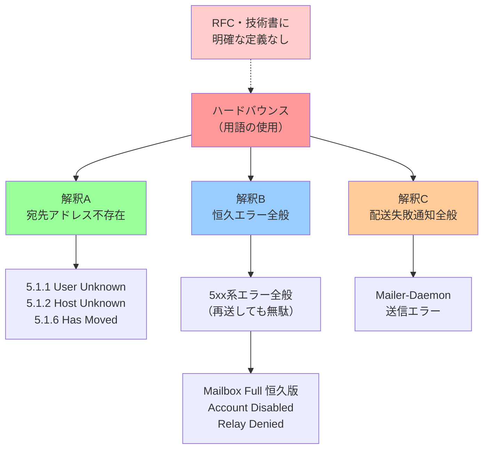

## 要約（Summary）

- ハードバウンス・ソフトバウンスという用語は人や組織によって意味が異なり、RFC や技術書にも明確な定義がない多義的な用語である。
- 1990年代のNewsGroup投稿を遡っても用法にバラつきがあり、「恒久エラー全般」を指す場合と「宛先アドレス不存在」に限定する場合が混在している。
- この曖昧さは技術的な議論やシステム設計において認識の不一致を引き起こす原因となり、より明確な代替表現が望ましい。

## 本文（Body）

### 背景・問題意識

メール配信システムの運用において「ハードバウンス」「ソフトバウンス」という用語は広く使われているが、実際には人や組織によって指し示す範囲が異なる。この多義性は技術的な議論を混乱させ、システム間の連携やドキュメント作成において誤解を生む可能性がある。

### 定義の多様性

**技術書・RFCでの扱い**

- O'Reilly の sendmail 関連書籍（2007年刊行の第4版を含む）に「ハードバウンス」「ソフトバウンス」の記載なし
- Postfix 実用ガイド・詳解にも該当用語なし
- RFC でも hard bounce / soft bounce という表現は実質的に登場しない（ietf.org で検索して2件程度）
- SMTP プロトコル仕様では「Permanent Error (5xx)」「Temporary Error (4xx)」という明確な用語を使用

**マーケティング業界での定義**

- 検索結果の大半はマーケティング関連記事
- 多くの記事で「ハードバウンス = 恒久的エラー」「ソフトバウンス = 一時的エラー」と定義
- SMTP 応答コード 5xx 系全般をハードバウンスとする広義の解釈が主流

**技術者コミュニティでの用例**

1995年〜2014年の comp.mail.sendmail における投稿を調査した結果：

- 1995年: Mailer-Daemon からの配送失敗メッセージ全般を「ハードバウンス」と表現
- 1998年: Permission Denied（システムエラー）を「ハードバウンス」と呼ぶ用例
- 2001年: **5.7.1 エラー（拒否）をソフトバウンスと認識している用例** も存在
- 2000年: 「バウンスにソフトもハードもない」という意見も見られる

この調査から、**20世紀末の時点で既に解釈がばらついていた**ことが判明している。

### 主要な解釈パターン

**パターンA: 宛先アドレス存在性に限定**

- `5.1.1 User Unknown`、`5.1.2 Host Unknown`、`5.1.6 Has Moved` のみ
- メールアドレスの実在性に焦点
- SendGrid、Microsoft などが採用

**パターンB: 恒久エラー全般**

- SMTP 5xx 系エラー全般
- 再送しても解決しないエラー全体を包含
- Mailbox Full (5.2.2 恒久版)、Account Disabled なども含む

**パターンC: Mailer-Daemon からのエラー通知**

- 初期の用例に多い
- 遅延通知との対比として使用
- 具体的なエラー理由は問わない

### 内容を視覚化するMermaid図

### 問題の影響

**技術的コミュニケーションへの影響**

- 開発者間で「ハードバウンス対応を実装」と言った際に、対象範囲の認識がずれる
- ドキュメントやAPI仕様で使用すると、利用者によって解釈が異なる
- バウンス処理ロジックの要件定義で齟齬が生じる

**システム設計への影響**

- 配信リストからの除外判定基準が曖昧になる
- エラー分類の実装が組織ごとに異なり、互換性がない
- レピュテーション管理の戦略が不明確になる

### 代替アプローチ

**明確な技術用語を使用**

- SMTP 応答コード: `5.1.1`、`5.2.2` など
- RFC 定義済み用語: Permanent Error、Temporary Error
- Extended Status Code による分類

**目的に応じた明示的な表現**

- 「宛先アドレス不存在エラー」
- 「配信不可能（恒久）エラー」
- 「リスト除外対象エラー」

### 反論・限界・条件

**用語の普及度**

多義的ではあるものの、ハードバウンス・ソフトバウンスという用語は広く認知されており、完全に廃止することは現実的でない。文脈を明示した上で使用する、あるいは定義を明記することで対処可能。

**歴史的経緯**

バウンスの種類が少なかった初期においては、「恒久エラー ≒ 宛先不明」という等式がほぼ成立していた可能性がある。現代のように多様なエラー理由が存在する環境では、より精緻な分類が必要になっている。

## 関連ノート（Links）

- [[20251215002511-bounce-three-tier-classification|バウンスの3階層分類体系]]
- [[20251215002512-toxic-flag-design|Toxicフラグ：配信除外判定の実装パターン]]

## To-Do / 次に考えること

- [ ] 社内の配信システムでハードバウンスをどう定義しているか確認
- [ ] API ドキュメントで「ハードバウンス」を使用している箇所を特定し、定義を明記
- [ ] バウンス処理の要件定義テンプレートを作成（曖昧さを排除）
