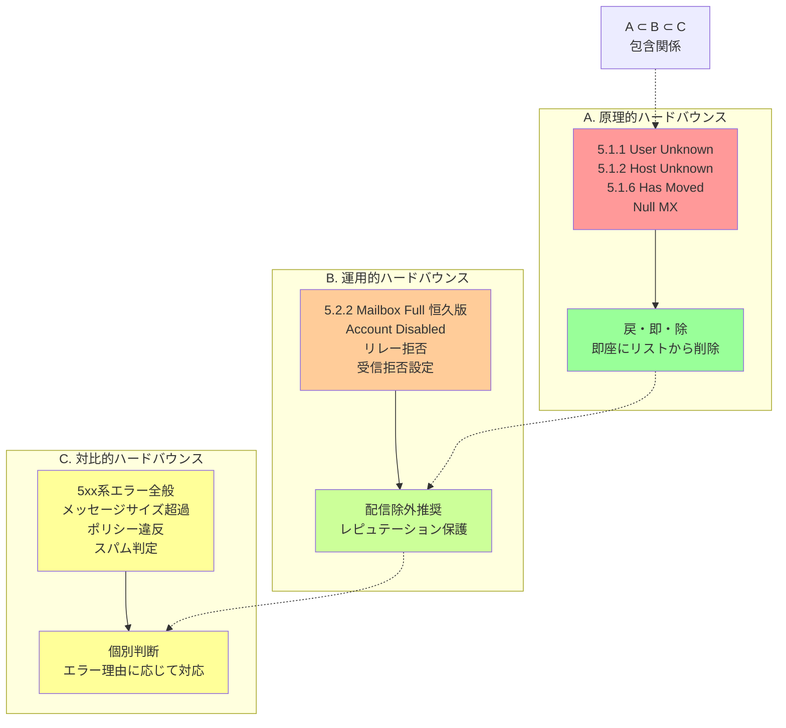

## 要約（Summary）

- メールバウンスは「原理的ハードバウンス（実在性）」「運用的ハードバウンス（到達性）」「対比的ハードバウンス（恒久性）」の3階層に分類できる。
- 原理的ハードバウンスは宛先アドレスの実在性に焦点を当て、運用的ハードバウンスはメールボックスへの到達可能性を、対比的ハードバウンスは一時エラーとの対比を重視する。
- 実務では運用的ハードバウンスレベルでの判断が必要だが、原理的ハードバウンスを基準として、追加的な判定ロジックを組み合わせる設計が推奨される。

## 本文（Body）

### 背景・問題意識

「ハードバウンス」という用語の多義性により、配信リストからの除外判定基準が曖昧になる問題がある。実務では単に「宛先が存在しない」だけでなく、「メールボックスに到達できない」「レピュテーションを損なう」といった多様な観点での判断が必要となる。

この3階層分類は、異なる文脈や目的に応じたバウンス処理の設計指針を提供する。

### 3階層の分類体系

#### A. 原理的ハードバウンス（実在性重視）

**定義**: 宛先メールアドレスが技術的に存在しないことを示すバウンス

**対象となるエラー**:

1. **送信元MTAでの検出**
   - `5.1.2 Host Unknown`: ドメインが存在しない（MX/A レコードなし）
   - Null MX (`0 .`): ドメインはメール受信を明示的に拒否

2. **宛先MTAでの検出**
   - `5.1.1 User Unknown`: ローカルパートが存在しない
   - `5.1.6 Has Moved`: 宛先が移動済み（滅多に見ない）

**運用方針**: **戻・即・除（レイ・ソク・ジョ）**

- 発生したら即座に配信リストから除外
- 再送は技術的に無意味
- 最も確実な除外判定基準

**該当 Extended Status Code**: RFC3463 の `X.1.Z` 系（Addressing Status）

#### B. 運用的ハードバウンス（到達性重視）

**定義**: 宛先アドレスは存在するが、メールボックスに到達できないバウンス

**対象となるエラー**:

1. **メールボックス満杯（恒久版）**
   - `5.2.2 Mailbox Full`: Gmail など、長期間放置されたアカウント
   - プロバイダが恒久エラーに遷移させた状態

2. **アカウント無効化**
   - `Account disabled`、`Inactive`、`Suspended`
   - 料金未納、規約違反、長期未使用など

3. **受信拒否設定**
   - 携帯キャリアのドメイン指定拒否
   - DATA コマンドで `User Unknown` を返す（実際は拒否設定）

4. **リレー拒否**
   - `5.7.1 Relaying denied`: メールホスティング解約後の放置ドメイン
   - オープンリレー探索と誤認される危険性

**運用方針**: **配信対象から除外すべき**

- 宛先は存在するが、到達不可能
- 再送してもレピュテーション低下のリスク
- 読者エンゲージメント指標を悪化させる

**該当 Extended Status Code**: 主に RFC3463 の `X.2.Z` 系（Mailbox Status）

#### C. 対比的ハードバウンス（恒久性重視）

**定義**: SMTP 5xx 系エラー全般（一時エラー 4xx との対比）

**対象となるエラー**:

- `5.2.3 Message too large`: メッセージサイズ超過
- `5.7.1 Policy violation`: DMARC 不備、SPF 失敗など
- `5.7.0 Security policy`: スパム判定
- その他すべての恒久エラー

**運用方針**: **エラー理由に応じて個別判断**

- すべてを配信リストから除外すると過剰
- 例: メッセージサイズ超過 → 次回は小さいメールを送信可能
- 例: DMARC 不備 → 送信者側の設定修正で解決

**歴史的背景**:

- バウンス種類が少なかった時代は、5xx ≒ 宛先不明という等式がほぼ成立
- 現代では多様なエラー理由が存在し、一律除外は不適切
- マーケティング業界で広く使われる定義だが、技術的には粗い分類

### 内容を視覚化するMermaid図



### 実装における優先順位

**推奨アプローチ: 段階的判定**

```
1. 原理的ハードバウンスをチェック → 検出されたら即除外
2. 運用的ハードバウンスの追加条件をチェック
   - Mailbox Full の継続回数
   - Account 状態（Disabled/Inactive）
   - リレー拒否の発生
3. 組織固有の基準を適用
   - 配信頻度を考慮した閾値
   - エンゲージメント指標との組み合わせ
```

**Sisimai における実装**:

- `"hardbounce": true` は原理的ハードバウンス（A）のみ
- `"toxic": true` は A + B の一部を示唆（後述の Toxic フラグで詳述）
- C レベルの判断は利用者側に委ねる

### 階層間の関係性

**包含関係**: A ⊂ B ⊂ C

- すべての原理的ハードバウンスは運用的ハードバウンスでもある
- すべての運用的ハードバウンスは対比的ハードバウンスでもある
- 逆は成り立たない（C に含まれても B や A とは限らない）

**優先度**: A > B > C

- 確実性: 原理的 > 運用的 > 対比的
- 除外判定の信頼度: 原理的が最も高い
- 誤検知リスク: 対比的が最も高い

### 具体例・ケース

**ケース1: Gmail の長期放置アカウント**

```
550 5.2.2 The email account that you tried to reach is over quota
```

- 分類: B（運用的ハードバウンス）
- 判定: 配信除外推奨
- 理由: 長期間満杯 → 恒久エラー化 → 読まれていない

**ケース2: メールホスティング解約後の放置ドメイン**

```
550 5.7.1 Relaying denied
```

- 分類: B（運用的ハードバウンス）
- 判定: 配信除外推奨
- 理由: 管理されていないドメイン → レピュテーション低下リスク

**ケース3: DMARC 設定不備**

```
550 5.7.1 DMARC policy violation
```

- 分類: C（対比的ハードバウンス）
- 判定: 送信者側で修正
- 理由: 宛先の問題ではなく、送信者の設定ミス

### 反論・限界・条件

**分類の境界は曖昧**

実際のエラーメッセージは多様であり、明確に分類できないケースも存在する。Extended Status Code が不正確な場合や、エラーメッセージが曖昧な場合は、複数の階層にまたがる可能性がある。

**組織依存の基準**

B（運用的ハードバウンス）の判定には、配信頻度やビジネス特性が影響する。一律の基準ではなく、組織ごとのカスタマイズが必要。

**時間軸の考慮**

一時エラー（4xx）が複数回継続した場合、実質的にB または C として扱うべきケースがある。単一バウンスの分類だけでなく、履歴データとの組み合わせが重要。

## 関連ノート（Links）

- [[20251215002510-hardbounce-definition-ambiguity|ハードバウンス定義の多義性問題]]
- [[20251215002512-toxic-flag-design|Toxicフラグ：配信除外判定の実装パターン]]

## To-Do / 次に考えること

- [ ] 自社の配信システムで B レベルの判定を実装する具体的な閾値を決定
- [ ] A/B/C それぞれのエラーコードリストを作成し、運用ドキュメント化
- [ ] バウンス処理の段階的判定ロジックをコードレビュー
