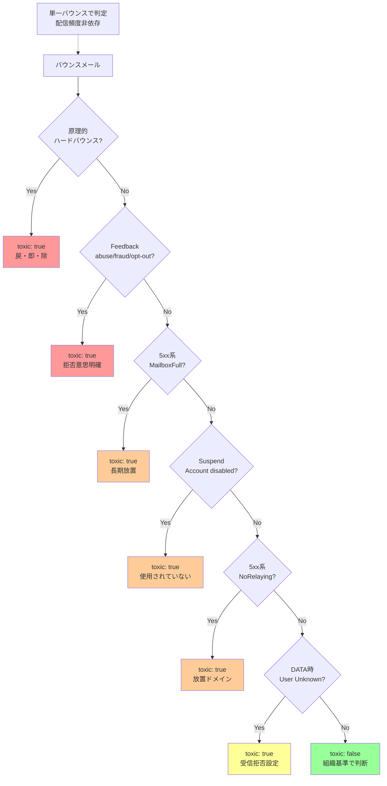

## 要約（Summary）

- Sisimai 5.5.0 で試験実装された `toxic` フラグは、単一バウンスの「毒性（配信リストを蝕む危険性）」を示す真偽値フラグである。
- 原理的ハードバウンス（宛先不存在）に加え、運用的ハードバウンス（到達不可能）の一部を自動判定し、配信除外の判断材料を提供する。
- 配信頻度に依存しない基準のみを採用し、組織固有の運用基準（履歴データとの組み合わせなど）は利用者側に委ねる設計。

## 本文（Body）

### 背景・問題意識

**従来の課題**

メール配信システムの運用において、`hardbounce` フラグ（宛先アドレスの実在性のみ）だけでは不十分なケースが多い：

- Mailbox Full (5.2.2 恒久版): アドレスは存在するが、長期間読まれていない
- Account Disabled: アカウントは存在するが無効化されている
- リレー拒否: ドメインは存在するが、管理されていない

これらは原理的ハードバウンスには該当しないが、配信を継続するとレピュテーション低下を招く「毒性のあるバウンス」である。

**組織依存の判断基準**

従来は利用者が以下を考慮して独自に基準を設定していた：

- 配信頻度（毎日 vs 週1回）
- Mailbox Full の継続回数（10回で除外 vs 5回で除外）
- エンゲージメント指標との組み合わせ

しかし、**配信頻度に依存しない共通基準**も存在するため、ライブラリ側で判定支援を提供する価値がある。

### Toxic フラグの設計思想

**命名の由来**

- **Toxic（毒性）**: 当該バウンスを放置すると、配信リスト全体を蝕む危険性があることを示唆
- **薬としての効果**: 除外判定の一助となる指標を提供し、レピュテーション低下を防ぐ
- **試験的実装**: 将来的に真偽値から多値フラグ（スコア化）に変更される可能性あり

**設計原則**

1. **単一バウンス判定**: 1通のバウンスメール単体で判断（履歴データは不要）
2. **配信頻度非依存**: 組織の配信頻度に関わらず適用可能な基準のみ
3. **保守的判定**: 誤検知を避け、確実に除外すべきケースのみ `true` にする
4. **並行運用前提**: 既存の組織固有基準と組み合わせて使用

### 判定基準の詳細

#### カテゴリ1: 原理的ハードバウンスの全て

**対象バウンス理由**:

- `HostUnknown` (5.1.2): ドメインが存在しない
- `UserUnknown` (5.1.1): ローカルパートが存在しない
- `HasMoved` (5.1.6): 宛先が移動済み
- `NotAccept` (Null MX): ドメインがメール受信を拒否

**判定ロジック**: すべて `toxic: true`

**根拠**: メールアドレスが技術的に存在しない場合、再送は無意味であり、即座に除外すべき

#### カテゴリ2: フィードバックループ（明確な拒否意思）

**対象**:

- `Feedback` 理由のバウンスで、`FeedbackType` が以下の場合：
  - `abuse`: 苦情・スパム報告
  - `fraud`: 詐欺の疑惑報告
  - `opt-out`: 購読解除

**判定ロジック**: 上記の `FeedbackType` なら `toxic: true`

**根拠**: 受信者の明示的な拒否意思があり、再送は法的・倫理的に問題がある

#### カテゴリ3: 恒久版 Mailbox Full

**対象**: `MailboxFull` (5.2.2) かつ SMTP 5xx 系

**判定ロジック**: 5xx 系の Mailbox Full のみ `toxic: true`

**根拠**:

- Gmail などは長期間（数ヶ月）満杯状態が続くと 4xx → 5xx に遷移
- プロバイダが恒久エラー化 = アカウントが事実上放棄されている
- 配信頻度に関わらず、除外が妥当

**除外されるケース**:

- 4xx 系の Mailbox Full: 一時的な可能性があるため `toxic: false`
- 継続回数の判定: 配信頻度に依存するため、利用者側で実装

#### カテゴリ4: アカウント無効化

**対象**: `Suspend` 理由のバウンス

**エラーメッセージ例**:

- `Account disabled`
- `Account inactive`
- `Mailbox unavailable`

**判定ロジック**: すべて `toxic: true`

**根拠**:

- アカウントが存在するが使用されていない（料金未納、長期未使用など）
- 活動していないアドレスへの配信は無意味
- レピュテーション指標（開封率、クリック率）を悪化させる

#### カテゴリ5: リレー拒否（5xx のみ）

**対象**: `NoRelaying` (5.7.1) かつ SMTP 5xx 系

**典型的なシナリオ**:

1. `example.co.jp` がメールホスティングサービスと契約
2. MX レコードをホスティング先に設定
3. 契約解約後、MX レコードが放置される
4. ホスティング先は `example.co.jp` を受け取らなくなる
5. リレー拒否エラーが発生

**判定ロジック**: 5xx 系の NoRelaying は `toxic: true`

**根拠**:

- ドメインが管理されていない（放置されている）
- オープンリレー探索と誤認され、送信元 IP のレピュテーション低下リスク
- 再送しても解決しない

**除外されるケース**:

- 4xx 系のリレー拒否: 一時的な設定ミスの可能性

#### カテゴリ6: DATA コマンドでの User Unknown (Filtered)

**対象**: `Filtered` 理由で、SMTP の DATA コマンド応答が User Unknown

**歴史的背景**:

- 携帯キャリア（特に NTT ドコモ）のドメイン指定拒否
- RCPT コマンドでは受理し、DATA で User Unknown を返す
- エラーメッセージは「宛先不明」だが、実際は受信拒否設定

**判定ロジック**: `toxic: true`（ただし慎重な判定が必要）

**根拠**:

- 受信者の明示的な拒否設定
- 継続すると送信元 IP がキャリアにブロックされる危険性
- 短時間で大量発生すると接続拒否に至る

**注意点**:

- 本当の User Unknown との区別が困難
- 誤検知のリスクあり（設定ミスで意図せず拒否している場合）
- ユーザーからの問い合わせ対応が必要になる可能性

### 内容を視覚化するMermaid図



### 実装における注意点

**真偽値から多値への移行可能性**

現在は `"toxic": true|false` だが、将来的には以下の形式に変更される可能性：

```json
{
  "toxic": 3,  // 0-15 の 4bit フラグ
  "toxic_flags": {
    "address_nonexistent": true,  // bit 0
    "mailbox_unreachable": true,  // bit 1
    "sender_blocked": false,      // bit 2
    "policy_violation": false     // bit 3
  }
}
```

**利点**:

- 複数の毒性要因を同時に表現可能
- 段階的な除外判定（スコアリング）が可能
- 将来的な拡張性

**組織固有基準との組み合わせ**

Toxic フラグは配信除外の**必要条件**であり、**十分条件ではない**：

```python
# 推奨される判定ロジック
def should_exclude_from_list(bounce):
    # 1. Toxic フラグチェック
    if bounce['toxic']:
        return True
    
    # 2. 組織固有基準
    if bounce['reason'] == 'MailboxFull':
        # 4xx でも10回続いたら除外
        if get_bounce_count(bounce['recipient']) >= 10:
            return True
    
    # 3. エンゲージメント指標
    if get_engagement_score(bounce['recipient']) < 0.1:
        return True
    
    return False
```

### 具体例・ケース

**ケース1: Gmail 長期放置アカウント**

```json
{
  "recipient": "user@gmail.com",
  "reason": "MailboxFull",
  "replycode": "550",
  "deliverystatus": "5.2.2",
  "hardbounce": false,
  "toxic": true
}
```

判定: 即座に除外

**ケース2: 一時的な Mailbox Full**

```json
{
  "recipient": "user@example.com",
  "reason": "MailboxFull",
  "replycode": "452",
  "deliverystatus": "4.2.2",
  "hardbounce": false,
  "toxic": false
}
```

判定: 履歴データと組み合わせて判断（5回続いたら除外など）

**ケース3: DMARC 違反（送信者側の問題）**

```json
{
  "recipient": "user@example.com",
  "reason": "PolicyViolation",
  "replycode": "550",
  "deliverystatus": "5.7.1",
  "hardbounce": false,
  "toxic": false
}
```

判定: 宛先の問題ではないため除外しない。送信者側で DMARC 設定を修正。

### 反論・限界・条件

**単一バウンス判定の限界**

配信頻度を考慮した判定（「10回 Mailbox Full なら除外」など）は Toxic フラグでは対応できない。履歴データベースとの組み合わせが必須。

**誤検知リスク**

特にカテゴリ6（DATA での User Unknown）は誤検知の可能性がある。ユーザーが設定ミスで意図せず拒否している場合、問い合わせ対応が必要。

**プロバイダ依存**

エラーメッセージやステータスコードの精度はプロバイダに依存する。不正確な応答を返すプロバイダでは、判定精度が低下する。

**仕様変更の可能性**

試験的実装であり、フィードバックに基づいて判定基準や出力形式が変更される可能性がある。本番環境での採用は慎重に。

## 関連ノート（Links）

- [[20251215002510-hardbounce-definition-ambiguity|ハードバウンス定義の多義性問題]]
- [[20251215002511-bounce-three-tier-classification|バウンスの3階層分類体系]]

## To-Do / 次に考えること

- [ ] Sisimai 5.5.0 の Toxic フラグを実際の配信システムで試験運用
- [ ] Toxic フラグと履歴データを組み合わせた除外判定ロジックを実装
- [ ] 誤検知率を測定し、閾値調整の必要性を検討
- [ ] 多値フラグ（スコアリング）への移行検討と要件定義
