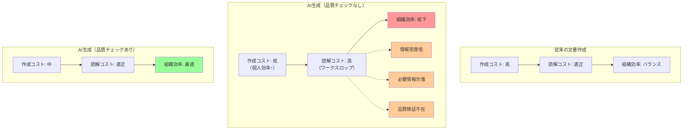

## 要約（Summary）

- ワークスロップ（Workslop）は、ハーバード・ビジネス・レビューが命名した「仕事の邪魔になるAI生成物」を指す用語
- 「やたら長文だが内容は薄い情報」「要約されているが必要な情報が抜けている文章」が代表例
- AI効率化が個人レベルで成功しても、チーム全体では逆に非効率を生む現象

## 本文（Body）

### 背景・問題意識

生成AIの普及により、誰でも簡単に大量の文章を生成できるようになった。しかし、その結果として「生成は簡単だが、読解に時間がかかる低品質な文書」が組織内に氾濫し始めている。

個人の作業効率を上げるツールが、組織全体の効率を下げる矛盾が発生している。

### アイデア・主張

**ワークスロップは「個人の効率化」と「組織の効率化」のミスマッチから生まれる**

AIによって文書作成コストは劇的に下がったが、読解コストは下がっていない。むしろ、品質チェックが不十分な文書が増えることで、読み手の負担は増大している。

#### ワークスロップの特徴

1. **情報密度の低さ**
   - 長文だが実質的な情報量は少ない
   - AIが「それらしい文章」で埋めた結果、冗長性が高い
   - 読み手が「結局何が言いたいのか」を探すコストが高い

2. **必要情報の欠落**
   - 要約はされているが、意思決定に必要な情報が抜けている
   - AIが「重要度」を誤判断した結果
   - 受け手が追加調査を強いられる

3. **品質検証の不在**
   - 生成者がAI出力をそのまま送信
   - 事実確認や裏付け調査が省略されている
   - 「AIが言っている」ことと「事実である」ことの混同

### 内容を視覚化するMermaid図

### 具体例・ケース

**ケース1: AIディープリサーチの丸投げ**
- 1万字のAI生成レポートをそのまま上司に送信
- 実際に読むと、冗長な説明が多く、結論が不明瞭
- 上司が「結局何が言いたいのか」を整理し直す作業が発生

**ケース2: AI要約の品質未検証**
- AI要約で文章を短くして送信
- 意思決定に必要な数値データや前提条件が省略されている
- 受け手が元資料を探して確認する手間が発生

**ケース3: AIの回答コピペ**
- 「AIはこう言ってました」とスクショやコピペを送信
- 事実確認がされていないため、受け手が信頼性を判断できない
- 結局、受け手が裏付け調査をやり直す

### 反論・限界・条件

**AIが悪いわけではない**

問題はAI自体ではなく、「生成物の品質を検証せずに送信する」運用にある。適切な品質チェックプロセスがあれば、AIは強力な生産性向上ツールとなる。

**文脈依存性**

同じ文書でも、受け手との関係性や文脈によって「ワークスロップ」かどうかは変わる。例えば、探索的な議論の初期段階では、粗いAI出力でも有用な場合がある。

**AIの進化**

AIの能力向上により、将来的にはより高品質な出力が得られる可能性はある。しかし、「品質検証責任は人間にある」という原則は変わらない。

## 関連ノート（Links）

- [[20251129160321-ai-delegation-failure-patterns|AI丸投げの失敗パターン]]
- [[20251215004321-ai-output-quality-check-responsibility|AI生成コンテンツの品質チェック責任]]
- [[20251215004400-reader-centric-ai-usage|読み手負担を考慮したAI活用]]
- [[20251129160319-ai-guardrails|AI開発におけるガードレールの重要性]]
- [[20251129164132-proactive-reporting|攻めの報連相の重要性]]

## To-Do / 次に考えること

- [ ] 自組織で発生しているワークスロップの事例を収集
- [ ] AI生成物の品質チェックリストを作成
- [ ] 新卒研修に「読み手負担を考慮したAI活用」を組み込む提案
