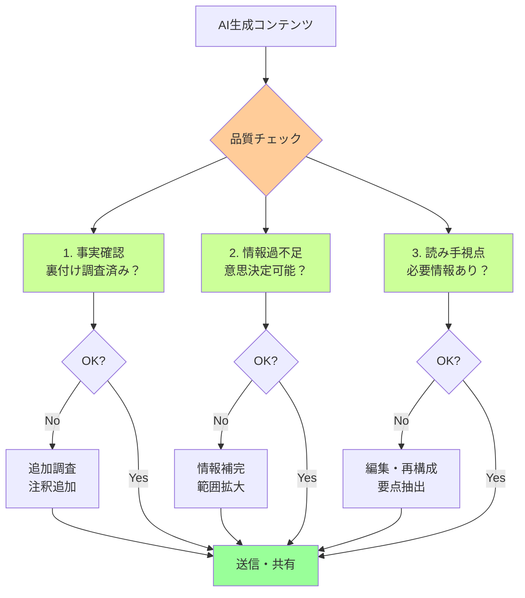

## 要約（Summary）

- AI生成コンテンツを送信する前に、生成者自身が品質チェックする責任がある
- チェック項目は「事実確認」「情報過不足の検証」「読み手に必要な情報の抽出」の3つ
- AIによる効率化は「生成の速さ」ではなく「品質を担保した成果物を速く作る」ことで測るべき

## 本文（Body）

### 背景・問題意識

AIによって文書生成が容易になったことで、「生成したらすぐ送る」という行動パターンが増えている。しかし、AI出力は必ずしも正確でも完全でもないため、品質チェックなしの送信は受け手に負担を転嫁する行為となる。

「誰がAI出力の品質に責任を持つのか」が曖昧なまま、組織内での利用が進んでいる。

### アイデア・主張

**AI生成物の品質責任は、最終的に送信する人間にある**

AIは道具であり、その出力の正確性・適切性を判断するのは人間の役割。「AIが言っている」ことを免罪符に品質検証を省略することは、職業倫理に反する。

#### 必須チェック項目

##### 1. 事実確認と裏付け調査

**問題**: AIは真偽不明の情報を「それらしく」生成する

**対応**:
- AI出力を元にGoogle検索などで裏付けを取る
- 確認が未完了の場合は「裏付け調査はしていないが、参考情報として」と明示
- 確認済みの場合は「事実確認済み」と明記

**悪い例**:
```
AIはこう言ってました [AIのスクショ]
```

**良い例**:
```
AIに確認した結果、以下の情報を得ました。
公式ドキュメントで裏付けを確認済みです。
[情報]
参照: https://...
```

##### 2. 情報過不足の検証

**問題**: AIは調査目的を完全に理解できず、情報の網羅性が保証されない

**対応**:
- 「この結果は妥当であるか」を批判的に検証
- 例: 「3つの製品を比較」→ 本当に3つだけで十分か？他に候補はないか？
- 意思決定に必要な情報が揃っているか確認

**具体例**:
- 製品比較で価格情報が抜けている
- リスク分析で「発生確率」は書かれているが「影響度」が書かれていない
- タイムライン情報が最新ではない

##### 3. 読み手視点での要約・編集

**問題**: AIの要約は「文章を短くする」だけで、読み手が必要とする情報を抽出するとは限らない

**対応**:
- 読み手の立場で「何を知りたいか」を考える
- 重要なポイントが要約に含まれているか確認
- 冗長な部分を削除し、情報密度を上げる
- 必要に応じて構成を変更

**AI要約の罠**:
```
AI長文出力 → AI要約 → 送信
```
この工程では「読み手にとって有用な情報か」の確認が抜けている。

**正しいプロセス**:
```
AI長文出力 → AI要約 → 人間による検証・編集 → 送信
```

### 内容を視覚化するMermaid図



### 具体例・ケース

**ケース1: ディープリサーチの品質チェック**

AIが生成した1万字のレポートに対して：
- 読み手（上司）が知りたいのは「結論」と「その根拠」
- 1万字をそのまま送るのではなく、3つのポイントに絞って編集
- 詳細が必要な場合は「詳細版も用意しています」と添える

**ケース2: 比較表の妥当性検証**

AIが生成した製品比較表：
- 「条件を満たす製品は3つ」→ 本当に3つだけか？
- Google検索で追加候補を発見し、5製品に拡大
- 比較軸（価格、機能、サポート）が揃っているか確認

**ケース3: 要約の読み手適合性**

AIが要約した会議議事録：
- 経営層向けには「決定事項」と「次のアクション」に絞る
- 技術チーム向けには「技術的な課題」と「解決策」を詳述
- 同じ元データでも、読み手によって要約内容を変える

### 反論・限界・条件

**品質チェックのコスト**

品質チェックには時間がかかる。「AIで速く生成したのに、チェックに時間を取られる」というジレンマが存在する。

**対応**: 
- チェックコストは「読み手の時間を節約するための投資」と考える
- 自分の5分が、10人の読み手の各5分（計50分）を節約できれば、組織全体では効率的

**スキル依存性**

適切な品質チェックには、ドメイン知識や批判的思考力が必要。AI初心者が品質を判断するのは難しい場合がある。

**対応**:
- チェックリストやガイドラインを整備
- レビュー文化を醸成し、相互チェックを行う
- 重要な文書はシニアメンバーがレビュー

**緊急性とのトレードオフ**

緊急の場合、品質チェックを完全に行う時間がない場合もある。

**対応**:
- 「暫定情報」「未検証」などのラベルを明記
- 事後に正式版を送る約束をする

## 関連ノート（Links）

- [[20251215004241-workslop-concept|ワークスロップ（Workslop）：AI生成による生産性阻害物]]
- [[20251215004322-reader-centric-ai-usage|読み手負担を考慮したAI活用]]
- [[20251129160321-ai-delegation-failure-patterns|AI丸投げの失敗パターン]]
- [[20251129160319-ai-guardrails|AI開発におけるガードレールの重要性]]
- [[20251129164132-proactive-reporting|攻めの報連相の重要性]]

## To-Do / 次に考えること

- [ ] AI生成物の品質チェックリストを作成し、チームで共有
- [ ] 「未検証」「暫定」などのラベル運用ルールを策定
- [ ] 品質チェックにかかる時間と、読み手の時間節約効果を測定
