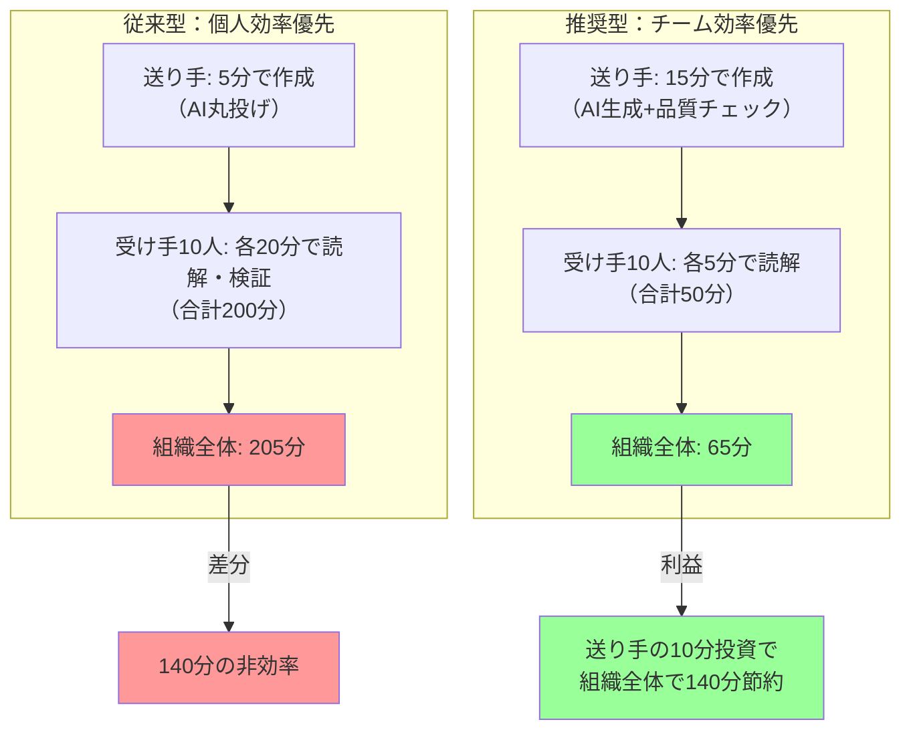

## 要約（Summary）

- AI活用で重要なのは「自分の効率」だけでなく「読み手・チーム全体の効率」を考えること
- 自分の作業時間を削減しても、読み手の負担を増やせば組織全体では非効率
- 「読み手の負担を想像しながらAIを使うスキル」が新しいビジネス基礎スキルとなる

## 本文（Body）

### 背景・問題意識

生成AIの普及により「自分の作業を効率化する」ことに注目が集まっている。しかし、コミュニケーションは相互作用であり、送り手の効率化が受け手の非効率化につながるケースが増えている。

「自分は楽になったが、相手に負担を押し付けている」状態が、AI時代の新しい問題として顕在化している。

### アイデア・主張

**AI活用の真の成功指標は「チーム全体の生産性向上」である**

個人の作業時間削減だけを追求すると、品質の低い成果物が組織に蓄積され、結果的に全体効率を下げる。AI活用においては「読み手の時間をどれだけ節約できるか」を考える必要がある。

#### 読み手負担の3つの側面

##### 1. 読解コスト

**問題**: 冗長で情報密度の低い文章は、読むのに時間がかかる

**影響**:
- 1万字のAIレポートを読むのに30分
- 適切に編集された500字なら5分で済む
- 10人が読むなら、250分 vs 50分の差（4時間の差）

**対応**:
- 情報密度を上げる
- 結論を先に書く
- 冗長な表現を削る

##### 2. 検証コスト

**問題**: 事実確認されていない情報は、受け手が裏付けを調べる必要がある

**影響**:
- 「AIはこう言ってます」→ 受け手が独自に調査
- 送り手の5分の節約が、受け手の20分の負担になる

**対応**:
- 送り手が事実確認を行う
- 未確認の場合は明示する
- 裏付け資料へのリンクを添える

##### 3. 意思決定コスト

**問題**: 必要な情報が不足していると、追加質問や再調査が必要になる

**影響**:
- 会議が延びる
- 意思決定が遅れる
- 結局、送り手に再調査を依頼

**対応**:
- 読み手が「何を決めたいか」を理解する
- その判断に必要な情報を網羅する
- 選択肢と推奨案を明示する

### 内容を視覚化するMermaid図



#### 効率化の方程式

```
組織全体の効率 = (送り手の時間) + (受け手の人数 × 受け手の時間)
```

- 送り手が10分追加投資して品質を上げる
- 受け手10人が各15分節約（計150分）
- 組織全体では140分の利益

### 具体例・ケース

**ケース1: 会議資料のAI生成**

悪い例：
- AIで1時間かかる資料作成を10分に短縮
- 参加者10人が資料を理解できず、会議で30分の説明が必要
- 自分の時間: 50分節約、組織全体: 300分の損失（会議時間増）

良い例：
- AIで下書きを10分で作成、20分かけて編集・構造化
- 参加者が事前に理解でき、会議は15分で終了
- 自分の時間: 30分節約、組織全体: 150分の利益

**ケース2: 調査報告のAI要約**

悪い例：
- AI要約をそのまま送信（3分）
- 意思決定に必要な「コスト比較」が抜けている
- 上司が追加質問し、再調査が発生（30分）
- 合計: 33分

良い例：
- AI要約後、意思決定に必要な情報を確認（10分）
- コスト比較表を追加して送信
- 上司がその場で判断でき、追加質問なし
- 合計: 10分

**ケース3: テクニカルドキュメント**

悪い例：
- AIが生成した汎用的な説明文をそのまま掲載
- チーム固有の文脈が欠けており、メンバーが混乱
- Slackで質問が10件発生、各対応に5分（50分）

良い例：
- AI生成後、チーム固有の文脈を追記（15分）
- 「当社の場合は〇〇を使う」と明示
- 質問がゼロになる

### 反論・限界・条件

**完璧主義の罠**

「読み手負担を最小化する」ことを過度に追求すると、送り手の負担が大きくなりすぎる。完璧な文書を目指すより、「十分に良い」レベルで送信する判断も必要。

**対応**:
- 重要度と緊急度でバランスを取る
- 重要な意思決定文書は時間をかける
- 速報性重視の場合は「暫定版」と明記

**受け手の多様性**

受け手のスキルレベルや前提知識によって、最適な情報量は異なる。全員に最適化することは困難。

**対応**:
- 主要な読み手を想定して最適化
- 複数のレベル（要約版・詳細版）を用意
- 補足資料へのリンクを提供

**文化的要因**

組織によっては「長文こそ丁寧」という文化があり、簡潔な文書が「手抜き」と見なされる場合もある。

**対応**:
- チーム内で「良い文書」の基準を合意
- 簡潔さと丁寧さは両立可能と示す
- 具体例で文化を変える

## 関連ノート（Links）

- [[20251215004241-workslop-concept|ワークスロップ（Workslop）：AI生成による生産性阻害物]]
- [[20251215004321-ai-output-quality-check-responsibility|AI生成コンテンツの品質チェック責任]]
- [[20251129164132-proactive-reporting|攻めの報連相の重要性]]
- [[20251129160317-ai-role-division-what-why-how|AI連携開発における役割分担の原則]]
- [[20251129160321-ai-delegation-failure-patterns|AI丸投げの失敗パターン]]

## To-Do / 次に考えること

- [ ] チーム内で「読み手負担を考慮したAI活用」のワークショップを実施
- [ ] 組織効率の計算式を使った費用対効果分析の事例を作成
- [ ] 新卒研修・オンボーディング資料に「読み手視点のコミュニケーション」を追加
