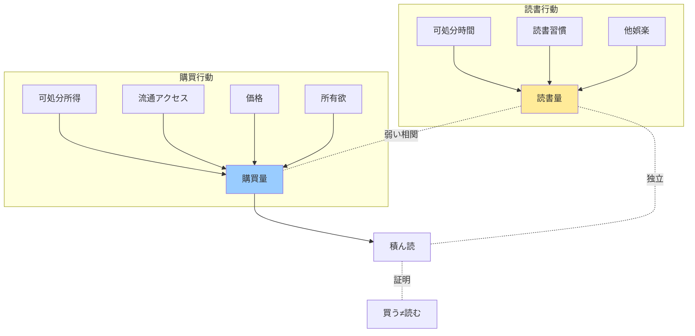

## 要約（Summary）

- 書籍市場では「読む量」と「買う量」は独立した指標であり、必ずしも連動しない
- 日本では読書量が横ばいでも出版市場は縮小しており、逆に米国では読書量が減少しても児童書市場は成長している
- 「積ん読」の存在が端的に示すように、購買行動と読書行動は別のメカニズムで駆動される

##本文（Body）

出版業界の分析において、「読む量」と「買う量」を短絡的に結びつける誤謬が頻繁に見られる。しかし実際のデータは、この二つの指標が必ずしも連動しないことを示している。

### 背景・問題意識

出版市場が1990年代後半から縮小しているにもかかわらず、書籍の読書量はほぼ横ばいである。この乖離をどう説明すべきか。多くの議論では「読書離れ」が市場縮小の原因とされるが、統計データはその前提を支持しない。

### アイデア・主張

**書籍の購買量と読書量は、異なる要因によって駆動される独立した行動である。**

支える根拠：
- 日本：読書量横ばい（月平均1.5冊程度で長期安定）vs 出版市場縮小（1990年代後半から）
- 米国：NAEP/NLT調査で子どもの読書量減少 vs CircanaBookScanで児童書・YA市場は成長
- 「積ん読」という言葉の存在自体が、買う≠読むを日常的に示している

読書量に影響する要因：
- 可処分時間
- 読書習慣の形成時期（学齢期）
- 他の娯楽との競合

購買量に影響する要因：
- 可処分所得
- 書店アクセス（流通構造）
- 本の価格
- 代替メディアの利便性
- 所有欲・コレクション欲

### 内容を視覚化するMermaid図

### 具体例・ケース

**日本の事例（1990年代後半〜2020年代）**
- 読書世論調査：書籍読書率は戦後一貫して「おおむね5割前後で推移」
- 出版科学研究所：書籍市場規模は1996年をピークに縮小
→ 読書量が一定でも、購買量は減少

**米国の事例（2010年代）**
- NAEP/NLT：子どもの読書量が減少傾向
- CircanaBookScan：児童書・YA市場は成長傾向
→ 読書量が減少しても、購買量は増加

**個人レベルの事例**
- 積ん読：多くの読書家が、読む速度を上回る速度で本を購入している
- 図書館利用：購入せずに読書量を維持する層の存在

### 反論・限界・条件

**一定の相関は存在する**
- 全く読まない層は当然買わないので、ゼロベースでは正の相関がある
- ただし、読む層の中では購買量と読書量の相関は弱い

**カテゴリー依存性**
- 雑誌では「読む量」と「買う量」の連動性が比較的高い（定期購読モデル）
- 書籍では連動性が低い（所有価値、再読価値、資料価値などが影響）

**時代・地域による変動**
- デジタル化、図書館の充実度、古本市場の規模などが媒介変数として働く
- 各国の文化的文脈（贈答文化、書棚展示文化など）も影響

**測定の難しさ**
- 電子書籍、オーディオブックなど、測定方法が統一されていない領域が拡大
- 「読む」の定義（拾い読み、斜め読みをどう扱うか）も曖昧

## 関連ノート（Links）

- [[20251215010141-magazine-book-statistical-confusion|書籍と雑誌の統計的混同]] 書籍と雑誌の統計的混同 - 統計分析における区別の重要性
- [[20251215010142-subjective-feeling-vs-statistics|実感と統計データの乖離]] 実感と統計データの乖離 - 個人の実感とマクロデータの不一致
- [[20251215010143-working-hours-reading-decoupling|労働時間と読書量の非相関]] 労働時間と読書量の非相関 - 労働時間削減が読書増加に繋がらない理由
- [[20251215010144-bestseller-ranking-representativeness-bias|ベストセラーランキングの代表性バイアス]] ベストセラーランキングの代表性バイアス - ランキングが市場全体を代表しない理由

## To-Do / 次に考えること

- [ ] 電子書籍時代における「購読量」「購買量」「読書量」の三者関係を再定義する
- [ ] 図書館貸出データと出版市場データの統合分析の可能性を探る
- [ ] 他の文化商品（音楽、映像）でも同様の非相関が見られるか比較検討する
