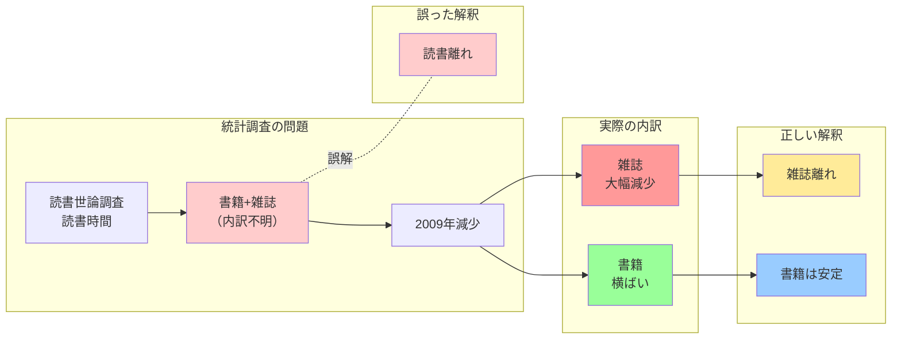

## 要約（Summary）

- 出版統計において「書籍」と「雑誌」を区別せずに分析すると、誤った結論に至る
- 両者は市場動向・消費者行動・メディア特性が大きく異なり、別個の分析対象として扱うべき
- 「読書時間の減少」の多くは雑誌の減少であり、書籍の読書量はほぼ横ばいである

## 本文（Body）

出版業界の議論において、「書籍」と「雑誌」を明確に区別せずに「出版物」「読書」として一括りに扱う誤謬が頻繁に見られる。これは統計的分析においても、政策議論においても重大な誤解を招く。

### 背景・問題意識

三宅香帆『なぜ働いていると本が読めなくなるのか』では、読書世論調査の「読書時間」を引用して「2009年にすべての年代で読書時間が減少した」と指摘している。しかし、この調査における「読書時間」は実際には「書籍＋雑誌」の接触時間であり、内訳は不明である。

書籍と雑誌では市場動向が大きく異なる：
- 書籍：読書量・読書率ともに長期的に横ばい
- 雑誌：市場規模・接触時間ともに大幅減少（特に2000年代以降）

### アイデア・主張

**書籍と雑誌は、出版形態は似ていても、消費者行動・市場構造・メディア特性が根本的に異なる別個の商品カテゴリーである。統計分析や政策議論では必ず両者を分離して扱うべきである。**

両者の本質的な違い：

| 特性 | 書籍 | 雑誌 |
|------|------|------|
| 消費パターン | ストック型・非定期 | フロー型・定期 |
| 情報の時間価値 | 長期保存・再読価値 | 速報性・鮮度重視 |
| 代替メディア | 電子書籍、オーディオブック | Web、SNS、動画 |
| 市場動向（2000年代〜） | 横ばい〜微減 | 大幅減少 |
| 購買決定 | 個別判断 | 定期購読・習慣 |

### 内容を視覚化するMermaid図

### 具体例・ケース

**読書世論調査の「読書時間」減少（2009年）**
- 問題：書籍と雑誌を合算した数値
- 結果：「読書離れが始まった」という誤解
- 実態：減少の主因は雑誌の読者離れ、書籍は横ばい

**雑誌市場の縮小（1997年〜2020年代）**
- 1997年：雑誌市場ピーク約1.56兆円
- 2024年：大幅に縮小
- 主因：インターネット、特にSNSによる速報性メディアへの代替

**書籍市場の相対的安定**
- 文化庁「国語に関する世論調査」：年齢による読書量の差は乏しく、長期的にも安定
- 小中高生：学齢が上がるにつれ減少するが、高校卒業後は横ばい
- 月2冊以下が約9割という構造は数十年変わらず

**雑誌と書籍の混同が引き起こす誤解の例**
- 「自己啓発書を中心として、労働者階級にも読まれる書籍は存在していた」との記述で、雑誌連載小説と単行本を混同
- 小説雑誌（定期刊行物）の隆盛を、書籍の読書量増加と誤認

### 反論・限界・条件

**両者を統合して扱うべき場合もある**
- 紙媒体全体 vs デジタル媒体という視点では統合が有意義
- 出版産業全体の経済規模を論じる場合
- 印刷業・流通業への影響分析

**境界が曖昧なケースの存在**
- ムック本：書籍と雑誌の中間形態
- 季刊誌・年刊誌：定期性は低く、書籍に近い消費行動
- 電子版：紙の区分が必ずしも当てはまらない

**データ取得の実務的制約**
- 調査コスト：内訳を取ると回答負荷が増大
- 回答者の記憶：何を「書籍」「雑誌」と認識しているかの揺れ
- 国際比較：各国で定義が異なる場合がある

**分離の粒度**
- さらに細分化すべきか？（コミック、文芸、実用書など）
- 目的に応じた適切な粒度の選択が必要

## 関連ノート（Links）

- [[20251215010140-reading-quantity-purchase-quantity-decoupling|読書量と購買量の非相関性]] 読書量と購買量の非相関性
- [[20251215010142-subjective-feeling-vs-statistics|実感と統計データの乖離]] 実感と統計データの乖離
- [[20251215010144-bestseller-ranking-representativeness-bias|ベストセラーランキングの代表性バイアス]] ベストセラーランキングの代表性バイアス

## To-Do / 次に考えること

- [ ] 電子書籍・オーディオブック・音声メディアをどう分類すべきか検討する
- [ ] 「読書」の定義を再検討（漫画、ライトノベル、技術書をどう扱うか）
- [ ] 出版統計のメタデータ標準化の国際的な取り組みを調査する
- [ ] 雑誌と書籍を分離した上で、さらなる細分化が有効なカテゴリーを特定する
